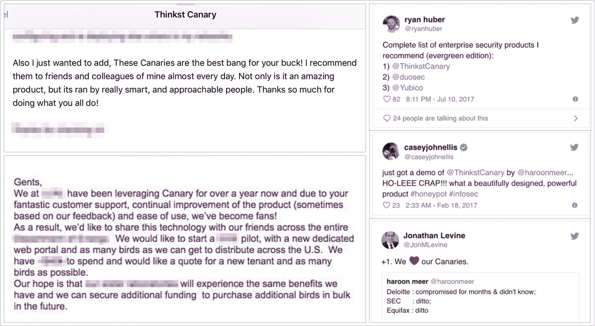

# 你知道这应该是伤害，你只是不知道哪种伤害是好的

> 原文：<https://medium.com/swlh/you-know-its-supposed-to-hurt-you-just-don-t-know-which-kind-of-hurt-is-the-good-kind-64b9d80d9d81>

当人们开始举重(或做交叉训练)时，一个常见的问题是他们不经意地过度了。他们为什么不在痛的时候停下来？因为每个人都知道这会很痛。肥大是目标，所以疼痛是交易的一部分…对吗？

Pain, guaranteed.

在一次关于 Twitter 崛起的旧采访中，Ev Williams 说了一些非常有趣的事情:在追求传说中的初创公司的过程中，我们已经如此习惯于赞美企业家的奋斗，并且如此经常地重复饥饿企业家的神话，以至于人们忍受糟糕/不可行想法的痛苦的时间比他们应该忍受的时间更长。他说，看到 Twitter 像病毒一样传播，更清楚地表明了 Odeo 没有。

> 当推特起飞时，他说:“这就是牵引力的感觉。”

这是一个有趣的问题。对企业家精神的崇拜是强大的，不乏油嘴滑舌的俏皮话鼓励人们去崇拜这份工作。让自己经历这一切，你可能会打造出最完美的海滩身材，或者你可能会让自己患上一辈子的慢性背痛。那么，我们如何区分这两者呢？你怎么知道这是所有年轻公司都必须忍受的痛苦，还是你真的在给自己制造数字疝气？

一个显而易见的答案是客户反馈，但这并不那么简单。我将通过我们构建的两个不同产品来讨论原因:Phish5 和 Canary。

我们在 2012 年建立了 [Phish5](https://phish5.com) ,其逻辑是网络管理员和安全团队可以注册，支付数百美元，并针对他们自己的公司开展高质量的网络钓鱼活动。它运行良好，多年来取得了一定的成功。(我的意思是，它在世界各地找到了客户，并赚了几十万美元，而运营成本只是这一数字的一小部分)。随着时间的推移，随着越来越多的玩家进入市场，自我钓鱼变成了一个小行业。我们仍然有一些跨国客户在使用它，所以我们继续运营，但没有在它上面投入太多..

2015 年，我们发布了我们的[思维金丝雀](https://canary.tools)。高质量的蜜罐将在几分钟内部署，几乎不需要管理开销。不到一个月的时间，我就意识到金丝雀将会与众不同。我们早期的 Phish5 销售几乎总是面向我们认识的人(来自我们的前世),而 Canary 几乎立刻就在我们永远不会探索的垂直行业中找到了我们从来不认识的客户。

Phish5 客户使用该服务直到他们的许可证过期，然后(可能)注册了第二轮。Canary 的客户通常会在订阅的过程中向他们的网络添加更多的金丝雀，在这个过程中推销自己。

> 最重要的是，虽然我们有 Phish5 的客户告诉我们他们喜欢 Phish5，但金丝雀的客户充满了“爱”。

保罗·格拉厄姆有一个著名的建议，创业成功始于“[制造人们喜欢的东西](https://genius.com/Paul-graham-lecture-3-counterintuitive-parts-of-startups-and-how-to-have-ideas-annotated)”。这个问题的一部分是，像许多十几岁的孩子一样，如果你以前从未谈过恋爱，你就无法判断这是不是爱。

我们让用户向他们的朋友推荐 Phish5，它甚至出现在一两篇文章中。但只有在金丝雀身上，我们才会说:“哦..这就是爱情的感觉”。电子邮件反馈确实“多愁善感”，我们越来越多地听到金丝雀在安全播客中被亲切地提及。Twitter 上不请自来的反馈非常好(比我们要求的要多得多！)

[https://canary.tools/love](https://canary.tools/love)

我们植根于安全研究社区，并努力推动我们的产品不断创新。没有什么比其他研究者引用你的工作更能表达对研究者的爱了。5 年来，网络钓鱼出现在一些新闻报道中，但金丝雀一家几乎立刻就溜进了其他人的滑梯甲板。

从[简短的介绍视频](https://www.youtube.com/watch?v=mDnaEmpO1C4)到像[carnolownage](https://twitter.com/carnal0wnage/status/808692967317929984)讨论[金丝雀在他日常工作中的用法](https://www.slideshare.net/chrisgates/open-canary-novahackers)这样的行业传奇；从摇滚明星如[科林·穆林纳](https://twitter.com/collinrm/status/1010150635436732416)伸展令牌[进行重新探测](https://mulliner.org/collin/publications/Detecting_Reverse_Engineering_with_Canaries_CanSecWest2018.pdf)，到聪明人如[迈克·鲁斯](https://twitter.com/MF_Ruth/status/1055953837863841792)谈论[大规模部署金丝雀](https://qconsf.com/sf2018/presentation/taking-canary-out-coal-mine)。人们(除了我们)围绕着我们的鸟发表演讲和论文..Phish5 没有发生任何类似的事情(老实说，我们从来不知道它发生过)。

爱情三角显然也反映在我们的数字上:金丝雀分布在七大洲，超过 95%的金丝雀销售仍然是入境和口碑推荐。我们并没有说“我们赢了”或者金丝雀的成功是既成事实。但我们确实知道，它正处于一个与我们之前构建的任何东西完全不同的轨道上，如果我们继续在 Phish5 上“努力工作”,我们就不会走到这一步。

决心和专注是伟大的，但是确保你的固执不会阻止你放弃你的 Odeo 去建立你的 Twitter。

__
那不是我们..那是永远..5 年后再来看看我们的成果如何

## 这篇文章发表在 [The Startup](https://medium.com/swlh) 上，这是 Medium 最大的创业刊物，拥有+390，714 名读者。

## 在这里订阅接收[我们的头条新闻](http://growthsupply.com/the-startup-newsletter/)。

