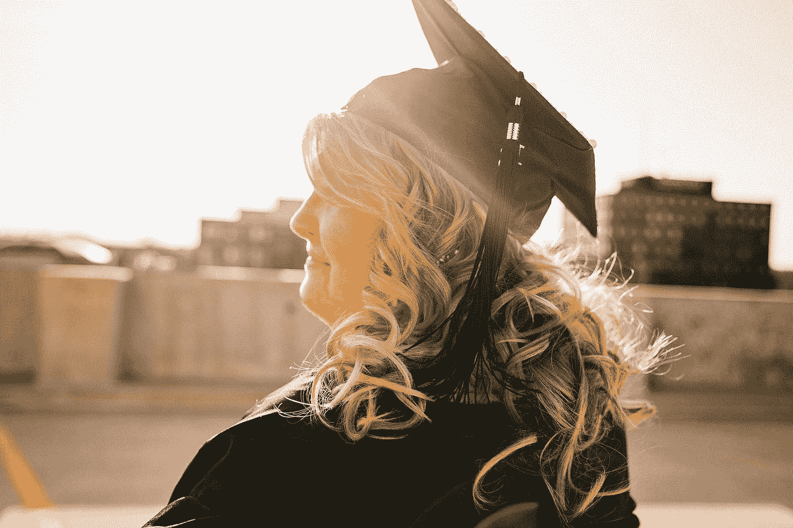

# 当你还是学生时，你永远不会成为自由职业者

> 原文：<https://medium.com/swlh/you-ll-never-work-as-a-freelancer-while-youre-a-student-b77d3a806ebd>

## 一个试图做自由职业者的学生的自白

“woman in gray dress resting her hands on white table” by [sean Kong](https://unsplash.com/@seankkkkkkkkkkkkkk?utm_source=medium&utm_medium=referral) on [Unsplash](https://unsplash.com?utm_source=medium&utm_medium=referral)

我已经试着在网上工作 6 个多月了，这简直是一场噩梦。

这是一场噩梦，因为作为学生，我们面临着一切。

我从来没想过网上学习和工作会这么难。

我认为这是一个创造一个有吸引力的个人资料和等待工作机会的问题。

我想我会自己安排我的工作日程。我以为我想工作的时候就会工作。

> 我有多迷惑？

我以为一切都会很容易。

但不是这样的。

> 这个世界是垃圾，当你还是学生的时候，你永远也不能工作。

出现这种情况的原因有很多。你只需要继续读这篇文章。

# 我们没有建立任何个人品牌

> 每个读过加里·维纳查克的人都会知道，没有什么比建立我们的个人品牌更重要。

**凯文·凯利**说我们只需要有 1000 个真正的追随者，我们的生活就会解决。

 [## 技术元素:1000 名真正的粉丝

### 这是我在 2008 年写的一篇文章的编辑和更新版本，当时这个现在流行的想法还处于萌芽状态。我…

kk.org](https://kk.org/thetechnium/1000-true-fans/) 

问题是我们 20 岁了。我们不知道有哪个成年人愿意为我们的服务付费。

> 我们唯一认识的成年人是我们的父母，他们会雇佣我们的服务，只是因为我们是他们的孩子。

在 20 岁建立个人品牌有点过于复杂。

第一个原因是我们的客户会比我们年长很多。

老实说。没有人愿意听从青少年的建议。

第二，我们的环境对我们没有帮助。

我们的环境不关心我们的个人品牌。我们的环境和我们一样都是 20 岁，只等着做爱和喝酒。

# 我们没有大学学位

作为学生，我们将面对没有人会信任我们的可悲现实。没有人会信任我们，因为我们没有大学学位。

没有人会雇用我们的服务，因为我们不是毕业生

没有人会雇佣我们的服务，因为人们追求专业性。人们在寻找有多年市场经验的人。

> 没有人在寻找一个开始工作生涯的学生。

# 我们很快就失去了动力

> 作为学生，我们非常情绪化。我们开始项目，相信两周后我们会成为下一个史蒂夫·乔布斯。

我们通常会因为看不到短期效果而放弃项目。

在我们这个年纪，想长远是不可能的。

这是不可能的，因为在 20 岁，每一年都很重要。

在我们的环境中，21 岁的女人不太可能和 19 岁的男人约会。

如果你年满 18 岁，有可能继续上学。如果你 22 岁，你应该已经毕业了。

在那个年龄，每一年都很重要。

这让我们很难从长远考虑。

> 20 岁时，我认为我必须每周发表 3 篇文章才能在 3 年内成功。这在那个年龄是不可想象的。

# 我们没有既定的投资组合

除了没有个人品牌。我们也没有作品集。

也许我们会开始做搜索引擎优化工作。但是我们没有东西给顾客看。

也许我们开始为社交网络设计。但是我们没有任何东西来证明我们的想法。

事实上，

> 作为学生，我们的简历实际上是空的。

在网上工作很难获得收入，因为我们甚至连一份简历都没有做好。

然后想象其他的一切？

# 我们的社会环境对我们没有帮助

我们周围都在等着大学的八卦。我们唯一想到的是米娅·卡莉法、麦莉·赛勒斯或勒布朗·詹姆斯。

很少有机会发现一群学生在讨论 SEO 定位。

这使得我们的工作环境更加复杂。几乎没有人会理解我们试图在互联网上谋生。

# 我们没有钱投资

人们说在线工作是免费的。只在 Fiverr 或 UpWork 上开个简介，等着他们录用你。

这些都不是真的。

目前，你将等待 6 个月，你将不会收到任何工作机会，无论是在五月或向上的工作。

> 获得在线工作的唯一方法是将流量重定向到我们的工作简介。重定向流量的唯一方法是投入时间和金钱。

> 我们必须在 linkedin 上建立个人资料，开始在 medium 上写作，在 Quora 上回答问题，甚至利用我们的社交网络，如脸书、Instagram 或 Twitter。

> 尽管他们告诉你社交网络是免费的，但最终它们并不免费。

你必须在每个社交网络中增加你的追随者，这是有代价的。

脸书广告要花钱。

机器人需要钱。

即使是中号也要花钱。

# 我们几乎没有接受过金融教育。

作为学生，我们不习惯为将来的开支存钱。

我们甚至不习惯把钱再投资。

> 当我们赢得第一个 100 美元时。我们更有可能把这些钱用在电子游戏、酒精和海滩旅行上。我们不会把钱花在 facebook 广告、书籍、课程等方面。

# 我们不善于组织自己

作为学生，很难组织起来。跟上学习的步伐不是不可能的。做作业。出去工作。

> 作为学生，我们总是会分心。总有一些我们不记得的活动。总有一个朋友邀请我们离开。总有一个考验要通过。

如果你加入自由职业者的工作，我们的时间会变得混乱。

我们将是一场灾难

“woman wearing academic regalia during daytime” by [Esther Tuttle](https://unsplash.com/@entradaphotography?utm_source=medium&utm_medium=referral) on [Unsplash](https://unsplash.com?utm_source=medium&utm_medium=referral)

# 结论

我并不是说，当我们是学生时，我们不能在网上工作。

我们当然可以在网上工作。我继续在网上工作。

> 写这篇文章的目的是告诉他们，我们学生还有更长的路要走。

我们的道路将比其他人的道路更加艰难。

然而，如果我们能克服这个巨大的挑战。我们的收益会更大。

24 岁的时候，我们可以做任何我们想做的事情。我们可以在世界上任何一个国家工作。

我们可以成为背包客，每 3 个月在不同的城市生活一次。

这一切都归功于我们从很小的时候就开始在互联网上工作。

## 这篇文章发表在 [The Startup](https://medium.com/swlh) 上，这是 Medium 最大的创业刊物，有+ 373，685 人关注。

## 订阅接收[我们的头条新闻](http://growthsupply.com/the-startup-newsletter/)。

