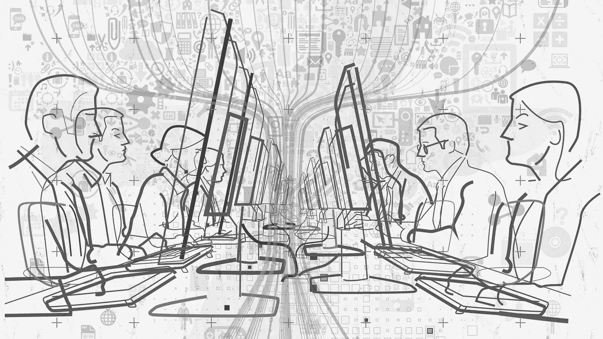
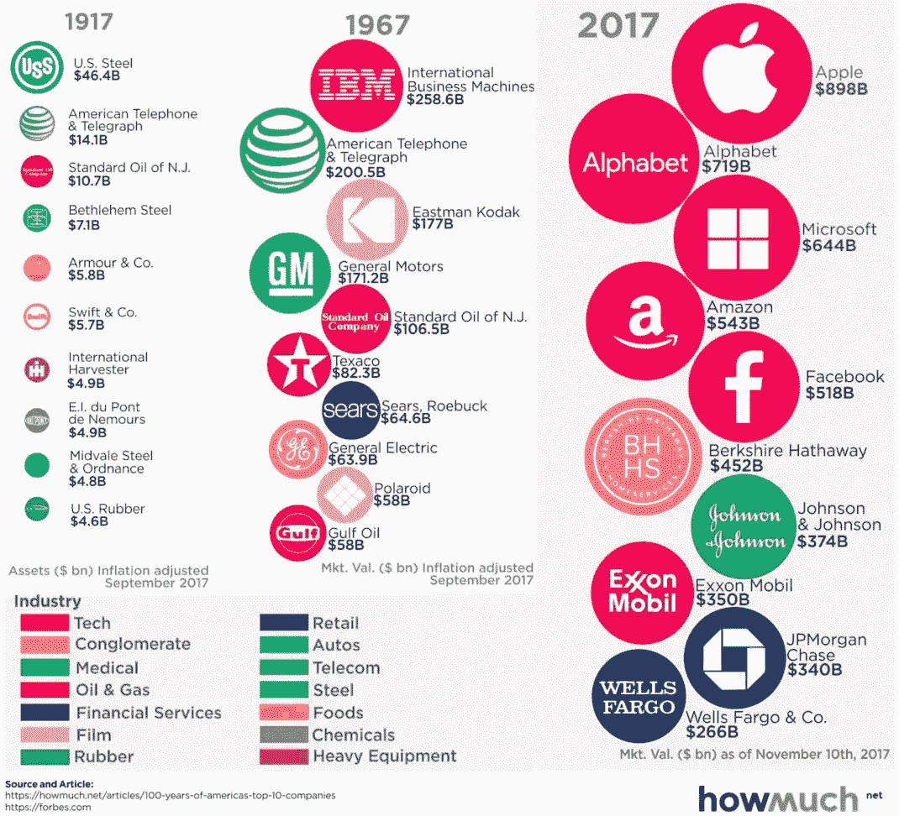
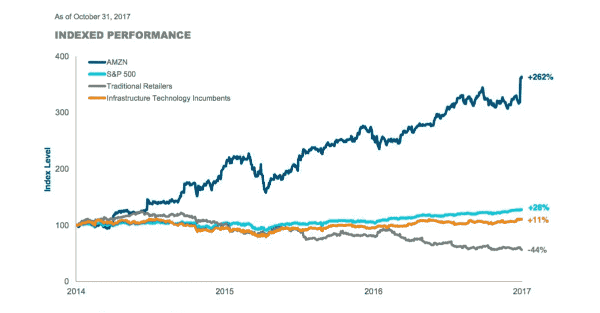
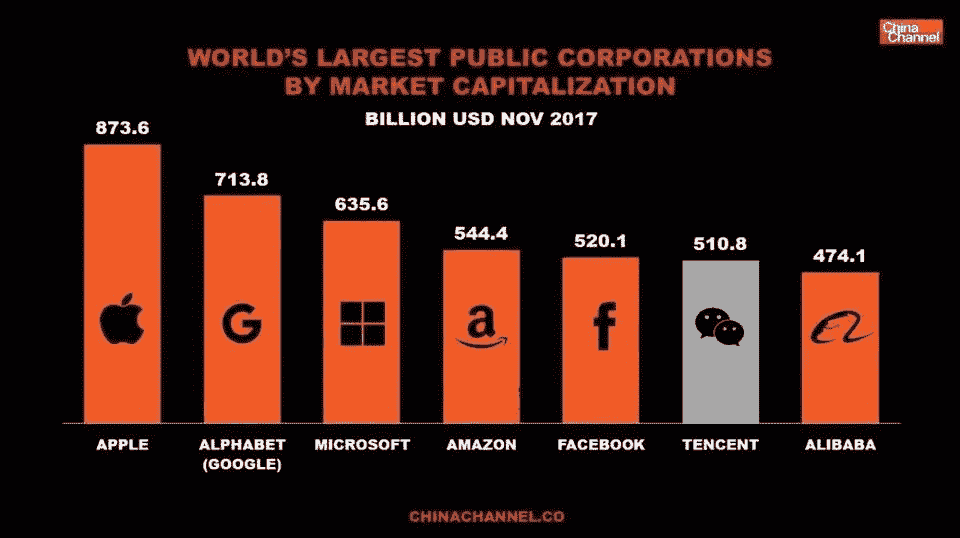
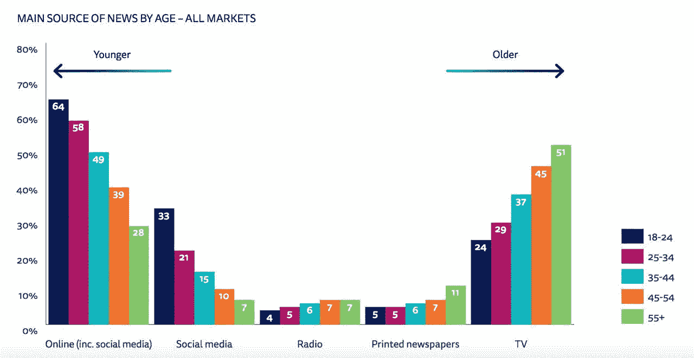
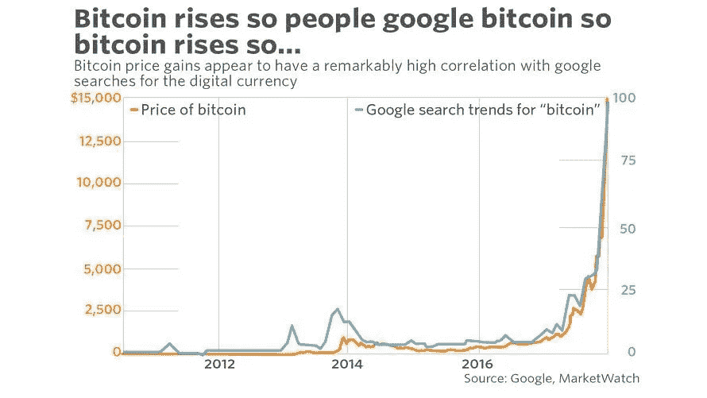

# 你可能会对 2017 年的技术感兴趣

> 原文：<https://medium.com/swlh/you-might-be-interested-in-technologies-of-2017-8ba5e222c4bb>

每年年初都会有很多科技预测。科学家、工程师和实业家试图总结过去一年的成果，并确定新的趋势。

但事实上，即使是来自著名专家的意见或预测也毫无价值。所以我认为我们可以只相信数据来弄清楚世界上正在发生什么。

因此，我想与大家分享 2017 年最令人难以置信的事实和数字，这些事实和数字帮助我了解了我们的尖端技术。它们都发表在我的电报频道“ [*Groks*](https://t.me/Groks) ”而这篇文章就像是它们的摘要。

# 五大银行

HowMuch

*   在过去的一年里，苹果、Alphabet、微软、亚马逊和脸书的市值增加了近 9000 亿美元(美国消费者新闻与商业频道为 T8，T9)。
*   **80%** 的推荐流量就来自那**两家公司**，来自谷歌和脸书([商业内幕](http://www.businessinsider.com/google-facebook-news-traffic-chart-2017-5))。
*   苹果公司已经在海外预定了 2460 亿美元(ITEP)。
*   超过 50 万人在亚马逊工作。
*   iOS 带动了谷歌移动广告收入的**75%**([Apple Insider](http://appleinsider.com/articles/15/05/27/apples-ios-drives-75-of-googles-mobile-advertising-revenue))。
*   30 亿美元是谷歌保持 iOS 设备默认搜索引擎的估计成本。而这个数额是苹果公司今年([美国消费者新闻与商业频道](https://www.cnbc.com/2017/08/14/google-paying-apple-3-billion-to-remain-default-search--bernstein.html))总营业利润的 **5%** 。

# 广告

*   超过 80%的广告收入集中在相对较小的用户群中——通常少于 20%的 T2 用户。*帕累托法则*适用于广告收入( [Soomla](https://news.unilead.net/wp-content/uploads/2017/07/SOOMLA_Mobile_Monetization_Report_2017_Q2.01.pdf) )。
*   **6.15 亿**设备现在使用 adblock 或**全球互联网人口的 11%** 正在屏蔽网络上的广告( [Pagefair](https://pagefair.com/blog/2017/adblockreport/) )。
*   令人沮丧的是，0.06%的观众点击了普通的横幅广告，其中大约 50%的点击是偶然的。
*   **全球广告支出总额的 20%** 来自谷歌和脸书([美国消费者新闻与商业频道](https://www.cnbc.com/2017/05/02/google-and-facebook-take-20-percent-of-total-global-ad-spend.html))。
*   1 亿美元是 P & G 削减的数字广告预算，并且没有注意到变化。*“精心绩效营销的最佳案例”* ( [WSJ](https://www.wsj.com/articles/p-g-cuts-more-than-100-million-in-largely-ineffective-digital-ads-1501191104) )。
*   美国和加拿大为脸书创造了人均**21.20**美元的广告收入，而亚太地区的广告收入仅为人均**2.27**([商业内幕](http://www.businessinsider.com/facebook-has-massive-growth-potential-abroad-charts-2017-11))。

# 电子商务和零售

[Business Insider](http://www.businessinsider.com/list-stores-closing-2017-9)

*   2017 年**已宣布关店**6400 多家([商业内幕](http://www.businessinsider.com/list-stores-closing-2017-9))。
*   在十年内，T42 有 600 万到 750 万个零售行业的工作岗位可能会受到自动化的影响。
*   亚马逊已经占领了将近 50%的电子商务市场，它在整个零售市场的份额大约是 T2 的 5% T3([商业内幕](http://www.businessinsider.com/amazon-stock-price-retail-apocalypse-2017-11))。
*   50%的千禧一代不仅去实体店，他们更喜欢把去实体店作为主要的购物方式。
*   100 万在 Houzz 应用中使用过 AR 功能的人购买的可能性是其他人的 **11 倍**，在应用中花费的时间是其他人的 **2.7 倍**(TechCrunch)。

 [## 美国的“零售业末日”才刚刚开始

### 所谓的零售天启已经在美国根深蒂固，现在它有了自己的特点…

www.bloomberg.com](https://www.bloomberg.com/graphics/2017-retail-debt/) 

# 语音技术

*   六分之一的美国人，也就是大约 3900 万人拥有智能音箱。这比一年前增长了 128%。
*   26%的语音技术用户表示，他们对自己的语音助手有过性幻想。
*   **3%** 是语音应用( [Voicelabs](http://voicelabs.co/2017/01/15/the-2017-voice-report/) )的第二周平均留存率。
*   **Android 上 20%** 的移动搜索是通过语音进行的( [MindShare](http://www.mindshareworld.com/sites/default/files/Speakeasy.pdf) )。
*   亚马逊今年将控制语音控制扬声器市场 70%的份额。

# 中国

*   中国的移动支付达到 5.5 万亿美元，大约是美国 T42 1120 亿美元市场的 50 倍。
*   微众银行(微信)的小额消费贷款服务于中国 **549 个城市**([中国日报](http://www.chinadaily.com.cn/bizchina/2017-01/16/content_27961167.htm))超过**6000 万**人。
*   阿里巴巴在光棍节的前 3 分钟销售额突破 10 亿美元。
*   **190 亿美元是京东在[#单日](https://twitter.com/hashtag/SinglesDay?src=hash)期间( [TechCrunch](https://techcrunch.com/2017/11/11/jd-com-singles-day/) )的总交易额。**
*   **在线保险公司众安已经为超过 4 亿客户(WJS)签发了超过 40 亿份保单。**
*   **今日头条(新闻应用)拥有 **7 亿**月活跃用户。平均值。耗时— **74 分钟！**100 万内容创作者每天生产 2000 万条新内容( [TechNode](http://technode.com/2017/12/01/toutiao-and-beyond-how-bytedance-will-keep-making-global-headlines/) )。**
*   **在 5 分钟内，中国博主黎贝卡通过微信([中国频道](https://chinachannel.co/cars-sold-wechat-fashion-blogger/))卖出了 **100 个迷你小铲子**。**
*   **据报道，中国知名网络名人张大奕在 11 月 11 日的前半个小时内帮助销售了价值超过 1 亿元人民币(1500 万美元)的商品。**

# **媒体**

****

**[Reuters Institute](https://reutersinstitute.politics.ox.ac.uk/risj-review/2017-digital-news-report-now-available)**

*   **只有 5%的使用网络的美国成年人非常信任他们从社交媒体获得的信息。**
*   **16%的美国人会为新闻付费。这些新支付的大部分来自年轻人。《金融时报》[超过](https://aboutus.ft.com/en-gb/announcements/the-financial-times-surpasses-900000-paid-for-readers/) **90 万**付费读者([路透社](https://reutersinstitute.politics.ox.ac.uk/risj-review/2017-digital-news-report-now-available))。**
*   **大约有 1 . 12 亿美国人(12 岁以上)听过播客。而且这个数字还在继续增长。《纽约时报》的每日音频新闻报道，[已被下载](https://www.nytco.com/the-daily-exceeds-100-million-downloads/)超过 **1 亿**次([商业内幕](https://www.businessinsider.com.au/podcasting-listening-and-regular-usage-is-growing-quickly-chart-2017-8))。**
*   **BuzzFeed 称其早间新闻节目“AM to DM”每天有 100 万观众。对比一下，最大的有线新闻网福克斯新闻频道有**[**14.65 亿**](http://www.adweek.com/tvnewser/q2-2017-ratings-cnn-has-its-most-watched-2nd-quarter-ever-across-total-day/333374) 日观看人数( [TechCrunch](https://techcrunch.com/2017/10/04/am-to-dm/) )。****
*   ****[苹果](https://www.inc.com/business-insider/apple-is-spending-1-billion-original-content-next-year.html)&脸书花费**10 亿美元**在原创视频内容上。[Hulu 25 亿美元](http://variety.com/2017/digital/news/hulu-2017-content-spending-2-5-billion-1202558912/)。谷歌[，45 亿美元。](http://www.investors.com/news/technology/youtube-original-content-budget-creeping-up-on-netflix-amazon/)网飞 60 亿美元。[亚马逊，45 亿美元](http://www.businessinsider.com/netflix-vs-amazon-prime-video-content-spend-estimate-chart-2017-4)。****

# ****加密货币****

********

*   ****加密货币挖掘影响了超过 5 亿人，而他们对此一无所知( [AdGuard](https://blog.adguard.com/en/crypto-mining-fever/) )。****
*   ****比特币挖矿平均每笔交易利用 **215 千瓦时****(kWh)**([副主板](https://motherboard.vice.com/en_us/article/ywbbpm/bitcoin-mining-electricity-consumption-ethereum-energy-climate-change))。****
*   ****比特币采矿现在比 159 个国家消耗更多的电力。比爱尔兰或尼日利亚多。****
*   ****如果比特币交易数量与 Visa 处理的交易数量相等，那么每年将需要超过 1.5 万亿美元。只是为了维持比特币网络( [FreeCodeCamp](https://medium.freecodecamp.org/antinomy-of-bitcoin-44a4654358c3) )。****
*   ****只有 **~1.8%** 的比特币在网络上流通。其余 98.2%的人躺在账户里期待增长( [FreeCodeCamp](https://medium.freecodecamp.org/antinomy-of-bitcoin-44a4654358c3) )。****
*   ****就在出售开始 30 分钟后，Filecoin 团队已经从 ICO ( [CoinDesk](https://www.coindesk.com/200-million-60-minutes-filecoin-ico-rockets-record-amid-tech-issues/) )获得了总计**2 . 52 亿美元的收入。******
*   ****在周五宣布收购一家专注于比特币背后的区块链技术的公司( [CNBS](https://www.cnbc.com/2017/12/18/ceo-of-surging-cryptocurrency-stock-this-market-cap-is-not-justified.html) )后，Longfin 的股票上涨了超过 1000%，市值超过 30 亿美元。****
*   ****大约 **40%** 的比特币由 1000 名用户持有([彭博](https://www.google.ru/url?sa=t&rct=j&q=&esrc=s&source=web&cd=1&cad=rja&uact=8&ved=0ahUKEwiaydDZjeHYAhXGCCwKHYbjA-MQFggpMAA&url=https%3A%2F%2Fwww.bloomberg.com%2Fnews%2Farticles%2F2017-12-08%2Fthe-bitcoin-whales-1-000-people-who-own-40-percent-of-the-market&usg=AOvVaw0I3WhNcYUG9BUxMvzQZunm))。****
*   ****100 个最大的 ICO 项目中有 84 个没有产品或服务。但是他们已经聚集了大约**27 亿**美元，其中将近一半已经落到了前十名的份额( [RBC](https://www.rbc.ru/magazine/2017/11/59e62b5d9a7947de527907d4) )。****

# ******杂项******

*   ****10 万美元**是脸书的广告费，在这个两次总统竞选筹款都超过 10 亿美元**([脸书新闻编辑室](https://newsroom.fb.com/news/2017/10/hard-questions-russian-ads-delivered-to-congress/))的国家，这可能会影响选举。********
*   ******印度 Aadhaar 数字身份证覆盖面广 **82%** 的人口(**11 亿人**)。这在 6 年前还是零( [KMPG](http://www.kpcb.com/) )。******
*   ****截至 4 月 3 日，安卓在互联网使用方面首次超过了 Windows。****
*   ******123 亿美元资产由艾未未([彭博](https://www.bloomberg.com/news/features/2017-09-27/the-massive-hedge-fund-betting-on-ai))控股的曼氏集团管理。******
*   ******只有 27%的合格 iPhone 用户使用过 Apple Pay，只有 8%的用户每周都使用它。******
*   ********70%** 的美国青少年使用 iMessage， **50%** — Snapchat，**50%**—Facebook Messenger([hacker noon](https://hackernoon.com/lets-face-reality-us-teens-may-engage-with-imessage-more-than-any-other-social-platform-f0c66cf6fc22))。******
*   ****超过 **90%** 的 Model S 和 Model X 车辆在组装后存在缺陷([路透社](https://www.reuters.com/article/us-tesla-quality-insight/build-fast-fix-later-speed-hurts-quality-at-tesla-some-workers-say-idUSKBN1DT0N3))。****

**** [## 特斯拉接近衰落末期

### 现在，七个月后，特斯拉(纳斯达克代码:TSLA)的财务表现以惊人的速度恶化…

seekingalpha.com](https://seekingalpha.com/article/4122890-tesla-approaches-terminal-decline)**** 

## ****最后一件事…****

*****如果你喜欢这篇文章，点击*👏*下面，并与他人分享，这样他们也可以享受它。*****

********

## ****这篇文章发表在[《创业](https://medium.com/swlh)》上，这是 Medium 最大的创业刊物，有 289，682+人关注。****

## ****在这里订阅接收[我们的头条新闻](http://growthsupply.com/the-startup-newsletter/)。****

********