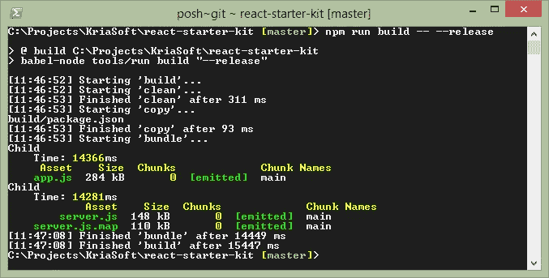

# 你可能不需要 Gulp.js

> 原文：<https://medium.com/swlh/you-might-not-need-gulp-js-89a0220487dd>

作为一名前端开发人员，您可能会注意到，最近一些人正在放弃使用构建自动化工具(任务运行器)，例如 Gulp 或 Grunt，转而使用定制脚本和 [npm 脚本运行器](http://substack.net/task_automation_with_npm_run)。这是什么原因呢？

像 [Browserify](http://browserify.org/) 和 [Webpack](http://webpack.github.io/) 这样的模块捆绑器正在稳步接管，留给 Gulp 基于流的任务的空间已经很小了。你以前用 Gulp 做的大部分工作现在都由 Webpack 处理了 JavaScript、CSS 和图像的捆绑和优化；代码拆分；不同环境的目标包(参见同构应用)。

使用 JavaScript 进行自动化构建的想法听起来很合理，因为它允许(1)减少前端项目和/或项目依赖性中使用的技术栈，(2)它真正是跨平台的(例如，与 bash 脚本相反)，以及(3)通过 NPM 注册表有大量的第三方库可供您使用，您可以直接使用，而无需在自动化脚本中添加插件。

下面是一个普通的 JavaScript 构建任务可能的样子(假设您正在使用带有 async/await 的现代 JavaScript 语法):

## 工具/build.js

您可以通过添加日志记录和错误处理功能来稍微改进它:

工具/build.js

## 工具/run.js

现在，您可以如下所示在 **package.json** 文件中列出您的脚本，并使用 **npm run build** 命令执行它。

## package.json

**tools/build.js** 脚本将被动态转换为 ES5 并由 Node.js 执行。无需安装任何全局依赖项即可运行(Node.js 和 npm 除外)。

顺便说一句，在 WebStorm IDE11 中，你可以直接从用户界面运行相同的命令:

如需完整示例，请访问 GitHub 上的 [React Starter Kit](https://github.com/kriasoft/react-starter-kit) 。

发表于*[**【SWLH】**](https://medium.com/swlh)**(***创业、流浪、生活黑客)**

******