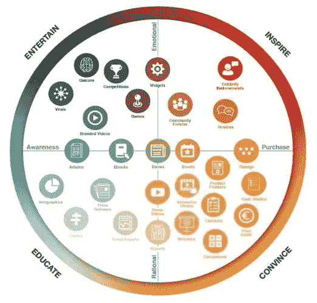
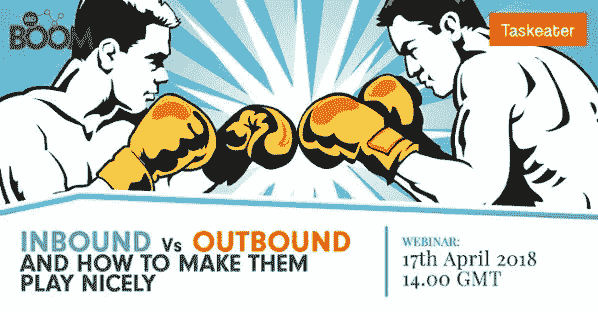

# 你需要外向营销来支持你的内向营销

> 原文：<https://medium.com/swlh/you-need-outbound-to-support-your-inbound-marketing-3603be7ff3d7>

## 用外向营销支持内向营销的 4 种主要方式

## 继续我们最近的文章，比较这两种策略([入境与出境，哪个真正有效？](/swlh/inbound-v-outbound-which-really-works-17bbcc7fd625))，我想写一篇文章来阐述外向战略和渠道如何支持内向策略，并让你的努力更有效。

如果你错过了上周的文章，回顾一下一些定义，这两种策略的线索就在名称中:

*   **外向**是你向潜在客户发送一条或多条信息的地方。这可能包括电子邮件推广、电话营销、横幅广告等。你正在积极寻求潜在客户的任何营销
*   **呼入**是指潜在客户通过制作信息丰富、引人入胜的内容，自愿进入你的网站或邮件列表。这可以通过你的博客，下载电子书，注册时事通讯或网上研讨会等。

我想强调的关键点是**在这些情况下，决策不必非此即彼** —入站和出站需要彼此来产生结果。

集客营销非常有利于在受众中建立品牌形象和知名度，这些受众更有可能尊重你在某个领域的权威，而不是阅读你的“开创性”“颠覆性”“业内最佳”冷冰冰的电子邮件。

**然而，入站也有缺点。仅仅因为你把观众带到了你的网站，让他们对你的内容感兴趣，并不意味着他们会很快(或者永远)转变。品牌意识和建立在线存在需要时间，如果没有这些即时的转化和结果，较小的公司和初创公司可能很难继续投资于内向战略。**

从长远来看，集客很重要，但是获得客户(尤其是获得合适的客户)需要时间。早期阶段的对外投资可以为你的对内投资提供资金，并帮助你度过初创企业财务不太稳定的阶段。事实上，如果你更有名气，呼出可以帮助你利用来自呼入销售线索或呼入受众的销售。

出站可以做的是利用您的入站努力来实现销售。**我将简要介绍外向销售可以为您的内向销售战略提供支持的四个关键领域。**

为了更全面地了解相似之处、不同之处以及您可以为您的业务利用的可能策略， [**请收听我们与入境专家 BBD Boom**](https://www.taskeater.com/downloads/inbound-outbound-lead-generation/) **的网络研讨会录音。**注册并接收网上研讨会的完整记录，包括演示幻灯片。

# 1.呼出有助于潜在客户分析

潜在客户特征分析对呼入和呼出策略都很关键——为了达成销售，你需要了解你的销售对象是谁。

虽然入站可以生成内容来吸引对特定领域感兴趣的特定人群访问您的网站，但出站可以让您直接向这些人传达为他们量身定制的信息。

随着电子邮件自动化和个性化的进步，以及人们在收件箱中花费大量时间这一简单事实，研究表明[电子邮件是 B2B 营销人员的首要线索和创收工具](https://www.marketingcharts.com/online/the-channels-and-content-types-b2b-marketers-say-are-generating-leads-and-revenue-74642/attachment/demandwave-b2b-lead-revenue-generating-channels-feb2017/)。

**如果你正在努力选择一个外出策略，下载我们的电子书:** [**为什么电子邮件比电话拜访多 11 倍的会议时间**](https://www.taskeater.com/downloads/outbound-strategy-why-emails-deliver-11x-more-meetings-than-calls/)

因为当你从对外宣传活动中得到回应时，你可以直接看到潜在客户如何参与你的产品，这些策略也使你能够更清楚地描绘你的目标人物形象，这反过来又使你能够创建更具体和定制的内容，以吸引合适的人到你的网站上。

**出库可以提供清晰度:**

*   现有的利益是你的产品或服务
*   哪些行业最需要你的产品或服务
*   最能引起共鸣的产品或服务信息
*   潜在客户的反馈将有助于塑造你的品牌形象和个性
*   反馈还会让你了解你的产品、服务或供应的可用性和质量

# 2.出站有助于利用您的内容

集客广告不起作用的一个最根本的原因是，营销人员和广告文案忘记了最终目标是什么——销售。

内容制作有 4 个关键目标——在提供的内容矩阵图中由 [CSDM](https://csdm.online/en/content/make-content-marketing-effective/) 说明。

Image Credit: [CSDM](https://csdm.online/en/content/make-content-marketing-effective/)

虽然教育和鼓舞人心的内容可能会吸引人们到您的网站，说服和说服您的观众是看到任何投资回报的关键。你需要确保产生富博(漏斗底部)内容来说服和转化你的客户，这些文章关注你的服务和产品，而不仅仅是用你关于感兴趣领域(而不是服务)的诱人豆腐(漏斗顶部)文章吸引他们。

**集客营销模式实际上是盈利的吗？**营销策略师 [Louis Gudema](http://louisgudema.com/) 在“【Hubspot 还能再做集客营销吗”中质疑集客营销的母船，而内容是集客营销的核心要素

对于 Hubspot 和那些购买 Hubspot 方法的公司来说，基于内容的高成本效益营销的承诺正受到挑战，因为购买该方法的公司数量庞大。

互联网上充斥着内容，营销策略师和作家马克·谢弗称这种现象为内容冲击。每个品牌及其竞争对手都在创造内容，旨在将人们吸引到他们的网站上，并建立人们一直追求的“思想领导力”，但有这么多的声音，越来越难穿过噪音。

此外，以集客方式(主要是通过社交媒体网络)分发内容的方式也发生了根本变化。LinkedIn 和脸书等平台已经改变了它们的算法，不再像以前那样适应链接。

为了盈利，我们思考内容分发的方式必须改变。正如 Louis Gudema 所探索的那样，甚至 Hubspot 也悄悄地开始在其营销组合中加入传统的“推送”广告和数字广告。

**利用外发电子邮件活动来传播内容，或者展示针对特定产品的内容，不仅有助于在高度饱和的市场中传播内容，还能看到内容的转化。**

# 3.出站有助于转化你网站上的访问者

展示广告是一种数字输出技术，投资回报率极低。所有形式和位置的展示广告的平均点击率[仅为 0.06%](https://www.thinkwithgoogle.com/intl/en-gb/tools/) 。更糟糕的是，现在全球有 1 . 98 亿活跃广告屏蔽用户。

展示广告和重新定位也令人沮丧——33%的互联网用户认为展示广告完全无法忍受。

通过重新定位富博的内容，或者通过识别对你的服务更感兴趣的内容和登陆页面，**你可以确保你的横幅广告被提供给有意向的访问者。**

这意味着你不会在那些刚好符合你的人口统计行业和地理标准的人身上浪费预算——那些会因为你的广告不相关而感到沮丧的人——而是会关注那些已经有兴趣解决某个特定问题的人。

更一般地说，重新定位仍然应该是你使用的一种技术，即使冒着你不会有很多转换的风险，因为**向内的一件事真的不能做的是在不知道他们有问题的人面前得到你的解决方案。**

# 4.出站技术可以扩大你的网络存在和在线范围

另一种解决内容饱和和社交媒体竞争的方法是利用他人的影响力来增加你自己的影响力。

影响者营销是在竞争中脱颖而出的一种方式。推荐比任何付费活动都更有说服力，70%的千禧一代消费者[在购买决策中会受到同伴推荐的影响，30%的消费者](https://collectivebias.com/blog/2016/03/non-celebrity-influencers-drive-store-purchases/)[更有可能购买名人博客推荐的产品。](https://collectivebias.com/blog/2016/03/non-celebrity-influencers-drive-store-purchases/)

**寻找有影响力的人是外联方法的用武之地** —通过电子邮件和社交消息联系并传达您的产品将扩大您的网络，并为内容分发提供潜在渠道。

有影响力的人还可以为你的文章提供客座博文和引用——当他们在他们的网络上分享时，这增加了你的影响力，也意味着你的网站有更多的访问者。

**自己为其他出版商或公司网站撰写客座博文是提高品牌知名度和影响力的另一种方式。**虽然这是一种基于内容的有效集客策略，但在网站上获得特色包括接触出版商和合作公司并建立关系。同样，电子邮件在这里是一个无价的工具，它创造了其他渠道所不能创造的可能性。

# 您可以使用出站来支持您的入站工作的一些主要方式

*   利用您的对外宣传活动为您的完美潜在客户构建清晰的画面，并了解他们从您的产品中获得了什么。
*   使用出站电子邮件将您的内容分发给合适的人
*   使用内容上的显示重定位来转化更多参与的销售线索
*   利用外向电子邮件活动招募合适的有影响力的人来扩大你的影响范围
*   使用出站电子邮件寻找客户写作机会，以提高您的思想领导力和品牌知名度

为了更全面地了解相似之处、不同之处以及您可以为您的企业利用的可能策略， [**请收听我们与入境专家 BBD Boom** 的网络研讨会录音。](https://www.taskeater.com/downloads/inbound-outbound-lead-generation/)

请鼓掌或分享我们的文章——我们仍然是媒体新手，感谢所有的支持！还将回复下面留下的任何问题或评论:)

# 丹·范伦宁

Taskeater 的常务董事，Taskeater 以前的客户之一。他有 16 年的销售经验，两个男孩，热爱橄榄球。[与丹连接。](https://www.linkedin.com/in/dan-vanrenen/)

## 这篇文章发表在 [The Startup](https://medium.com/swlh) 上，这是 Medium 最大的创业刊物，有 316，028 人关注。

## 订阅接收[我们的头条新闻](http://growthsupply.com/the-startup-newsletter/)。

