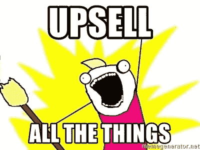

# 你需要销售订阅服务

> 原文：<https://medium.com/swlh/you-need-to-be-selling-subscription-services-f651fc53ce88>

不久以前，软件几乎总是作为你在商店购买并安装在你的计算机上运行的一个软件出售。如今，几乎所有的软件都是作为云订阅服务出售的。

它并没有止步于软件，现在一切都可以通过订阅服务获得。

## [来自福布斯](https://www.forbes.com/sites/richardkestenbaum/2017/08/10/subscription-businesses-are-exploding-with-growth/#4aab5f486678)

> 2017 年 4 月，订阅公司网站的访问量约为 3700 万。自 2014 年以来，这一数字增长了 800%以上。

如果你是一个企业主，你应该考虑转向这种模式，否则可能会失去通过订阅销售服务所能获得的主要好处。

订阅模式为您提供了更可预测的收入、更多的客户价值，以及更多追加销售高级套餐的机会。

# 为什么您应该以订阅的形式销售服务？

转向订阅模式的企业通常会立即看到三个主要好处。

## 可预测的收入流

试图创办服务型企业的人最大的抱怨之一是收入的不可预测性。他们并不总是确定下一个项目什么时候会到来，可能会有一段时间没有赚到钱。

当他们转向订阅模式时，这种不稳定性就会消失，因为你每个月都会得到一定数量的保证。这不仅是一个让你安心的好方法，也是一个很好的指标，可以显示你在任何给定时间的工作量，让你优化分配资源。

你也不再追着客户支付他们的发票，因为钱每个月都会自动从他们的账户中扣除，将付款责任放在客户身上，而不是你自己，从而节省了你的时间。

## 提升销售潜力

当客户订购你的服务时，你就有机会向他们展示你的质量。人们扣动昂贵服务扳机的最大障碍之一是信任，他们不相信他们会得到承诺给他们的价值。作为一家销售廉价订阅的企业，你可以向你的客户展示，他们可以通过获得与他们建立良好关系的机会，信任你购买更昂贵的商品。

关于如何在使用订阅模式时追加销售客户的一些提示:

*   给现有客户免费试用高级服务，让他们体验贵公司更昂贵的解决方案
*   告知您的客户他们可能感兴趣的相关服务。
*   将网关放在您的层上，这样当您的客户表现良好时，他们将需要升级，例如，一家 SaaS 公司可能会根据付费客户的数量来为他们的订阅选项定价。
*   为购买年度订阅的客户提供较大的折扣，一年的承诺是非常宝贵的资产。

## 数据驱动的业务

销售订阅的最大好处之一是您可以利用大量数据来做出决策。您可以通过获得的订户数量以及您的决策如何影响您提供的服务(通过查看流失率)来准确评估营销工作。

你掌握的信息越多，你就能做出更好的决定。

使用订阅数据进行决策时:

*   记录你的 MRR(每月经常性收入)和 ARR(每年经常性收入)
*   确保付费广告让你赚的比你花的多，密切关注转化率
*   询问客户对你的服务喜欢什么和不喜欢什么的反馈，以减少客户流失。

# 如何开始销售订阅？

如果你想出售订阅服务，但不知道如何开始，

## 找到一个平台来销售你的服务

不是每个人的网站都支持开始销售订阅服务所需的“理想”功能集，请确保您可以获得以下功能，以便为您和您的潜在客户提供最佳体验。

*   **自动计费** —这是必须的，能够放入信用卡并按月收费是任何订阅业务的核心。
*   **高级表单** —根据你的业务模式，你的潜在客户需要输入的数据可能会变得相当复杂，尤其是如果它们影响到账单的话。
*   **免费试用**——让顾客试用你的服务是获得顾客信任的好方法，如果你想让顾客上门，免费赠送东西几乎总是管用的。

如果你目前的网站不具备所有这些功能，请查看一下 [ServiceBot](http://bit.ly/2nEIkN3) ，这是一个让销售订阅服务变得极其简单的平台。

## 设计您的服务

将服务作为订阅出售的第一步是设计服务的“产品化”版本。这可以归结为在每个支付周期提供一个标准化的功能包。

这将使客户对将要交付的内容有一个很好的了解，并且由于标准化了工作量(消除了范围蔓延),还将使您的工作量保持可预测性

这里有几个要记住的提示

*   **为任何预算提供选项**
*   **提供免费试用，尤其是在刚开始时，以鼓励早期用户并建立信任。**
*   **尽早展示您对质量的承诺，并且经常展示，快乐的客户会和您在一起，并在未来花更多的钱**

# 结果不言自明

## 在美国，40%的收入来自回头客或回头客，他们只占所有游客的 8%

通过利用不断增长的订阅经济，转向订阅模式对您的业务有好处。这对你有好处，给你一个可预测的收入流和工作量。这对你的客户也有好处，让他们对如何花钱有更多的控制权，让他们有机会在启动更昂贵的项目之前与企业建立信任。

# 想开始销售订阅服务吗？[试用服务机器人](http://bit.ly/2nEIkN3)

## 这篇文章发表在[《创业](https://medium.com/swlh)》上，这是 Medium 最大的创业刊物，有 293，189+人关注。

## 在这里订阅接收[我们的头条新闻](http://growthsupply.com/the-startup-newsletter/)。

