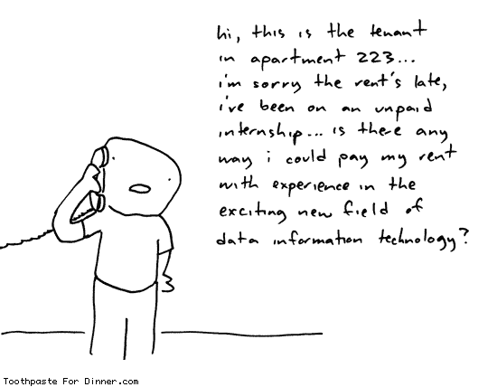
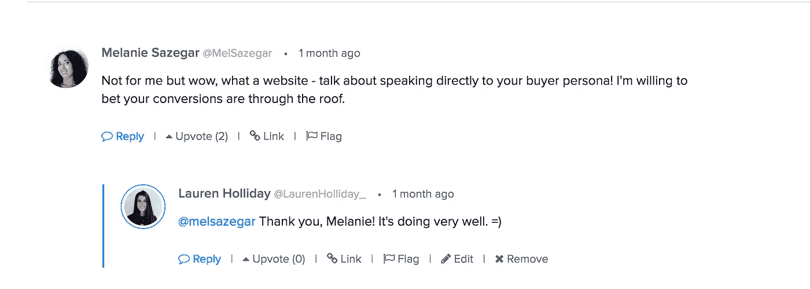
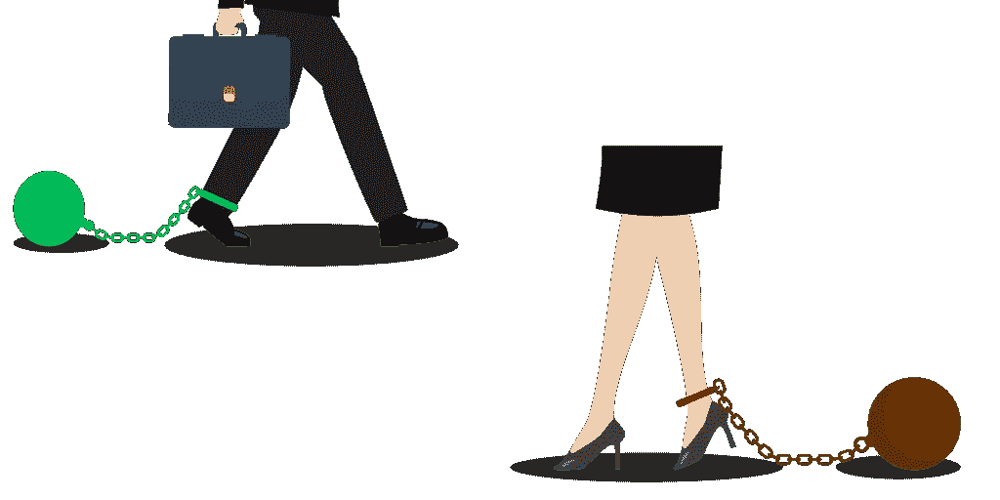

# 你需要变得擅长赚钱

> 原文：<https://medium.com/swlh/you-need-to-get-good-at-making-money-e1d85167c231>

Because you’re not Barbie.

> "一个聪明的人应该头脑里有钱，而不是心里有钱。"—乔纳森·斯威夫特
> 
> "每次你借钱，你都是在抢劫未来的自己。"内森·w·莫里斯
> 
> "你必须控制你的钱，否则没钱将永远控制你."戴夫·拉姆齐

四年前，我记得在麦当劳的免下车通道崩溃了，当时收银员认为我用便士支付我的 3 美元账单是个混蛋。她很快发现，当我热泪盈眶的时候，我不是一个混蛋。我只是破产了。

我破产了，事实上，我在向上帝祈祷，我的车不要马上就熄火，因为我付不起汽油费，它已经跑了一个星期了。

那是那个星期第二个因为我基本上是穷人而生我气的人。那周早些时候，我不得不取消一个会议，因为我没有足够的汽油去我需要去的地方。我对这个人很诚实(这是个坏主意)，但他们认为我不专业。

如果你读过我的《女服务员》一文，你就会知道我不得不让 T2 从大学退学，搬去和我爸爸一起住。

因为我不能养活自己，我不得不按照他的规则生活。

我不知道你怎么想，但我想按照自己的规则生活，而不是按照我父亲或任何人的规则生活。

> 对我来说，赚钱不是致富。相反，对我来说，赚钱是为了保持对自己生活的控制。

我再怎么强调财务独立对[的重要性也不为过。我花了很多年才学会如何赚钱。在这篇文章中，我将分享我一路走来学到的一些惨痛教训。](https://thebillfold.com/a-story-of-a-fuck-off-fund-648401263659)

## 第一课:免费工作真的不行。

> 三个月没有报酬是一段很长的时间，要求任何人无偿工作是不公平的
> 
> 泰勒·斯威夫特

在我父亲断绝我的经济来源之前，我是一名无偿的实习生。

我的实习经历很愉快。我喜欢和我一起工作的每个人。我喜欢专业的环境。我喜欢做真正的工作。那我为什么后悔免费工作呢？

因为免费工作对那些负担不起免费工作的人来说是不公平的。

正如我在最近的一篇文章中提到的，统计数据证明，少数学生能够实习，因为他们的家庭有资源支持他们，所以他们不必支付自己的账单。

让我们假装一下，除了我自己，我谁也不在乎。现在，免费工作可以吗？

我的回答仍然是一个响亮的他妈的不，因为这将伤害未来的我，[因为我学到了艰难的方式](/@laurenholliday_/why-i-gasp-dropped-out-of-college-5cafe6d3c072)。

如果你打算免费工作，那么[为了一个好的理由](http://volunteermatch.org)或者为你关心的人工作(尽管如果他们关心你并且有资源，他们会付你钱)。或者见鬼，给自己做点什么。

## 第二课:你的价值只和你上一份工作的价值相当。

> **“当计划退休时，许多美国人用他们过去考虑房地产或股票价值的方式来考虑他们的工资:它将永远上涨……**
> 
> 但是一旦人到中年，好日子就结束了。对大多数人来说，40 多岁是收入的高峰期，全职男性的收入中值在 40 多岁时徘徊在 52，000 美元至 40 多岁时的 54，000 美元左右。此后，中值收入几乎没有变化——50 岁至 54 岁的男性仍为 54，000 美元。换句话说，有 15 年的平台期。”
> 
> [来源](http://www.wsj.com/articles/SB10001424052702304453304576391734231318102)

你知道吗？通常情况下，一生工资增长的三分之二发生在你职业生涯的前 10 年。

辞去无薪实习后，我开始申请全职营销工作。

我现在有了所有这些伟大的经历，为什么没有人想雇用我，我天真地对自己说，但男孩，我错了。

雇主们不在乎我有很多宝贵的经验可以提供给他们。他们在我的简历上只看到“**无薪**实习生”

听到这样的话真是让人心力交瘁:我们认为你不适合这个职位，但我们确实有一份我们认为你非常适合的无薪实习，一遍又一遍。

我再也负担不起无薪实习了，但他们不在乎。

我很快意识到，我的价值取决于我上一份工作愿意支付给我的报酬；因此，我开始如饥似渴地阅读关于谈判的书籍。

## 第三课:希望你免费工作的人永远都希望你免费工作。

我不想放弃我的无薪实习，因为正如我前面提到的，我喜欢我所做的事情和我的同事，所以我决定说服我的老板给我报酬，让我全职工作。

令我天真沮丧的是，他们说没有。他们只是带来了一个年轻的无薪实习生，我最近才培训了他，所以他们不需要我。

那时我才明白，仅仅因为你免费工作并不意味着你会从中得到任何东西。

## 第四课:讨人喜欢很重要。

> **“永远不要害怕给东西定价。”**——[杰森·弗里德](http://www.inc.com/magazine/20110301/making-money-small-business-advice-from-jason-fried.html)

我仍然纠结于这一课，因为我只是想帮助每个人…嗯，*当然是我喜欢的每个人*。

正如 Fried 在他的文章中所说，“人们会为他们喜欢的东西付钱给你”，如果你是他们最喜欢的人，他们会给你更多的钱。

不管你喜不喜欢，讨人喜欢在生活中很重要。

> **“讨人喜欢的人更容易被雇用，在工作中得到帮助，从别人那里得到有用的信息，并且错误得到原谅。**麻省大学的研究人员去年对 133 名经理进行了一项研究，发现**如果一名审计师讨人喜欢，并给出了条理清晰的论点，经理们往往会遵从他的建议，即使他们不同意，而且审计师缺乏支持证据。** [来源](http://blogs.edweek.org/topschooljobs/k-12_talent_manager/2014/03/likeability.html)

## 第五课:只卖你相信的东西。

一天下午，我在星巴克和一个潜在客户打完电话后，坐在我旁边的女人说:你做得真的很棒。你很擅长销售。我被侮辱了。我不是销售人员。恶。我抽搐只是想到它。

我们根深蒂固地将销售人员(赚钱的人)与混球联系在一起，但所有的销售人员(赚钱的人)都不是混球……如果他们卖的东西是他们相信的，并且他们自己已经取得了成功，那么他们就不是混球。他们是帮手。他们希望与他人分享财富，但他们不能免费这样做，因为他们需要生存。

我只卖我相信的东西，这就是为什么我如此擅长销售，尽管承认这一点让我很痛苦。

我不接受我不喜欢、不信任的客户，也不接受那些为客户提供零价值的客户。我是营销人员，不是魔术师。我不能让劣质产品卖出去，而且我也不想让我的名字和垃圾联系在一起。

## 第六课:真实是值得的…在你建立信誉之后。

> “在社会心理学中，**摔倒效应是个人犯错后吸引力增加或减少的趋势，**取决于个人在一般意义上表现良好的感知能力**。平均而言，一个被认为有能力的人在犯了大错后会更受欢迎，而如果一个被认为普通的人犯了错，情况就会相反。”**

**相信我，我是个作家；我知道脆弱有多可怕。**

**但相信我，我是个营销人员，所以我也知道脆弱有多好。**

**我不是(也不建议)总是脆弱的，尤其是如果你在职业生涯的早期，但我会告诉你，一旦你建立了信誉，脆弱就有卖点。**

> **通过让自己变得脆弱，有可能在比清理洒了的拿铁咖啡更短的时间内建立信任。 [来源](http://www.fastcompany.com/3054275/how-to-be-a-success-at-everything/the-secret-to-getting-other-people-to-trust-you-quickly)**

## **第七课:太专注了，你惹怒了不该惹的人。**

**当我启动我的[课程](https://hackthejobhunt.com)时，我非常紧张，因为网站有点……嗯……吵。**

****

**[https://hackthejobhunt.com](https://hackthejobhunt.com)**

**我知道这会触怒一些人，事实也的确如此…**

****

**…但只是错误的人的羽毛，像律师，他肯定不是我的观众，以上。**

****

**皈依者人数激增。该课程在不到两天的时间内售罄([现在重新开放](https://hackthejobhunt.com))，而这还是在我写了[一篇博文](/@laurenholliday_/fuck-college-get-money-94ebfb0ccf51)之后。**

## **第八课:公平。**

**你不需要对你的竞争对手做的事情收费。如果[我收了](https://hackthejobhunt.com)大学的学费或者这些一万多美元的训练营，我就发财了。**

## **第九课:赚钱是激励。**

> **“为某样东西收费会让你想把它变得更好。”—杰森·弗里德**

**为某样东西收费会迫使你变得更好，因为你想确保人们从你的产品中获得价值，但更重要的是，当客户为某样东西付费时，他们会给你真正诚实的反馈。**

**你应该想被强迫做好你的工作。它给你带来了这种好的压力。**

**自从出售了我的课程，我每天起床都不会晚于 8 点，而且我保证我几乎一整天都可以为我的学生服务。他们为我的课程付费，所以我想确保他们从中受益。如果不这样，我晚上就睡不安稳。**

## **第十课:价格不应一成不变。**

**最近我收到了很多邮件，要求我解释我是如何收费的(d)。我不喜欢这个问题，因为我的价格根据时间和实验一直在变化。**

**以下是我测试过的一些不同的定价结构:**

**我讨厌按小时收费，因为按小时收费不利于高效率的人。**

****基于项目的定价:**基于项目的工作，你在项目开始和结束时都会得到报酬。例如，当我为某人制作网站时，我在开始之前先支付一半的款项，然后在客户满意后再支付另一半。**

**[**基于价值的定价**](http://99u.com/articles/38599/what-should-i-charge-how-to-justify-your-freelance-rates) **:** 这种定价策略根据对客户的价值而非产品成本或历史价格来定价。**

****VIP 日:**VIP 日是我以前提供给客户的套餐，他们希望我去他们的办公室。我会给他们 4-6 个小时的时间，每天 300 美元。这些卖得很好，因为它是一个小的价格和短的时间框架。**

> **“大的数字和长的时间框架让人紧张。”— [杰森·弗里德](http://www.inc.com/magazine/20110301/making-money-small-business-advice-from-jason-fried.html)**

**最近，我为每月一次的家臣工作。例如，我每月工作 20 个小时，可以得到 6000 美元。(每两周支付一次)**

****每周冲刺:**我测试的另一个结构类似于 VIP 日，但它是 VIP 周。而这些不一定发生在办公室。相反，它关注的是可交付成果。**

# **外卖:生活不是免费的**

**只要你活着，你至少需要吃的食物和住的地方——这两者都需要钱。**

****

**除非你是芭比娃娃、糖宝宝、T21 或茶杯吉娃娃，否则没有人会支持你的生活，所以不要指望你的父母、丈夫或妻子——不管是谁——会为你的免费工作买单。这对你，对他们，对我们这些拼命养活自己的人都不公平。**

****

## ****如果你想学习如何通过成为一名全栈营销人员来赚钱，** [**看看我的自定进度课程**](https://hackthejobhunt.com) **，它还有大约 10 个空位。****