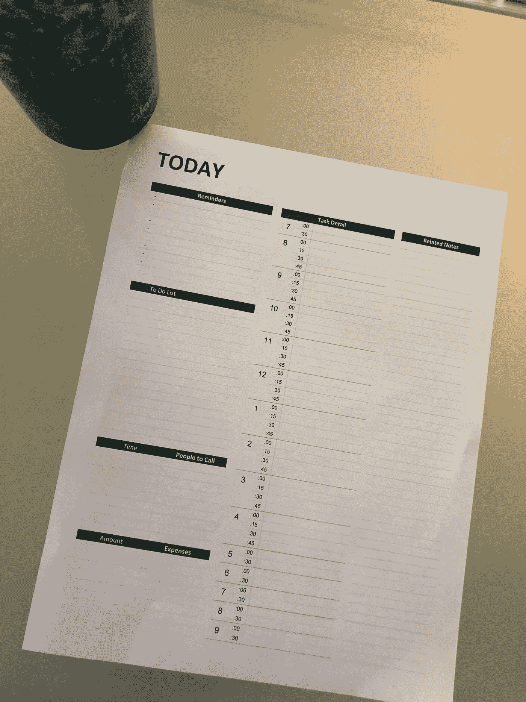

# 你需要一点一点地度过你的大日子

> 原文：<https://medium.com/swlh/you-need-to-get-through-your-big-days-with-tiny-bites-7e15736905fd>

## 当你把所有事情都分解时，不要被压倒

Photo by [Aron](https://unsplash.com/photos/BXOXnQ26B7o?utm_source=unsplash&utm_medium=referral&utm_content=creditCopyText) on [Unsplash](https://unsplash.com/search/photos/tiny-time?utm_source=unsplash&utm_medium=referral&utm_content=creditCopyText)

这个秋天把我带到了一百万个不同的方向。

我有一个新的咨询客户。几年前我的一个客户。刚刚又订婚了。

我对这个项目非常感兴趣。这个管理团队是我近年来最喜欢合作的团队之一。他们收到了大量的现金。这家公司肯定会大有作为。优化公司战略是一种有趣且富有挑战性的动脑方式。

所以，这个闪亮的新项目最近吸引了我的很多注意力。

有优秀人才的新项目非常有趣。

我有点想整天都做这个项目。忘记我生活中的其他事情。那些无聊、困惑或者没什么回报的小任务。我为什么要做一些不会给我带来新项目的多巴胺的事情呢？有时候甚至很难记起。

但后来我退一步。我还有写作目标。我不仅希望继续我一直在做的事情，还希望弄清楚如何以及在哪里扩展。

另外，我还有两个孩子、一个丈夫、一只狗和一栋房子。自我保健、跑步、瑜伽和充足的睡眠。这些对我来说也很重要。

我知道我想在所有这些方面不断进步。不是每件事都可以优先考虑，但每件事至少需要我一天中的一小部分。

当我想到这一切，我的心开始狂跳。我的大脑完全被淹没了。我的反应是要么躲在闪亮的新项目中，要么什么都不做。因为我不知道该转哪条路或者先做什么。

但是我有一个比以前更好的处理事情的系统。尤其是在日常生活中。一种有意为每件事腾出时间的方法。每天都是。这样我就能自信地知道，随着时间的推移，所有的小事情都会积累成大的成果。我也不是在兜圈子。

我知道如果我计划好一切。我可以继续在对我来说重要的事情上取得进步。我不会把所有事情都“做完”。一点也不。但是我也不会因为这个有趣的新想法而分心，以至于其他事情(包括我自己)都半途而废。

我是这样做的:

## 列个清单。

老掉牙但很好吃。不浮华，不新颖。我把我必须做的事情列了一个清单。以随机的顺序。从为孩子们订购万圣节服装到为我客户的一件产品创建估价分析，无所不包。

所有微小的事情加起来就是你生命中重要的事情。

这个名单是不可知的。它不在乎哪些事“好玩”，哪些事“无聊”。所有的东西都包含在列表中。

关于这个列表的另一个重要的心态是，我还不需要知道我什么时候在做所有的事情。或者甚至将所有任务组合在一起。顺序是随机的。因为我不想成为完美主义者。我不想打断思路。我想把一切都记下来。

关于待办事项清单，人们已经写了很多，说了很多。但我仍然认为这是实现目标最重要的第一步。因为当所有的事情都在你的脑海里飞来飞去时，任务量会变得巨大。没有方向。理论上，这个列表是有限的。你可以开始把东西组合在一起。看看哪些任务有助于保持你的动力。哪些需要完成，但不是优先事项。

还有一件事。列一张待办事项清单很少会花去我几分钟以上的时间。有时候会想起后来忘记的事情。但通常只是一两件小事。从来都不是紧急的事情。一旦你创建了一个列表，就很容易添加到列表中。

## 准确安排做任何事情的时间

这需要一些技巧。

我从不可协商的开始。客户会议。学校接送。我把这些塞进了我的生活。然后我算出还剩多少时间。我会填补我的空缺。

我很擅长计算某些事情需要多长时间。我知道写一篇 5 分钟的中型文章可能需要 2 个小时。也许我应该更快，或者更慢。但这就是我需要的时间。您的时间可能会有所不同。

所以当我把事情放在我每天的日程表上时，我会把它具体化。以 15 分钟为增量。

我以前用一张普通的纸。但是我最近开始使用一个从网上免费下载的模板。看起来是这样的:

Photo by me.

这样，我就能准确地知道我一整天都在做什么。

我确保在**缓冲时间**内安排。每天有 30 分钟或更多的时间用于意外情况的发生。或者，如果我即将完成某件事，我可以利用这段时间去做。

我也安排在**停机**。我使用的时间表到晚上 9:30。但是我是一个早起的人。所以，我的一天从早上 5 点或 5 点半开始。我总是确保安排时间吃午饭。通常，去遛狗。大中午的休息时间给自己充电。但是到了晚上 8:30 我就完蛋了。所以像叠衣服这样的事情会在一天结束时进行(根本不用大脑)。晚上 8:30 以后，我就下班了。是时候看电视或其他形式的植物了。无罪恶感。因其**有心无脑**。

## 使用计时器

这些天我越来越依赖计时器了。当我陷入一个工作项目或写作项目时，我会失去所有的时间观念。我变得热情，不想停下来。但我知道我需要转向下一件事。如果我想在很多方面继续进步。

所以，我设置了我的计时器。

根据我整理的时间表。我设置了我需要的时间，减去 5 分钟。我知道我需要最后 5 分钟来结束。或者转变我的大脑。我的一天将会是一列失控的火车，没有我计时器的超人主题播放来让我知道是时候继续下一件事了。

## 接受我的清单不会在一天内完成的事实

这对我来说是最难的部分之一。我是一个完美主义者。我想要完美的一天。我和孩子们一起烤饼干的那个。进行杀手级客户演示。去跑 10 英里。然后写一万字。任何达不到这一点的东西都会让人觉得失败。失败的想法让我避免做任何事情。但是，那一天不存在，也永远不会。

相反，我承认有些东西会留在清单上。那就得推后一天，甚至一周。有时候很难。告诉我的孩子们他们的万圣节服装将不得不等待我的心弦。但实际上，我们还有很多时间。他们将在 10 月 31 日前完全装备好。

原来如此。我用这个系统来分解它。安排所有的小事。确保我的一天在大事上有所进展。每一件小事都是为了我更大的目标而有意构建的。

然后我就不用担心我是否在做正确的事情，或者让一些东西从缝隙中掉出来。我制定了一个计划。我知道该怎么做。

我要做的就是执行。

有了正确的框架和正确的心态，一切皆有可能。

*你是否觉得想要完成更多工作，但又不确定是什么阻碍了你？参加这个测试，找出 https://www.debknobelman.com/quiz*

## 这篇文章发表在 [The Startup](https://medium.com/swlh) 上，这是 Medium 最大的创业刊物，有+ 375，041 人关注。

## 订阅接收[我们的头条新闻](http://growthsupply.com/the-startup-newsletter/)。

