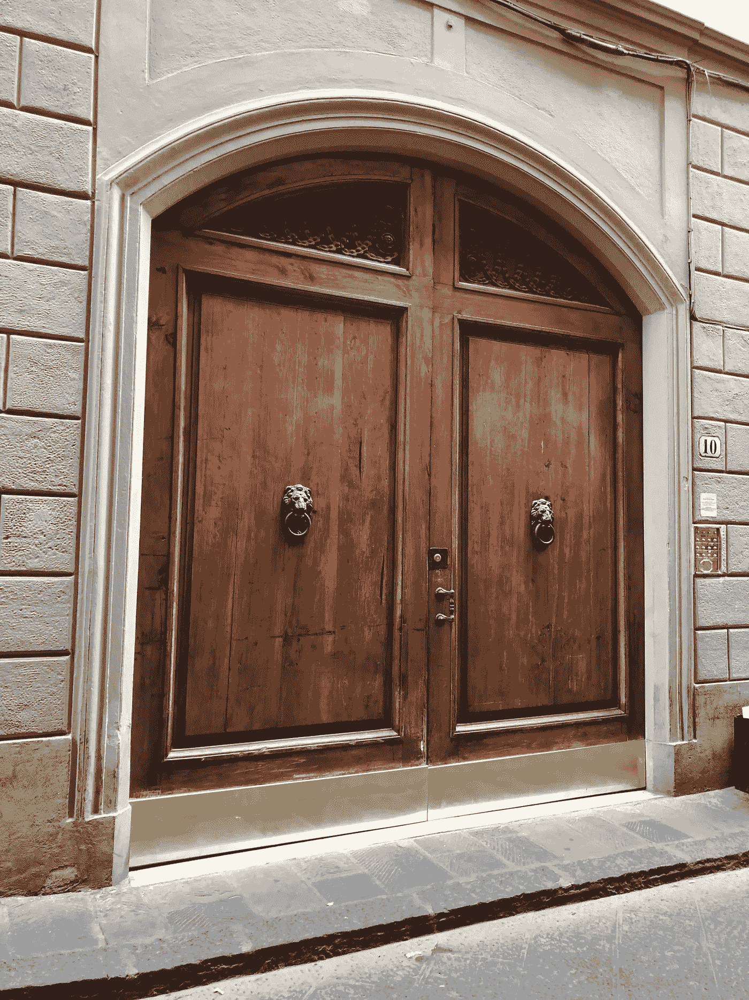

# 你需要有意识地暂停工作

> 原文：<https://medium.com/swlh/you-need-to-take-intentional-breaks-from-productivity-5b05ddb39eab>

## 有意的休息可以让我们更接近目标

Photo by [Andrew Bui](https://unsplash.com/photos/z7rzbFHXym0?utm_source=unsplash&utm_medium=referral&utm_content=creditCopyText) on [Unsplash](https://unsplash.com/search/photos/freedom?utm_source=unsplash&utm_medium=referral&utm_content=creditCopyText)

我一直是一个“多产”的人。之前有上千篇关于晨练和日常锻炼的文章。我倾向于结构，倾向于奋斗。

即使回到 20 世纪 90 年代的大学时代，我仍然记得在早上 8 点穿过寂静的校园。来开始我的化学实验室工作。几个小时后，当我回到房间时，我的室友刚刚醒来。

我也喜欢给自己设定目标。我总是有想法。有时这是一个愿望。有时候这是合乎逻辑的下一步，比如升职。从我记事起，这就是我为自己做的事情。因为之前它是一个“东西”

但是，所有这些为目标而奋斗，所有这些不屈不挠的生产力都有黑暗的一面。有时候，对目标的追求会变成对完美的追求。如果我们没有在设定的时间内达到目标，我们会自责。目标本身甚至很难成为奖励。达到目标是避免自我打击的一种方式。

但是，众所周知，完美是不可企及的。

对于我们这些不懈奋斗的人来说，我们需要计划一次生产率的突破。一个我们停止成就并花些时间去体验的特定时间。做能丰富你生活的事情，但不要“完成”任何事情。

**这里有三个故意中断生产力可以带来的好处:**

## 确认你的目标仍然是你想要实现的

我现在正在度假。当我写这篇文章时，我正坐在意大利佛罗伦萨清晨的空气中。沉浸在城市的声音和意大利语言的音乐中。但是我今天早上写这篇文章并不是因为这是我实现写作目标的战略步骤。而是因为我有话要说，觉得不得不说。

我告诉自己，如果我不想写，这两个星期我完全可以不写。但我发现我还是喜欢。提醒我写书的目标仍然与我的价值观一致。我想要的东西。而不是不花任何时间去登记就直奔目标。我知道我仍然朝着正确的方向前进。

## 证明你可以信任自己

有时候我们每天都在不停的磨，因为我们害怕。**害怕如果我们休息一天，如果我们在通往目标的道路上偏离了一步，我们将永远无法回到正轨。我们会“掉下马车”,跌进沟里，再也爬不起来。**

但是，这是完美主义的想法。没有马车，也没有沟渠。无论你做了多少计划，通往你目标的道路永远不会是笔直的。

所以，和自己发展更好的关系吧。有计划、有目的地休息一段时间。然后回到你的目标。相信自己。当你看到自己值得信赖时，你会更加自豪。

## 乐趣是享受旅程的提醒

记得好玩吗？

对我来说，成为一个天生多产的人的另一面是我不是一个天生有趣的人。乐趣需要自发性。快乐需要你愿意闭上眼睛向前走，伸出双手，四处摸索。

但是花两个星期没有结构帮助我更多地了解自己。这提醒了我享受生活的乐趣。也是一种找到我从未意识到自己喜欢的新体验的方式。

我佛罗伦萨之行最愉快的部分不是博物馆或教堂。它一直在佛罗伦萨城内游荡，没有任何预定的目的地。虽然大教堂令人叹为观止，但佛罗伦萨的所有小部分甚至更好。看看这个城市所有漂亮的门(我在下面包括了一个)。街头的意外艺术。提醒你，并不是每段旅程都需要一个目的地来提供价值。

One of the beautiful doors in Florence, Italy. Photo by Me.

现在是夏天。你在努力工作。制定一个意向计划来充电。检查你的目标。来证明你可以相信自己。为了开心。

你会对自己的目标和实现目标的能力重拾信心。这是我们都需要的心态，带我们去我们想去的地方。

## 这篇文章发表在《初创企业》杂志上，这是 Medium 最大的创业刊物，有 344，974 人关注。

## 订阅接收[我们的头条新闻](http://growthsupply.com/the-startup-newsletter/)。

