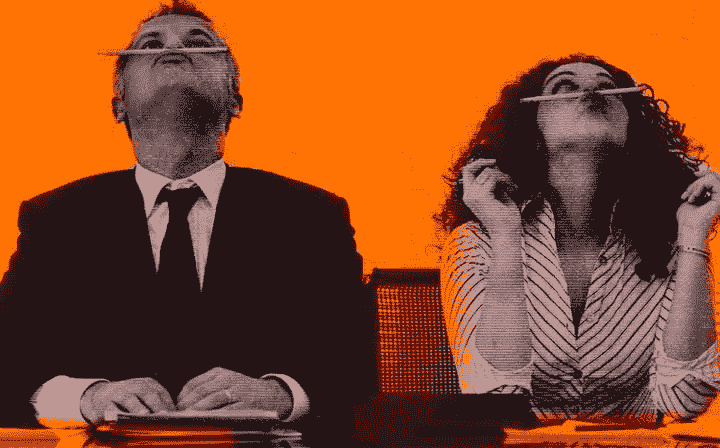

# 你永远也不想成为房间里最聪明的人:不要试图成为。

> 原文：<https://medium.com/swlh/you-never-want-to-be-the-smartest-person-in-the-room-quit-trying-to-be-c586245c879d>

我不断地犯愚蠢的错误。在我所有的在线简历中，我都用“声名狼藉”这个词来形容自己。

然后，一个非常聪明的粉丝给我发了电子邮件，说:“蒂姆，用‘声名狼藉’这个词来形容你的工作是最糟糕的。”

**他意识到，即使作为一名成功的博客写手，我在很多事情上也很笨。我对语法、拼写，甚至是词汇量都一窍不通。对一个博客作者来说很疯狂吧？**

正是像这样的时刻，我感到幸福。我一直自豪地宣布，我想成为房间里最笨的人。

> 聪明的定义:做了一些改变世界的事情，帮助了很多人，或者是某个领域公认的专家。

## 这就是为什么你永远不想成为房间里最聪明的人:

# 比你聪明的人能看到你看不到的东西。

几年前我以为自己真的很聪明。我发现了比特币，并认为我将从我所知道的东西中获利。

比我聪明的人解释说，比特币价格上下波动很大，现在不是买入的时机。

他们是对的。如果我不让比我聪明的人看到我看不到的东西，我业余的投资头脑早就让我赔钱了。

这些同样聪明的人阻止我在一个好的郊区买房子作为投资，因为他们可以看到，相对于该地区的其他房产，我支付的价格太高了。

> 我的大脑痴迷于邮政编码，而比我聪明的人则专注于投资的数学计算(这是我不擅长的)。

和聪明人在一起可以让你有第二双眼睛，在他们选择的专业领域比你更有经验。

# 最笨是一种力量。

你和聪明人坐在一个房间里的次数越多，你学到的就越多。真正聪明的人喜欢分享他们的知识，并欣赏愿意接受他们教导的人。

我想起了*“你不能责怪他们的尝试”*这句话。你可能不得不影响人们进入那个充满聪明人的房间。

这需要自信和对自己的信念，以及你的未来。这种态度和信念是一种力量。

# 最笨的人可能会争先恐后地进入房间(这很聪明)。

在满是聪明人的房间里做最笨的人很难。与取得最高成就的人共处一室并不容易。

房间里最笨的家伙经常被排除在房间之外。这就是我们生活的精英文化。你必须努力才能和埃隆·马斯克、理查德·布兰森或托尼·罗宾斯共处一室。

这些家伙不会随便邀请任何人参加他们的会议。你必须努力才能和他们共处一室。即使你可能一事无成，他们也必须相信你。

足够大胆地与聪明人共处一室将会阻止你长期成为一个失败者。

# 聪明通常意味着“无所不知”

并非所有聪明人都适合共处一室。他们中的许多人认为他们的大便不臭。有时候不是房间里最聪明的人也不错。

作为所谓的“最笨的人”进来可能是一个长期的优势。

当我是房间里最笨的人时，我也是最愿意成长并被证明是错的。

当其他人都在放弃头衔，让他们的自我主宰时，我只是一个坐在后面做笔记的谦卑的哑巴——你可以说是一个安静的成功者。

# 最笨让你不舒服。

成为房间里最笨的人并不容易。

当房间里的其他人都知道他们在谈论什么，而你不得不坐在那里谷歌他们说的每一句话时，这可能会很不舒服(我已经这样做了很多次)。

不舒服是指你学到了在正常环境中学不到的东西。你获得了 10 倍的知识，而且获得得更快，因为你已经力不从心了。

> “得到房间里最笨的人的工作的最好方法是主动提出做会议记录员”

# 房间里最笨的人可以接受失败。

成为最聪明的人往往会让你害怕失败。聪明人喜欢保持他们的“聪明状态”,所以承认失败或走向死胡同并不总是他们的首选。

> **《不要低估哑巴地位的力量》**

Image Credit: [TONY KELLY](http://WWW.TONYKELLYWORLD.COM)

# 和聪明人在一起会提高你的标准。

和聪明人在一起会迫使你提高自己的标准。如果我们假设他们已经掌握了他们生活中的一个领域，使他们变得聪明，那么他们可能会提高你在这个领域的标准。

我曾试图在商业谈判中做出许多愚蠢的决定，而在解决问题时，比我聪明的人能够向我展示更好的策略。

我发现和我在一起的聪明人不太可能接受我的胡言乱语。

他们已经达到了人生中的某个阶段，他们希望你也能达到那个阶段——尽管可能没有那么明显。

# 成为房间里最笨的人意味着目标更高。

当我们志存高远时，我们喜欢成为房间里最笨的人。

> **整个短语*“房间里最笨的”*比喻目标比别人高。**
> 
> 与其说是愚蠢，不如说是聪明。这是两个人思考方式的区别。

这是一种不同的体验，而不是对人类智力的测试，如果你从远处观察这篇文章，或者是这篇文章的评论家，听起来就是这样。

# 最笨是一种选择。

没有人会强迫你成为房间里最笨的人。你可能运气好，被选中，但可能性不大。与比你聪明的人共处一室的天赋经常被忽视。

敢于梦想。

敢于认为有一天你可以自己改变世界。

向拥有你所缺乏的经验的人学习。

# 行动呼吁

如果你想提高你的工作效率，学习一些有价值的生活窍门，那就订阅我的私人邮件列表吧。你还将获得我的免费电子书，它将帮助你成为改变游戏规则的在线影响者。

[**点击这里马上订阅！**](http://timdenning.net/free-ebook)

## 这篇文章发表在《T4》杂志《创业》(The Startup)上，这是 Medium 最大的创业刊物，拥有 333，253+读者。

## 在这里订阅接收[我们的头条新闻](http://growthsupply.com/the-startup-newsletter/)。

