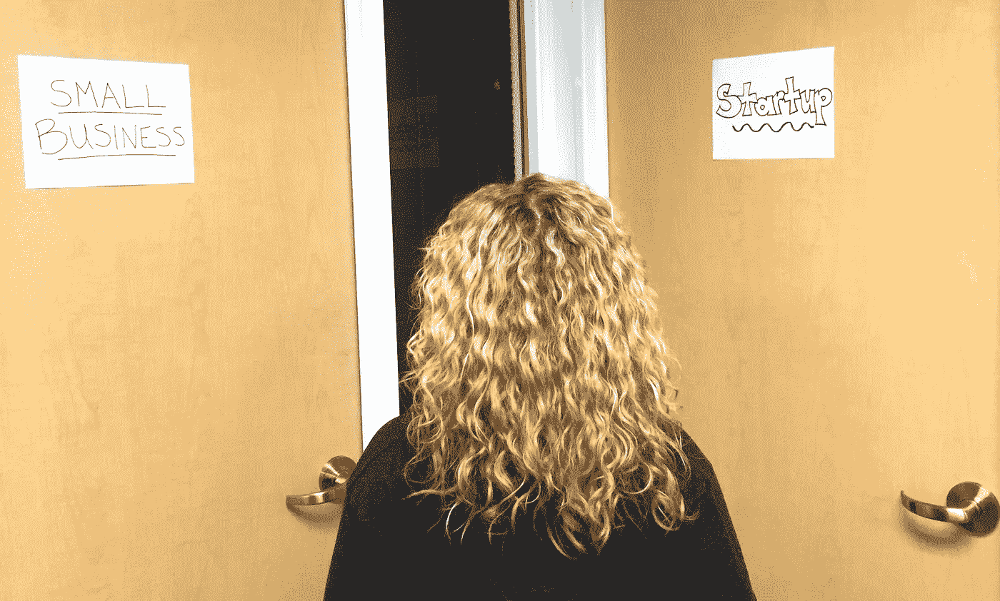

# 你认为你是一家初创公司，但你实际上是一家小企业(这也很酷)

> 原文：<https://medium.com/swlh/you-think-you-re-a-startup-but-you-re-really-a-small-business-and-that-s-totally-cool-too-cd45ff80e6be>

创业公司看起来很迷人。这个笨拙的大学辍学生把自己锁在车库里几年，以创造将会彻底改变世界的技术。这是我们现在都非常熟悉的一种说法。多亏了像《鲨鱼池》、《T2》【硅谷】这样的节目，以及像《T4》、《社交网络》和《工作岗位》*这样的电影，越来越多的人放弃了他们朝九晚五的工作，扔掉了他们的西装和公文包，买了一张去 Startuplandia 的单程票，以追求创造下一个大事件。*

*但对我来说越来越明显的是，创业并不适合所有人。在过去两年指导了数百名初创公司创始人后，很明显，他们中的许多人并不像他们应该的那样了解创办一家初创公司和发展一家小企业到底意味着什么。这是一个非常重要的区别。这很重要，因为取决于你想让你的企业变得多大，你想让它增长得多快，以及你想在它的未来扮演什么角色，你需要制定一个特定的战略。这种策略并不总是意味着典型的创业方法。*

*因此，通过这篇博文，我的目标是为那些考虑创业的人提供一点清晰的思路。希望当你读完这本书的时候，你能辨别出创业公司和小企业之间的主要区别，并能更好地决定哪一个最适合你。*

*哦，让我先解释一下:在某些圈子里,“创业”这个术语不是用来描述一种*类型的*业务，而是任何给定业务所处的*发展阶段*(即所有业务在开始时都是创业)。**然而，在这篇文章中，我将“创业”定位为一种*类型的*业务，这种业务*与小企业*确实不同。我这样做是因为从我的经验来看，创始人对 T21 的意图似乎有所不同。举例来说，一位创办了一家初创公司*的创始人打算*尽可能快地扩大她的/他的业务；而一个小企业的创始人打算在她/他愿意承担的特定范围内发展他/她的业务。***

*好的，这就是…*

# ***创业公司和小企业的 10 个区别:***

# *1.创新ˌ革新*

****你要从零开始创造多少？****

*   *小企业:有很多人已经做了你将要做的事情(例如，发廊、餐馆、律师事务所、博客/虚拟博客)，你可以参考他们的蓝图来建立自己的企业。*
*   ***创业:**创新是必须的。作为一家初创公司，你将会创造一些新的和/或比现有的更好的东西。例如，你可能创造一种新的产品类别(如可穿戴设备)、一种新的商业模式(如 Airbnb)，或者一种全新的技术(如 3D 打印)。*

# ***2。标尺***

****你的生意会有多大？****

*   ***小企业:**小企业在自己设定的固定界限内运营。换句话说，你故意限制自己的增长，专注于服务一定数量的客户。*
*   ***初创公司:**初创公司通常不会限制自己的发展，并渴望尽可能做大。你的目标是获得如此大的影响力，以至于你可以被视为对市场具有“破坏性”。*

# ***3。增长率***

****你的业务增长会有多快？****

*   *小企业:当然，你希望发展得越快越好，但你最关心的是盈利。一旦出现这种情况，你可能会考虑谨慎扩张。*
*   *创业:你对尽可能快地成长感兴趣，并创造可重复的商业模式。你希望能够在全世界复制你的成功。*

# ***4。利润***

****多久能赚钱，能赚多少？****

*   *小企业:你从第一天起就开始创造收入，如果可能的话，还有利润。你渴望获得多少利润取决于你个人想要多少钱，以及你的扩张计划是什么。*
*   *创业:你可能需要几个月或几年的时间才能赚到一毛钱。你主要专注于打造一款人们喜爱的产品，从而获得大量用户。如果你的计划成功了，财务收益将是天文数字。(优步目前的估值是 500 亿美元——没错，是带“b”的 10 亿美元)。*

# *5.融资*

*你需要借多少钱？*

*   *小企业:为了起步，你需要依靠你的个人资金、家人和朋友的捐款、银行贷款和/或投资者的资金。然而，你的目标是自我维持，所以你要仔细监控你融资了多少钱，要认识到这些钱都需要连本带利的偿还。*
*   ***创业:**很多创业公司最初都是自筹资金，或者靠家人朋友的捐款支持。众筹活动也越来越受欢迎。尽管如此，初创公司最常见的融资途径是从天使投资人、投资人和风险投资人那里筹集资金。作为一家初创公司，你希望实现快速增长和扩张，需要额外的资本来维持，直到你能够创造自己的收入并实现盈利。请注意，你的投资者会期待尽可能大的财务回报，所以会有额外的成功压力。(值得注意的是，一些人认为[初创公司没有必要依赖风险投资](https://hbr.org/2013/07/how-startups-overcome-the-capi/)。*

# *6.技术*

****运营您的企业需要技术吗？****

*   ***小型企业:**不，这不是必需的，但是有大量的技术产品可以帮助您满足核心业务需求(例如营销、会计)。*
*   ***初创公司:**技术往往是初创公司的核心产品。然而，即使在情况并非如此的情况下，初创公司仍然可能依赖技术来帮助他们实现快速增长和大规模的目标。*

# *7.寿命*

****你的企业会存在多久？****

*   ***小企业:** [32%的小企业在前 3 年内倒闭](https://www.linkedin.com/pulse/20140915223641-170128193-what-are-the-real-small-business-survival-rates)。与创业公司相比还不错…*
*   ***初创公司:** [92%的初创公司在前 3 年内都会失败](https://s3.amazonaws.com/startupcompass-public/StartupGenomeReport2_Why_Startups_Fail_v2.pdf)。哎呀！我知道。)*

# *8。领导力*

*你将监督多少人？*

*   *小企业:你可以期望领导，但是在你预先建立的增长结构内，你的企业需要多少人来经营。*
*   *因为你的目标是尽可能快地发展壮大，所以你真的需要集中精力发展你的领导和管理技能。随着你的业务增长，你将不得不有效地领导越来越多的员工、投资者、顾问和其他利益相关者。*

# ***9。生活方式***

****你会有多少工作/生活平衡？****

*   ***小企业:**与初创公司相比，你的风险要低得多，你对风投的承诺也是一样，要尽可能快地成长。这个现实*可能*给你机会建立一个你认为可以接受的工作/生活平衡。但是，话说回来，你是在为自己创业，这总是会带来一些有趣的挑战，而大多数朝九晚五的人从来不必应对这些挑战。所以我要说:这将会很费力，尤其是在开始的时候，但是你有希望建立一个你满意的工作/生活平衡。*
*   ***创业:**如果你接受投资者的资金，你就有义务将你的公司发展到让你的投资者获得尽可能大的回报的程度。考虑到这一点，根本就没有太多的休息时间来“磨磨蹭蹭”你有一大堆人等着你去破解密码，并在不可能的情况下取得成功，这意味着曾经的工作/生活平衡看起来更像这样:工作/工作/工作/生活— *那是什么？**

# *10.退出策略*

*你能继续追求其他项目吗？*

*   ***小企业:**你的愿望可能属于将你的小企业传给下一代家庭成员，或者将它卖给一家更大的公司。*
*   *初创公司:你通常会瞄准一个非常大的目标，比如出售或首次公开募股。*

**但是创业公司就不能变成小企业，或者小企业就不能变成创业公司吗？是的，这取决于你是否决定做出改变。有时，这种转变是由你做出的个人决定引发的(例如，你的意图或梦想的改变，你希望你的企业成为什么样子)，有时是由外部因素引发的(例如，产品需求、市场变化)。**

*无论哪种方式，理解创业公司和小企业之间的差异，并认识到你选择最适合你的个人能力，是一项重要的技能。这是一种技能，它将帮助你调整你的行动以符合你的期望，并使你能够选择正确的计划来达到你想要的目的地。*

# *感谢阅读！如果你喜欢这篇文章…*

## *在 [Instagram 上打招呼](http://instagram.com/mandelash) | [脸书](http://facebook.com/mandelash) | [推特](http://twitter.com/mandelash) | [YouTube](https://www.youtube.com/channel/UC1XemKTBoMTxK3rgUSDFIVg)*

## *订阅我的简讯[这里](http://bit.ly/moremandelash) *发表在* **创业、旅游癖、生活黑客***

******

*-*