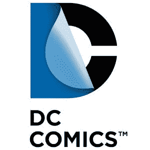
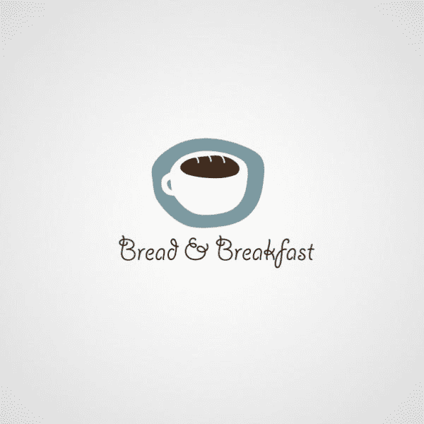

# 你每天都会看到这些标识，这就是你所缺少的

> 原文：<https://medium.com/swlh/you-ve-seen-these-logos-every-day-this-is-what-you-ve-been-missing-57a0e26d424c>

## 联邦快递的隐藏箭头和其他 43 件你从未注意到的事情

品牌是每个公司的关键部分。这是最终的第一印象——一个美学的握手——而一个伟大的标志是维系一切的关键。

随着时间的推移，徽标成为提供产品或服务的实体的视觉代理。在某些情况下，它们变得如此受欢迎，以至于在全球范围内都可以识别，不再需要文本。苹果和耐克就是两个明显的例子。

虽然它们看起来很简单，但这些符号是经过仔细考虑并使用复杂方法设计的。这些复杂性的一个很好的例子包括隐藏的信息，有时嵌入在徽标中，我们将在下面详细介绍。

# **负空格**

联邦快递在 E 和 X 之间的负空格里插了一个箭头，代表递送。

在 Toblerone 的标志中，山的负空间内可以看到一只熊。

Via 标志中字母之间的空间的负面使用类似于火车轨道。

Picasa 的标志中的负空间创建了一个房子。Casa 是西班牙的房子。

这个标志的前两个字母之间的负空间创造了一个好时之吻的形状。

# **排版**

乍一看，密尔沃基酿酒人队的标志看起来像一个简单的棒球手套，但小写字母 m.b .实际上是存在的。

这个善意标志中的小写 g 实际上是一个笑脸的一半。

Baskin Robbins 以其 31 种口味而闻名，他们将数字 31 嵌入首字母 B.R。

如果你仔细观察，你会发现丰田的标志是如何使用两个省略号来暗示公司名称中的每个字母的。

亚特兰大猎鹰队标志的头部、爪子和翅膀组合在一起，构成了字母 f。

Tostitos 标志中小写的 ts 代表两个人分享公司的芯片和萨尔萨。

NCAA 十大会议设计了一个标志，其中字母 I 和 G 也类似于数字 10。

拉斐特画廊使用草书文字重现了埃菲尔铁塔和拉斐特的小写字母 ts。

字体和空格的巧妙运用使得西北航空公司能够有效地展示他们两个名字的首字母。三角形也代表指南针上的箭头。

环法自行车赛标志用字母 R 和 O 创造了一个骑自行车的人的形象。

伦敦交响乐团标志的单笔画代表了他们的三个首字母和工作中的指挥形象。

温迪的衣领上使用了隐藏字体来拼出妈妈这个词。

DC 很好地利用了印刷术来显示他们名字的首字母，同时想象出一本漫画书里的一页图像。

# **符号**

在第二个杯子的标志中，蒸汽从杯子中升起，类似于字母 s。

思科商标中线条的使用类似于该公司总部所在地旧金山的金门大桥。

亚马逊的标志有一个从 a 指向 z 的箭头，暗示他们提供从 a 到 z 的一切，它也像一个微笑。

这个标志中使用的彩色符号与负白色空间一起创造了一只孔雀的形象。

伦敦博物馆的这个标志用颜色和抽象的形状来代表伦敦边界随时间的变化。

这个隐形儿童的标志结合了符号和负空间的使用，创造了一个类似非洲地图的人类足迹。

# **鲜为人知的标志**

Mylo(我即将发布的一款男装应用)的标志使用了元音变音和小写的 y 来创造一个笑脸的形象。

这个标志重新利用首字母 O.V .在地图上创造出精确的位置，反映了品牌的户外形象。

在这个例子中，向下箭头的最小使用在小写的 I 和 l 之间产生了铅笔的效果。

狗屋标志中的啤酒杯兼作门。

海豚之家使用负白色空间来创建海豚的鳍。

Handy Dog 的 logo 中的负空间是从字面意义上来体现他们的名字。

负空间被用在 Wine Forest 的 logo 中，创造出树状的酒瓶。

乍一看，这个标志似乎是一只孤独的大象。仔细观察会发现负白色空间中还有其他几只动物园动物。

女人瑜伽姿势创造的负空间展现了一幅澳大利亚地图。

对称的字体用来代表 Flight Finder 的首字母，而负空间产生了一架喷气式飞机的图像。

这个 Shift 的标志使用了两个箭头符号在产生的负空间中创建一个 H。

这个标志中的两个马提尼酒杯创造了一个负空间的房子。

鱼是这个标志是巧妙的排版和负空间的结果。

Bipolar 的标志利用了键盘符号:一个向前的括号，两边各有一个分号，以创造一个快乐/悲伤的表情。

CodeFish 的标志也使用键盘符号来创建一条鱼的形象。

住宅区利用箭头来模仿摩天大楼。

Unlock 使用锁的钩状部分作为他们徽标中的字母 U。

符号使用的另一个很好的例子是:3 根高尔夫球杆、一个洞和一个球被放置成拼出单词 golf。

这个标志可能看起来相当普通，直到杯子里的负空间露出一条面包。

# 感谢阅读

我们错过了什么标志吗？请在评论中联系我们，我们会在更新或其他帖子中包含它们。

> 如果你喜欢读这篇文章，请点击页脚的♥按钮，这样更多的人可以欣赏伟大的设计！

大家好，我是[丹尼尔](http://www.danieleckler.com)。我创办了一些公司，包括 Piccsy (acq。2014)和 EveryGuyed (acq。2011).我目前对新的职业和咨询机会持开放态度。通过[电子邮件](mailto:hi@danieleckler.com)联系。

# 你可能也会喜欢:人性化设计

我写的一篇互动文章，探索了拟人化设计的过去、现在和未来。也可用作会议、活动等的演讲。

 [## 人性化设计

### 1950 年，美国心理学家哈里·哈洛进行了一项实验，将幼猴从它们的…

medium.com](/swlh/the-future-of-design-is-emotional-5789ccde17aa)