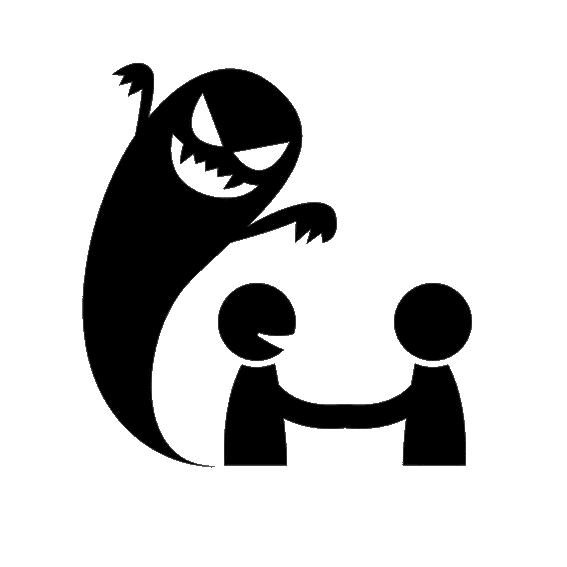
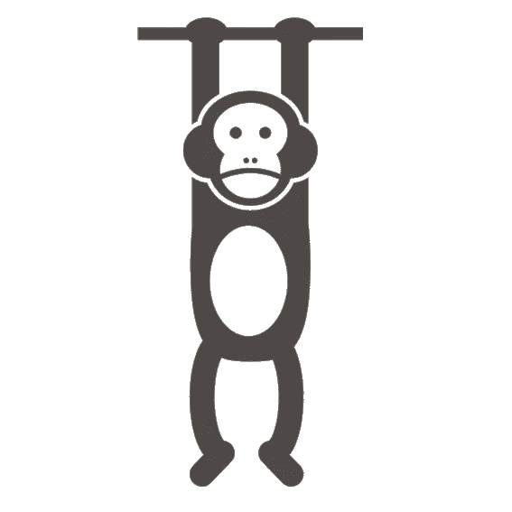
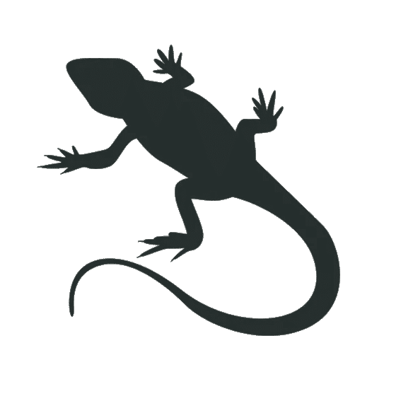
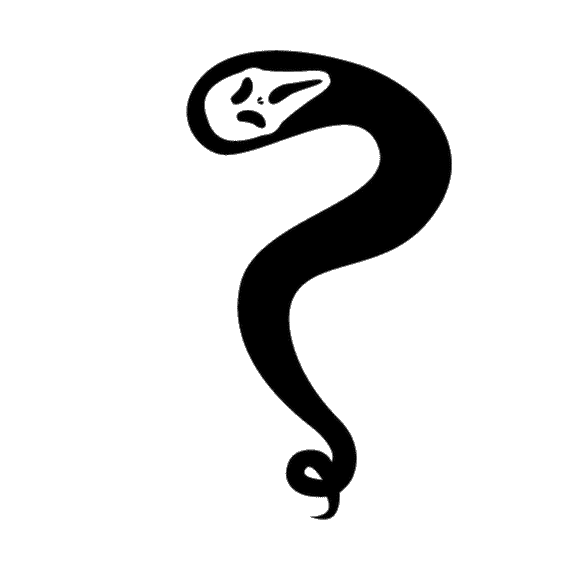
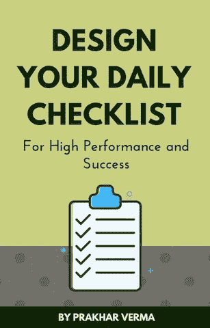

# 你与个人成长的敌人——你会赢得这场战斗吗？

> 原文：<https://medium.com/swlh/you-vs-the-enemies-of-personal-growth-will-you-win-the-battle-7e60399e569c>

## 你的生命取决于它

“black and white portrait of a man in Medieval armor, getting ready to swing a sword.” by [Henry Hustava](https://unsplash.com/@enzo74?utm_source=medium&utm_medium=referral) on [Unsplash](https://unsplash.com?utm_source=medium&utm_medium=referral)

你的生活是一部电影。你是英雄。你的任务就是你的目标。

只有一个问题。

你的球门前站着很多敌人。

你的目标可以是一个远大的人生愿景，过平静的生活，或者两者兼而有之。但无论你的使命是什么，生活都会向你抛出挑战。

挑战可能以任何形式出现，但是有一些共同的敌人试图阻止你达到目标。

那么，这些敌人是谁？

让我们一个一个地去认识他们，找出他们的弱点。

# 能量吸血鬼

能量吸血鬼渴求灵魂。它吸走你的能量，让你内心空虚。

你必须避开你生活中的那些[人或活动。](https://designepiclife.com/boost-energy/)

那么，如何打败能量吸血鬼呢？

它始于自我意识。注意哪些想法、活动、环境或人让你的生活很痛苦。

检查你是处于 **H** ungry、 **A** ngry、**L**only 还是 **T** ired (HALT)。

一旦你确定了来源，你就可以避免它们或者制定一个应对这种情况的方法。

饿吗？吃点健康的食物。生气？找到平静或者心存感激。孤独？和你爱的人说话。累吗？给你的大脑和灵魂一些休息。

另一个例子是[用积极的想法平衡消极的想法](https://designepiclife.com/stop-negative-thoughts/)。当你感到暴躁或不知所措时，进行治疗活动。花时间独处，冥想，感恩，呼吸，锻炼，写作，这样的例子不胜枚举。每个人都是不同的，所以你需要找到自己的食谱。

# 不耐烦的黑猩猩

黑猩猩想要短暂的快乐。它希望点击一个按钮就能立即得到满足。

它不关心未来的后果。它想要短期收益，甚至不惜牺牲长期利益。

问题是愉快的活动仅仅是基于大脑中的化学活动。他们可能会让我们长期受苦。

日常的小决定奠定了我们长期幸福生活的基础。

选择在查看社交媒体之前做一件重要的事情听起来可能是一个小决定，但它可能会产生重大影响。选择下一餐吃什么也是一样。

**要打败急躁的黑猩猩，培养耐心和坚强的原则。**

改变你的价值观，这样你就能证明自己是一个有主见的人。

考虑长远。耐心点。感到骄傲，以延迟满足为乐。

在[每日成功清单](http://bit.ly/daily-success-list)中检查项目是令人满意的。这样，你会在当下感觉良好，同时获得长期收益。

# 蜥蜴脑

> “蜥蜴脑是你害怕的原因，是你不做所有你能做的艺术的原因，是你能做的时候不出货的原因。蜥蜴的大脑是阻力的来源。”——塞思·戈丁

“蜥蜴脑”是大脑的[杏仁核](https://en.wikipedia.org/wiki/Amygdala)区域。它是边缘系统的一部分，处理情绪。

它负责战斗或逃跑反应。当它感觉到危险时，它会放大并给你所有的理由去忽略积极的想法、情绪或行动。

> 史蒂文·普雷斯菲尔德称之为抵抗。当你拖延、避免不适或寻找借口时，你可以识别它的存在。

蜥蜴脑可以阻止你成为最好的自己。那你是怎么处理的呢？

简单。你忽略它，并采取行动。

迈出微小的第一步，让球滚动起来。一旦你有了动力，采取进一步的措施就变得容易了。

另一个克服抗拒的方法是进行表演前的仪式。

最后，[精心打造你的环境](https://designepiclife.com/focus-on-your-goals/)，这样你就能在蜥蜴脑每次爬上来的时候打败它。

假设你正在电脑上拖延一项重要但困难的工作。蜥蜴脑可能会给你很多逃避工作的理由。

在这里，你可以喝一大杯水作为表演前的仪式。然后，你可以分解任务，迈出最小的第一步。

为了营造动力环境，你可以

*   使用番茄红素或任何其他自定义计时器技术。
*   听古典音乐、电子游戏、环境音乐或其他不会让你分心的音乐。
*   使用应用程序或网络扩展阻止所有干扰。把你的手机调成飞行模式。变得遥不可及。

先行动，后思考。当你采取行动时，蜥蜴的大脑会安静下来。

# 内心的恶魔

内心的恶魔是根深蒂固的恐惧和不安全感。

这就是冒名顶替综合症的运作方式。以下是常见的内心恶魔以及战胜它们的方法:

## 害怕失败

即使你失败了，你也赢了。因为你学会了什么不该做，现在你可以做下一个实验了。如果你接受失败，失败可以成为你的朋友。

尽力而为。支点。重复一遍。

不要期待每一个行动都能成功。出乎意料的成功让我感觉更好。

## 害怕被拒绝

它来自于自我和缺乏自信。当你 100%接受自己，对自己感到满意时，你不需要别人的认可就能感到自信。

是的，认可确实让你感觉良好，让你更加自信，但是不要让拒绝伤害你。不是关于你的。如果你缺乏技能，随着时间的推移培养它们。如果你不适合，那就找别的吧。

变得脆弱，因为只有你掌握着自尊的钥匙。

## 对成功的恐惧

许多人认为成功是只有“成功”的人才能实现的事情。他们认为自己不配获得成功。他们害怕发挥自己的全部潜力，因为他们害怕放弃平凡的生活。

是什么阻碍了你的成功？你是谁，不能达到伟大的高度？你不需要追逐成功，但如果成功伴随着你成长的行动，就让它来吧。

别再一意孤行了。[让自己成功](https://designepiclife.com/live-your-best-life/)。成功不是不可能的。只是需要时间。

## 害怕不确定性

没有人知道将来会发生什么。你不需要害怕未知。人生冒险的一部分是迷路并找到回来的路。

接受新事物。如果你不喜欢，试试别的。但是如果你从不尝试，你永远不知道你会经历什么，你能做什么。

你只有一次生命来失去或得到任何东西。充分利用它。现在就面对不确定性的恐惧，否则下半辈子都会在悔恨中煎熬。

## 害怕改变

许多人阻止自己成长，因为他们担心别人会如何看待他们的“新”身份。或者他们对自己形成了负面的看法。

他们认为——“我是个胖子，所以我吃得过多。”或者“我很害羞，所以我不擅长社交技巧。”

你的身份就是你想成为的人。如果你想要不同的结果，你必须在每一步都拥抱变化。放开你或其他人认为你是谁。[提高你的标准](https://designepiclife.com/raise-your-standards/)。每天再造自己。

> “每天做一件让你害怕的事。”―埃莉诺·罗斯福

在进攻模式中生活。不要防御内心的恶魔。直面恐惧，战胜恐惧。

然而，恐惧并不总是坏事。有好的恐惧和坏的恐惧。

如果你害怕失去自由，那就每天努力工作来获得自由。如果你害怕健康不佳，那就每天做出健康的生活方式决定。

所以，如果你把恐惧当作燃料，让你的生活发生积极的变化，恐惧可能是件好事。

# 结论

成功故事和普通人故事的不同之处在于，成功的人善于击败他们生活中个人成长的敌人。

将你的人生故事变成一部惊悚电影，像超级英雄一样站起来，每次击败能量吸血鬼、急躁的黑猩猩、蜥蜴脑和内心的恶魔。

这不是一次性的战斗。这是你生活中一系列持续的插曲，你必须反复克服它们来完成你的人生使命。

现在，由你来设计你的电影。

你有勇气扮演男主角吗？

*本文的一个版本最初发表于*[*【DesignEpicLife.com】*](https://designepiclife.com)

# 成功是日常行动的结果…

## 为**高绩效和成功**设计你的每日清单。[点击这里下载](http://bit.ly/daily-success-list)你的免费拷贝。

## 这篇文章发表在 [The Startup](https://medium.com/swlh) 上，这是 Medium 最大的创业刊物，拥有 336，210 多名读者。

## 在此订阅接收[我们的头条新闻](http://growthsupply.com/the-startup-newsletter/)。

