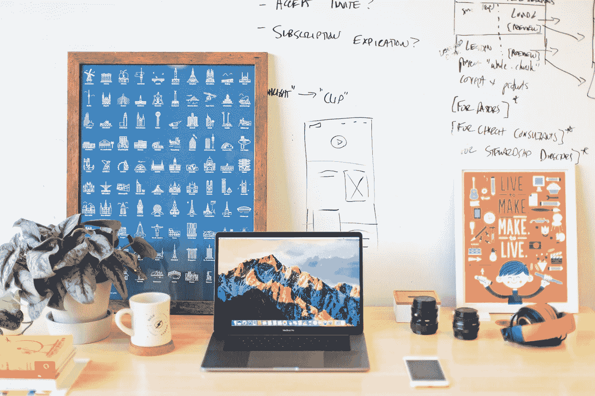
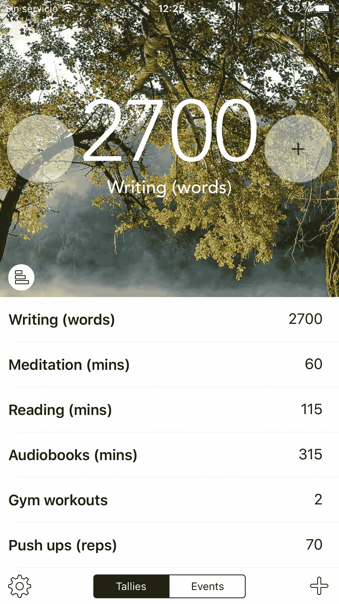

# 你想有所作为吗？你需要一个目标和过程

> 原文：<https://medium.com/swlh/you-want-to-be-productive-purpose-process-f28e815387c6>

Photo by [Mia Baker](https://unsplash.com/photos/cqkbESEkhjk?utm_source=unsplash&utm_medium=referral&utm_content=creditCopyText) on [Unsplash](https://unsplash.com/search/photos/productivity?utm_source=unsplash&utm_medium=referral&utm_content=creditCopyText)

## 不知所措？后退一步，重新回到有效的基础。

有些时候，我们需要后退一步，专注于重要的事情。在 30000 英尺的高空。着眼于理解更大的图景，这样我们就可以调整和重新设计我们生活的基石。

在过去的几年里，我一直在尝试行之有效的实践和习惯，以提高我们的影响力和生产力。通过这个过程，我学到了两个关键原则，当它们成功地结合在一起时，能够让人类保持最高的生产力。

方法很简单。如果我们将富有成效的生活与旅行的概念相比较，那么定义我们运动的关键要素是什么？

## 1.方向:

在身份和目标的交叉点上设定抱负。

## 2.燃料:

**采用一种能驱使你达到目标的日常生活方式(通过让我们专注于行动)**

# 1.方向:s **在身份和目标的交叉点上实现你的抱负。**

基本前提:我们所做的事情缺乏意义会严重削弱我们发挥最佳水平的能力。

> 在个人和职业层面上，你的目标是在未来几年成为什么样的人？你的日常行为有助于你成为那样的人吗？抱负如何平衡你生活中不同的责任领域？

*你多久没花时间进行这种批判性思考了？*

我自己也是现代生活的牺牲品，旋风般的忙碌，日复一日“生存”的需要。但是有一种方法可以拉近距离，重新开始掌控我们的生活。

没有原则的志向会导致失败和沮丧。我们的志向应该是我们想成为的人的结果，它们需要被身份定义。他们需要反映意图。否则，我们将无法找到我们的广泛目标和我们每天所走的道路之间的一致性。如果我们的目标和行动不一致，我们就无法在旅程中找到目标。不是我们目标的实现，而是我们努力成为的那个给我们的生活带来意义的人。

如果我们不首先解决这个难题，那么其余的就不会建立在坚实的基础上。如果我们不相信我们正在做的事情，当我们陷入低谷时，我们就不会有弹性。我们将无法重新聚焦并重获我们的中心地位。我们将无法确立明确的优先事项，也无法按照这些优先事项生活，无法保持清醒。方向感和强烈的意图使我们保持正确的方向。

# 2.燃料:采用一种能驱使你达到目标的日常生活方式。

> “运动中的物体继续运动”——艾萨克·牛顿

基本前提:将意志力从等式中剔除。用一个简单的过程来促使你行动的方式来组织你的一天。

作为父母，我见过一个没有套路的孩子如何挣扎着适应社会生活的基本需求。我们都需要依靠过程，以这样或那样的方式来发挥作用。这是人性的一个基本前提。

当试图最大化我们的个人和专业产出时，一套定义良好的流程、习惯和惯例变得至关重要。[我们的思维无法很好地应对放置在遥远未来的宏伟目标](/the-mission/arent-you-tired-of-failing-yourself-f94393b419e)。我们希望从未来得到的东西和我们今天需要做的事情之间缺乏联系，加上纯粹依赖意志力，导致了失败。当你制定典型的新年决心时，你可能已经遭受了这种痛苦。我去过那里。研究表明，在没有强有力的框架的情况下，最初的推动最多持续 4 到 8 周。

我们需要简化现在，定义一周又一周可以让我们更接近这些目标的行动。这就是过程变得关键的原因。我们可以认为这是我们需要在*现在*和我们的目标之间建立的漏斗。

**步骤 1——定义对结果具有最佳预测能力的高影响力行动。这些行动如果持续一周又一周，将帮助我们更接近目标。**

对我来说，不断学习个人发展、生产力和效率是我个人的主要愿望之一。我的高影响力活动是尽可能多的研究这个主题，这反映在我每年阅读 50 本书的目标中。

我们再举一个例子。为了恰当地组织我自己的学习和思考，另一个与同样雄心相关的高影响力活动是创建一个书面的工作主体。这体现在我的 2018 年至少写 40 篇文章的附加目标上。

第二步——建立一个适合你的流程。如果你像我一样，在早上最有精神，你可以通过一个坚实的早晨惯例来实现你的抱负。对我来说，我很早就醒来，在去工作之前冥想、阅读和写作。

正如我在之前的一篇文章中提到的，我每天早上花 30 分钟阅读，一边喝着咖啡。一旦我离开家去办公室，我会打开一本有声读物。我的通勤时间会再花 30 分钟，所以当我到达办公室时，我通常已经完成了 1 小时对我重要的内容。这足够平均每周看完一本书了。也就是每年 52 本书。

我每天早上也花大约一个小时来写作。我进一步将每年 40 篇文章的目标分解为每周 5000 字的更易管理的目标。*所以每天我都设定自己在一个小时内写 500 到 1000 个单词，不管结果如何*。我只是写作，当时间到了，我就停下来。今天到此为止。

事实证明，每周点击 5000 个单词就足以为每周 1600 个单词的文章制作有价值的材料，我会在周末编辑这篇文章，并在下周发表。

**第 3 步——忘记目标。专注于每天的行动，相信这个过程。**

阅读 50 本书似乎是一个非常雄心勃勃的目标，但是你可以看到把它分解成一个日常的低强度工作是如何推动你达到这个目标的。从非常小的开始，几乎用一点点时间投入，将确保你建立一个粘粘的习惯。每天这 60 分钟让我能够专注于必要的日常行动，从而停止思考目标。

让我们再来谈谈我的写作。在一年之内，40 篇发表的 1600 字的文章(我的平均文章长度)相当于 64000 字的编辑作品。**以每天一小时的工作计算，这足够写一本书了。**每天练习小套路的力量。

**奖励点——为您的目标添砖加瓦。跟踪每周目标的力量。**

我使用 [*Teal*](https://itunes.apple.com/us/app/teal-tallies-countdowns/id982527747?mt=8) iPhone 应用程序来跟踪我的一些个人发展目标。每周都要在仪表板上填写我的进度，这让整个过程变得有趣而富有挑战性。

试试你最喜欢的指标吧……那*“每周拜访客户的潜在客户数量”怎么样。*根据您试图跟踪的高影响力活动，选择适合您的方式，并让仪表盘成为您的提醒。

Keeping myself on track

# 您可以在此框架的基础上最大限度地发挥您的影响力和生产力

> **您可以将生产率定义为 1)有意义的愿望，2)一套可预测的日常流程和 3)每天一致地执行小动作的成功组合。**

很容易看到这个框架如何应用于任何愿望，无论是个人的还是职业的，以*协调目标和行为*。

您可以在这两个基本前提的基础上设计有效的早晚仪式，重新检查您的睡眠卫生，或制定一个有效的专业工作流程，以匹配您一整天的能量水平。

我将在未来的帖子中分享我是如何创建这些和其他流程和例行程序的，所以请继续关注并…继续前进！

如果你喜欢这篇文章，请给它一个大大的掌声(最多 50 个掌声！)并在这里输入你的****这样我们就可以保持联系了？我将能够把我的新文章直接发送到你的收件箱，这样你就不必在媒体中寻找它们了。****

****

## **这篇文章发表在 [The Startup](https://medium.com/swlh) 上，这是 Medium 最大的创业刊物，有 301，336+人关注。**

## **在这里订阅接收[我们的头条新闻](http://growthsupply.com/the-startup-newsletter/)。**

****