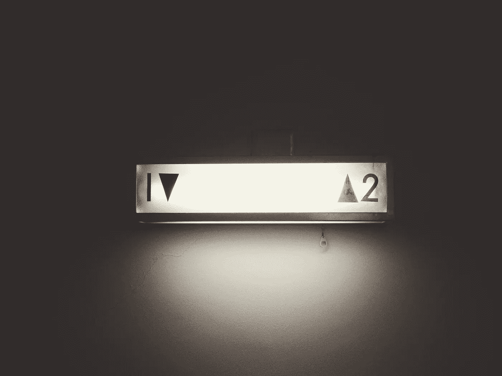

# 你永远不会是“最好的”，这没关系

> 原文：<https://medium.com/swlh/you-will-never-be-the-best-and-thats-okay-6c26dde352c9>

Photo by [Franck Veschi](https://unsplash.com/photos/UA3R3P479i8?utm_source=unsplash&utm_medium=referral&utm_content=creditCopyText) on [Unsplash](https://unsplash.com/search/photos/number-1?utm_source=unsplash&utm_medium=referral&utm_content=creditCopyText)

不幸的是，生活抛给我们一些不容忽视的事实。

其中一个事实是，你必须明白自己并不是绝对的“最好”。

很抱歉这很难接受，但这是事实。

> 总会有人更强、更聪明、更快、更好。

总会有更好的音乐家、艺术家、医生、作家、运动员——我可以让火车继续行驶。

当然，这并不是因为你永远不会成为最好的而阻止你尝试的帖子。你仍然可以做最好的自己。

你不必成为最棒的 T2。

然而，你注定要发挥自己的才能和天赋，做出一番伟大的事业！

我知道，听起来有点俗气，不切实际，老套。

事实是，没有测量尺，我们都非常满意。如果我们不选择做决定命运的事情，不与他人比较，我们会发现我们可以贡献很多。

这就是令人沮丧的地方。

> 你要能够谦卑自己，明白自己不是最好的。其次，没有这种认识，你永远不会成为最好的自己。

那么，这意味着什么呢？

这意味着如果你不谦逊，你会认为自己是最棒的*，这永远不会让你发挥出全部潜力。*

有点好笑，不是吗？

你不仅大错特错地认为自己应该做得最好，还因为坚持这种观点而阻碍了自己。

我知道，我对每个人都评头论足，把每个人都放在同一条船上，诸如此类，诸如此类，真是疯狂。

如果你坐在那里说，“嗯，这不可能和每个人都有关系，因为有人*有*是最好的”，我会说你是对的，那不是你。

让我们以一个大作家为例。我不会特别指出谁，只是把这些受欢迎的作家中的一个放在你的脑海里。

无论谁是媒体上最优秀的人，都有一个比他们做得更好的人的世界。

如果他们不能认识到这一点，他们会变得对学习麻木。它们会阻碍进一步的生长。他们会拒绝帮助和自我破坏。

谦逊是开启你能力的终极钥匙，这样你才能走出自己的路。

如果你曾经被解雇，自尊心可能是主要因素。你不能遵守“规则”,因为你相信你会制定出更好的规则。

或者，也许你无法与同事相处，因为你自己做了“太多的工作”，而其他人都不是团队成员。

也许你就是得不到这份工作，那是因为他们没有把你培养得“足够好”。

所有这些原因都来自于你的骄傲。你不想接受这样一个事实，即有人认为你就是不能理解。

这是一颗难以下咽的药丸。但是，我也认为，任何被解雇的人可能都有一个故事，它如何帮助他们在另一家机构的未来角色。

如果你被解雇了，不管你愿不愿意承认，你可能已经从那种特殊的情况中获得了宝贵的经验和洞察力。

生活中很多让我们犯错的情况都是因为骄傲和谦逊之间存在摩擦。

让我澄清一些事情——谦逊和缺乏信心之间有很大的区别。

我不想让任何人认为我在告诉你不要相信自己。

相反，也许重新定位这种信念是个好主意。相信你自己，但不要认为你已经想通了一切——因为你没有。

谦逊是**而不是**在你做完卷发后不得不贴上你的健身房照片，因为**不**需要其他人的认可，并且你认识到你还有很长的路要走。

骄傲是向全世界炫耀或者惊呼自己上了大学的院长名单，好像那个名单上没有别人一样，还有校长名单，这本身就是一个更有声望的名单。

我不是说你永远不能为自己骄傲。你可以。但是你为什么要告诉你见到的每个人呢？

你问过自己吗？

答案就是我之前提到的**测量棒**。

其他人在吹嘘他们的成就和目标。这有时会让我们想到“我呢？”反应。

我们开始思考我们在一定时间内完成的所有事情。我们算了一下分数，然后我们意识到那个吹嘘脸书的人甚至没有达到我们一直在做的事情，似乎永远都没有！

我用一个个人的例子。我最喜欢的例子可能是健身房，因为它很容易使用，而且有很多人喜欢在健身房里拍照，不管出于什么自私的原因。

无论如何，我坚持举重 6 到 7 年了。我从来没有在社交媒体上发布过。我不觉得我需要任何认可。

让我想走出阴影的人是那些刚刚开始努力的人。在我的脸书上，几乎不动一根手指的人会拍照，给“健身房生活”贴标签，谈论所有锻炼前和锻炼后最好的奶昔和饮料。

我差点接受不了。这让我很困扰，因为它打击了我的自尊心。

我为什么给你讲这个故事？

因为我相信我们不应该仅仅因为别人有一点骄傲就改变我们自己。我们通常对自己的生活很满意，直到我们看到那个人在我们的脸书上发帖。

可能是一位新妈妈——也许你有 4 个 2-10 岁的男孩——但是这位新妈妈让你想发表评论。“她认为她的生活很艰难——她甚至不知道”。

我明白，我不止一次有这种感觉。但是，为什么要让别人的经历改变你一直以来处理自己的经历呢？

当然，关于健身房的事情，我想评论一下这些人的照片，并开始给他们一些建议——首先是停止在健身房拍照。但是，最终有什么意义呢？

我会让他们的吹嘘让我觉得我需要向世界透露我已经举重 6 年了，没有抱怨，也没有告诉这个世界？

不，因为那样我会变得和他们没什么不同。我基本上是想向他们证明他们是新手。为什么我的自尊需要这种保证？

当你选择保持谦逊时，通常会面临两个挑战。

*   不是自夸
*   不怨恨别人的吹嘘

第一个挑战不言自明。我们的目标是不吹嘘我们的成就和成绩。再次强调，为你自己感到骄傲，不要再每天在脸书上发布这些了。

相信我，过一会儿，没人会在乎你跑了多少英里。

第二个挑战是抵制因某人吹嘘自己而怨恨他的冲动。

你不仅要通过不拿自己和别人比较来表现出谦逊，而且你还不得不面对那些试图告诉世界他们有多擅长烘焙晚餐的人，就好像我们需要知道他们成功地找到了如何根据一系列说明将原料放在一起。

这只是一个例子，但重点是怨恨可以建立。这就是为什么人们不再看某些人的固定帖子。如果需要的话，你可以转过身去。这比面对一个他们不认识的问题要好。

我想在这两方面鼓励你。你不必公布你曾经征服的每一项成就。有更多的人可以发布他们每天实现的目标。

社交媒体是一根测量棒。这是危险的，当它被用来向每个人展示我们正在完成的一切时，坦白地说，这是愚蠢的。

它制造了一种自夸的气氛，一种竞争的气氛，它使人们互相怨恨。

所以，如果你是一个忍不住的人——你必须发布你正在做的一切，你刚刚跑的 80 英里，你举起的重量，你做的晚餐，你工作的时间，你是一个了不起的父母，请停下来。

请记住—

> 总会有人更强、更聪明、更快、更好。

这并不是说要打击你。相反，据说这是为了鼓励谦逊。

## 在这里找到更多我的故事。你也可以关注我的[推特](https://twitter.com/Eturn102)。谢谢你让我开心！

## 如果你喜欢这个故事，请点击👏按钮并分享，帮助其他人找到它！欢迎在下方留言评论。

## 这篇文章发表在《创业公司》杂志上，这是 Medium 最大的创业刊物，有 315，628 人关注。

## 订阅接收[我们的头条](http://growthsupply.com/the-startup-newsletter/)。

