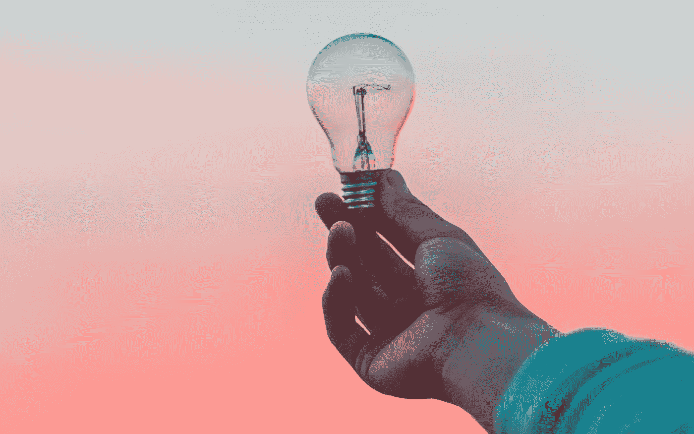

# 通过一次避免一件事让你分心，你会惊讶于你的创造力

> 原文：<https://medium.com/swlh/youll-be-amazed-how-creative-you-can-be-by-avoiding-one-distraction-at-a-time-34b3c87ed9cb>

## 如何专注于重要的事情

我们生活在一个充满干扰的世界。当你想逃离残酷的现实时，这并不总是一件坏事。如果你想提高你的生产力呢？

如果你从事的是创造性的工作(这可能包括很多不同的职业)，找到完成工作的节奏是很重要的。

## 社交媒体=分散注意力

如果你是一名社交媒体经理呢？我们都知道社交网络有多让人分心，所以如果照看它们是你的工作，这种挣扎是真实的。

我已经开始写这篇文章，我的大脑跳到了下一个标签，我打开了 Twitter。我偶然看到一个有趣的帖子，它把我带到了一个更有趣的电子书，就这样，我结束了对一个我想了解更多的主题的笔记。

这就是我们的大脑在网上冲浪时的工作方式。

> 我们的大脑就像我们的笔记本电脑。这么多标签，这么少的时间。

## 试图提高我的注意力

我可能意识到我的注意力持续时间很短，但我最近开始改善它。我已经开始为严肃的工作计划时间块，一次留出一个分心的事。

例如，我最近关掉了手机上所有的社交通知。这种感觉太好了，当我真的需要集中注意力时，我也开始使用“请勿打扰”模式。

当我在我的办公桌上时，我会转动我的手机以确保我只在我想看的时候才看(结果是每三个小时才看一次)。

## 减少对智能手机的依赖

我很惊讶这对我戒掉智能手机瘾有什么影响。我不敢说我已经找到了现代瘟疫的治疗方法，但至少，我正在研究如何控制它。

每次弹出新的通知，它都要从我们这里吸收多少能量，真令人吃惊。我还观察到，我并没有真正错过任何通知。我还在回复需要我注意的事情，事实上，我觉得没有必要打开我的脸书通知。

这让我进入了一个新时代，我仍然可以出于职业原因使用社交媒体，甚至偶尔发推特和发 Instagramming，但不会把我的创作精力花在上面。

## 不是每个问题都解决了

正如我之前提到的，我在使用笔记本电脑时仍然会拖延，因为大量打开的标签页很容易让你失去注意力。

然而，我也注意到有时候正确的标签可以让你更有效率。

如果你的大脑漫游在鼓舞人心的内容周围，而不是一个猫 Youtube 视频，你甚至会觉得有必要匹配这种创造力。

## 中等不算分心

每当我访问 Medium 时，这个想法对我都有效。主页上有大量关于任何话题的有趣文章。我总是比其他网站花更多的时间阅读中型博客文章。大多数时候，他们激励我写更多。拥抱我创造性的一面。更符合文字。

如果我不得不提供一个小小的建议，仅仅来自个人经验，那就是一次集中精力消除一个干扰，而不是一次全部。你不必排除生活中所有的乐趣和各种各样的干扰来变得有创造力。

你所需要的是掌握你的时间，找到当下的纪律，完成任务。

*PS。这个帖子根本不是计划好的。我刚刚让自己进入深度聚焦模式，写了一篇关于脸书广告的帖子。这是另一种类型的拖延，但至少，这是一种有效的拖延。*

## 这篇文章发表在[《创业](https://medium.com/swlh)》上，这是 Medium 最大的创业刊物，有 285，454+人关注。

## 订阅接收[我们的头条新闻](http://growthsupply.com/the-startup-newsletter/)。

