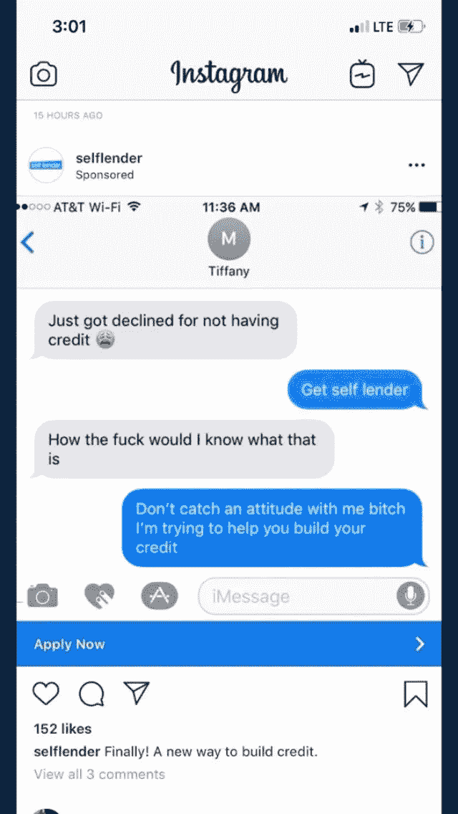
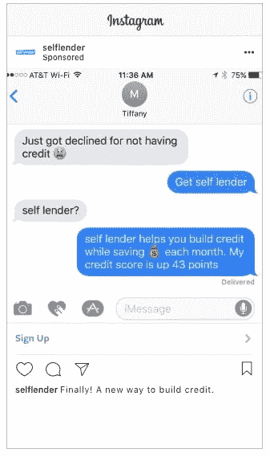
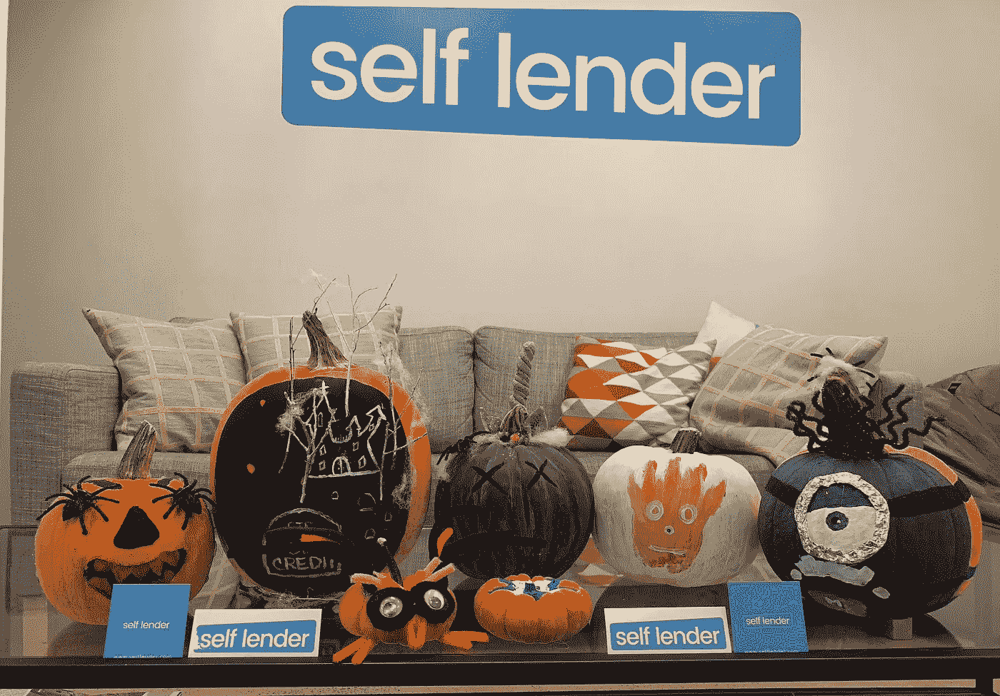
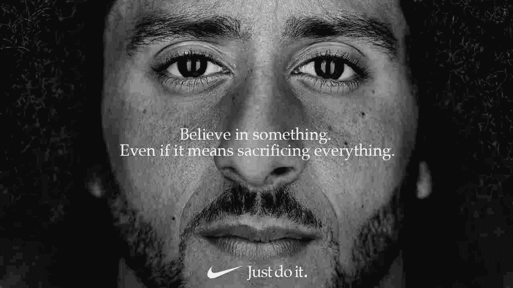
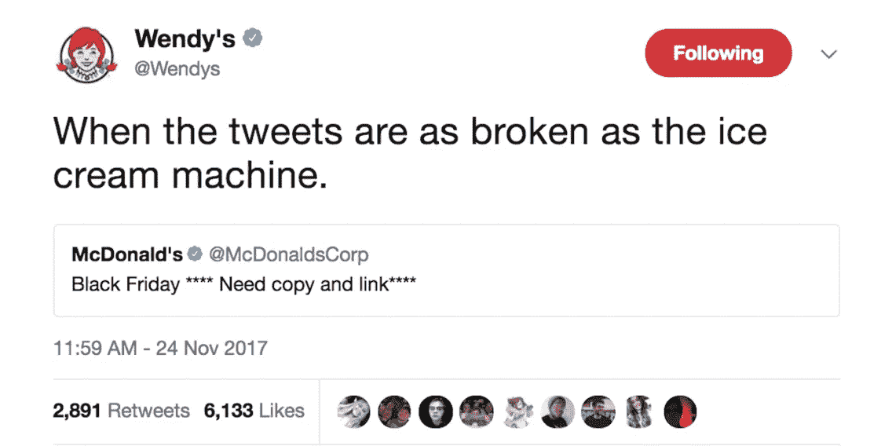

# 你的广告很无聊。你的牌子很无聊。没人买

> 原文：<https://medium.com/swlh/your-ads-are-boring-your-brand-is-boring-and-no-ones-buying-5c93621cc4b6>

“person writing on white book” by [rawpixel](https://unsplash.com/@rawpixel?utm_source=medium&utm_medium=referral) on [Unsplash](https://unsplash.com?utm_source=medium&utm_medium=referral)

> 让我们先做一个快速测试。下面的广告一个是真的，一个是假的。你能猜出哪个是哪个吗？

Left or right?

真正的广告在右边。

但是左边的那个假的给 SelfLender 带来了一大堆新客户。**那么这里发生了什么？**

在看到他们最初的广告后，一位 Twitter 用户想找点乐子。*“我决定用 photoshop 处理它，因为最初的广告就像‘嗯’，我想，如果广告看起来像人们实际上的说话方式，那会很有趣，”*他说。

他的帖子火了。它已经被转发了数千次，并为 SelfLender 带来了极其宝贵的流量和追随者。该公司因拥有一个真正能与受众交流和沟通的营销团队而受到称赞。

但 SelfLender 实际上与此无关。

 [## 这个家伙不小心把他们的一个广告 PS 成了一个笑话，让一个新应用火了起来

### 一个伪造推特的家伙无意中给公司带来了很多新客户。发布于 2018 年 10 月 31 日，地址为…

www.buzzfeednews.com](https://www.buzzfeednews.com/article/tanyachen/a-guy-photoshopped-an-instagram-ad-but-it-actually-worked?bftwnews&utm_term=4ldqpgc#4ldqpgc) 

尽管对自由媒体心存感激，他们的 CMO 布雷特·比利克说:

> “我们的使命是帮助人们建立信用，但作为一家(金融科技)公司，我们通常需要在使用的语言上更保守一点。”

## 我的问题是——***为什么？***

为什么一定要保守一点？为什么你要注意你使用的语言？

你怕谁？是市场吗？是你的董事会吗？是你的投资人吗？因为，相信我，他们关心的只是你的底线，而不是你如何达到的。

# “正常的交流”无法突破互联网的噪音干扰。

我们现在被广告轰炸。说真的，新的报告称，我们每天面对大约 5000 个广告。因此，获得人们的关注比以往任何时候都难。

相信我，驯服你的语言是不会成功的。我明白，作为一家公司，你想让自己听起来完美和有企业精神。你想变得专业，不管这意味着什么。

但是，你猜怎么着？其他人也是这么做的，很无聊。你会被社交媒体遗忘。

没有了神秘的 photoshop man 的帮助，Selflender 现在又回到了发布没人关心的常规东西。它们比我每晚喝的尼奎尔伏特加鸡尾酒更能让我入睡。

他们已经失去了优势(以及所有人的注意力)。我的意思是，看看这个:

Booring…

突破界限，承担风险，不做政治正确的事是最成功的营销活动的核心要素。

去年九月，耐克播出了近代史上最具争议的广告之一。在 NFL 球员跪求国歌抗议警察暴行的戏剧中，他们决定接受运动的领导者，让他成为他们品牌的代言人。

尽管疏远了他们的一些消费者，但该广告在 18-29 岁的目标受众中引起了极大的共鸣。他们成为了一个更加两极分化的品牌，但更重要的是，一个有个性的品牌。有点冒险，但是成功了。

在社会问题上表明立场是让你的品牌更有个性的一种方式(见耐克或小鸡-fil-a)，但还有更多:

**Dollar Shave Club** 在 2016 年以 10 亿美元的价格卖给了 Unliver，它的大部分成功和品牌认知度都来自于它的开箱即用广告。

他们的第一个活动——“*我们的刀片真他妈的棒*”——在 Youtube 上有超过 2500 万的浏览量，其中大多数都是有机的(也就是免费的)，因为它像病毒一样传播开来。

该广告由创始人迈克(Mike)解说，其中包含了如下充满幽默的瞬间:

> “你认为你的剃须刀需要一个振动手柄、一个闪光灯、一个刮刀和 10 片刀片吗？(递过一张挂在背后墙上的祖父的旧照片)你英俊的祖父有一把刀片…还有小儿麻痹症。”

它甚至(轻松地)取笑一个拉丁女人:

> 迈克:阿莱杭德娜，上个月你在做什么？'
> 
> **阿莱杭德娜** *【狞笑】* ***:*** 【不工作】
> 
> 迈克:那你现在在做什么？
> 
> **阿莱杭德娜**

我不知道他们的刀片，但他们的广告真的很棒。

社交媒体很拥挤。每个品牌都在争夺关注，正如丛林法则所说，只有适者生存。

在 Twitter 这个可怕的地方，快餐店 **Wendy's** 已经被证明比任何人都更懂得如何与消费者沟通。

使用时髦的语言，聪明的笑话，甚至对它的竞争对手大放厥词(一语双关)，将他们定位为一个年轻、酷的品牌——与乏味、更成熟的麦当劳相对。

要点是，你不应该仅仅为了制造噪音而引起争议——消费者可以嗅出这一点，他们会认为你很烦人。

## 要点是，你与听众交流的方式很重要。

听起来专业和公司可能是获得人们信任的最好方法，但这会让你变得平庸和无趣。取而代之的是，给你的品牌一个强有力的个性，让人记住，并在人的层面上联系起来。

## 这篇文章发表在 [The Startup](https://medium.com/swlh) 上，这是 Medium 最大的创业刊物，拥有+387，966 名读者。

## 在这里订阅接收[我们的头条新闻](http://growthsupply.com/the-startup-newsletter/)。

