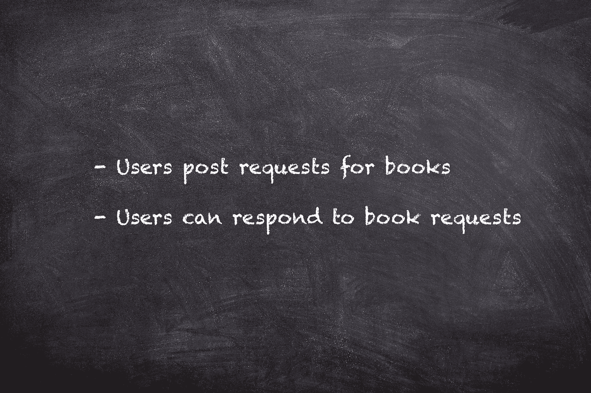
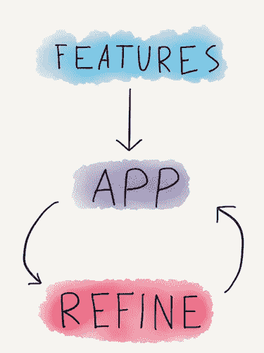
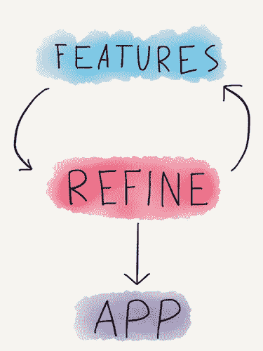
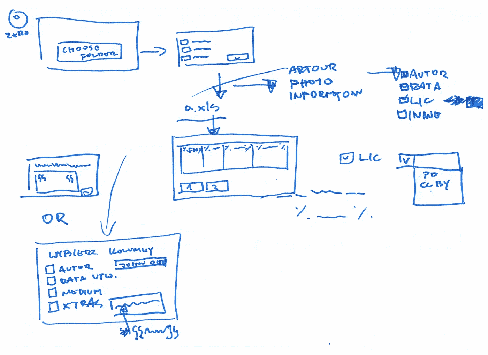

# 你的应用是一个洋葱:为什么软件项目会失控

> 原文：<https://medium.com/swlh/your-app-is-an-onion-why-software-projects-spiral-out-of-control-bb9247d9bdbd>

你的出发点是好的。你雇佣一个开发人员来构建你的创业想法。但是几乎每周，感觉这个项目都需要调整。功能开始慢慢出现，范围慢慢扩大。

就好像这个项目有它自己的生命，并试图摧毁你的生命。

这是怎么发生的？你雇佣了一个糟糕的开发者吗？项目管理摸索了吗？还是这个想法一直都很糟糕？

有可能。但是有一个核心误解经常从一开始就给项目带来厄运。

我们假设我们的产品是由一组写在纸上的特性定义的。偶尔会添加一些功能；偶尔特征会被删除。但是你一眼就能看出项目的范围。

这个假设**错了**。

你的项目不是二维的，不像一张纸。它有*深度*。

每一个特征都可以剥开，一层一层地展现出来。事实上，如果我倾向于创建 clickbait 标题，我会说**你的应用是一个洋葱**。让我告诉你我的意思。让我告诉你为什么，当你剥开每一层时，你的应用程序会让你哭。

# 结束所有图书馆的图书馆

我们来看一些具体的东西。给我出个主意。

> 人们经常想要附近图书馆没有的书。这个地区的其他人可能会。所以这个应用程序让人们发出购书请求，拥有这本书的人会回复。我们从每笔交易中赚钱。

天才。

> 我知道，对吧？功能列表非常简单:

> 是时候将规范发送给开发人员，并开始考虑杀手级的启动名称了。 **kaBooki？lib.rari.ly？reddit？**

好吧，坚持住。让我们仔细看看。还有，reddit 已经是一个东西了。

让我们用一些问题来探索这个想法，看看它会把我们带到哪里。

用户如何互相付费？他们见面时只是互相扔现金，还是通过应用程序付款？

> 哦，他们应该通过应用程序用信用卡支付，所以我们可以提成。

他们实际上是如何要求一本书的？我是说，他们在应用程序上到底做了什么？他们会在开放式表格上填写书名和作者吗？

> 哦，嗯。他们应该搜索他们的书，并选择他们想要的书。

好吧，我们需要一个图书数据库。

> 我想是的。

其实什么**是**一个图书请求？卖书的人会看到所有被要求的书的清单吗？或者我们会像优步或图钉那样给卖家发通知吗？

> 那一个。我们向其他拥有这本书的人发出请求。

所以，卖家需要在应用程序中填充他们出售的所有书籍？

> 嗯，是的。

这本书实际上是如何被理解的？是用户自己发，还是我们处理投递？

> 我们负责送货。

所以你需要一个系统来告诉你需要拿哪些书，以及它们需要去哪里。我想你的司机会希望看到连接这些的最短路线，对吗？

> 好吧，不。这个怎么样？用户互相邮寄书籍。

所以我们把收件人的地址给发件人看？我们如何处理运费？

> 实际上，你知道吗。这些用户必须彼此靠近。他们可以去捡回来，然后交个新朋友，好吗？

所以，我们需要匹配附近的用户。他们是怎么找到对方的？该应用程序是否有实时地图，以便他们可以安排会面？

> 当然可以。好吧。随便啦。

我们给书定价吗？还是他们自己协商价格？

> 他们谈好了价格。

他们如何决定？我们需要在应用程序中内置聊天功能吗？

> 他们可以打电话给对方。

好吧，那我们要不要用短信来验证这个号码？关于……你明白了。我们真的可以永远继续下去。

> 请不要。

现在让我们来看看特性列表是什么样子的:

这些行项目中的每一个都可以扩展多次。我们只是把洋葱剥开一层，看看发生了什么。

好啦，好啦，别哭了。

# 发生了什么事？

我们先明确一下功能爆炸的原因是什么**不是**。

## 这不是通常所说的特性蠕变。

这是新功能不断被添加到产品中的时候。如果你看看我们最终的功能列表，每一项都是为了支持最初的推介而存在的。

## 这是**而不是**因为**的技术考虑**。

比如最适合的聊天系统架构是什么？什么支付平台最容易整合？

我们不是在这里谈论这些。一个好的开发人员可以告诉你各种技术选择。但是一个开发者不能替你决定需要构建什么特性。

## 这也是**而不是**因为**市场的考虑**。

人们想使用这样的产品吗？在其他用户很少的情况下，是什么激励早期用户注册？用户愿意为这项服务付费吗？

这些问题与**验证你的想法**，确定**产品与市场的契合度**，以及**定价策略**有关。同样，这些都是重要的问题。但是这是*而不是*你的特性列表爆炸的原因。

> 是的，也不是因为全球变暖或者牙仙。你是要告诉我洋葱的原因，还是要解释每一个非原因？

哦，你一点都不好玩。事情是这样的。

> 我们从根本上误解了复杂性是如何运作的。

我们认为每个特性都和我们开始描述的一样复杂。嘿，也许写代码或工程师做的任何事情都需要时间，但是这个特性可以用商业术语中的几个词来充分描述。“用户用 y 做 x”。对吗？

这个观点是**错**。

# 软件特性更像是*分形*

你看得越仔细，细节就越明显。

> 洋葱是分形？

不，我换了隐喻。跟上。

我们从描述该特性的大图开始。然而，当应用程序(由开发人员)构建或(由用户或您自己)使用时，它的规模要小得多。它是通过一步一步地浏览 app 来完成的。在每一步，你都可能遇到问题。要解决这个问题，您可能需要重新设计这个步骤，添加新的步骤，或者添加全新的功能。

这就像计划一次从你家到办公室的旅行。看着地图，旅程可能看起来像一条直线。

当你缩小范围时，你会发现你的直线不符合城市网格。你会遇到交通阻塞、海拔和障碍物。根据方向是步行、骑自行车还是开车，你需要不同的路线。

构建软件大同小异。你看得越仔细，你就越会意识到你的解决方案必须越详细。

> 太好了。一直到细节。正是我需要的。这是否意味着我的产品永远不会完成？

嗯，是也不是。复杂性的出现是因为我们从一个特性描述开始，这通常是一个目标。然后，我们放大并构建解决方案的每一步来实现该目标。我们越放大，我们会发现越多的复杂性。

不过，复杂性不是问题。问题在于我们选择的揭露方式。我们将特性规范交给开发人员。几周后，我们得到了这个应用的第一个版本，并开始试用。我们第一次一步一步地浏览软件，我们看到了巨大的漏洞。我们写下我们的修订注释，并将其发送给开发人员以构建版本 2。

在整个过程的最后，这样做几次后，我们有了一个相当好的解决方案。麻烦的是开发周期**真的很长**。每个循环需要几周或几个月。

虽然发现应用程序固有的复杂性是必要的，

> 与开发人员反复沟通是发现这种复杂性的一种既昂贵又耗时的方式。

我们想做的是:

我们希望能够在编写一行代码之前*尽可能多地发现这种复杂性。我们希望剥离这些层，以发现一个更强大的功能列表，并且我们希望以一种快速而廉价的方式来实现这一点。*

*我们想迭代规范，而不是迭代应用程序。*

*我们想从这个过程开始:*

**

*对这一过程:*

**

*为了有效地做到这一点，我们需要两样东西。第一，我们需要一种方法来表示特性列表，这样它就可以被迭代。第二，我们需要一种方法来有效地查询这个特性列表。*

*下面就来说说如何做到这一点。*

# *描绘出特征*

*我们希望停止从商业角度考虑这个问题，而开始从用户角度考虑这个问题。这是我们必须处理软件复杂性的层次。*

*首先，列出**个用户目标**。用户使用你的应用想达到什么目的？*

*接下来，您需要绘制出**用户流**。浏览用户为实现你的每一个目标而采取的每一个步骤。记录这些步骤。*

*我们正在构建的是用户如何在应用中流动的地图。*

*有很多方法可以做到这一点。你可以对每一步做一个简单的概述。你可以绘制用户经历的每个屏幕的**模型**。你可以在纸上或用软件画出流程图。*

**

*An example of the kind of simple mockup you can make - [Credit](https://meta.wikimedia.org/wiki/Grants_talk:IEG/Batch_uploader_for_small_GLAM_projects/Mockups)*

*无论你选择哪个，确保优先考虑速度。除非你是 Photoshop 的专家，否则把它收起来，拿起笔和纸。*

*确保**每个屏幕都在你的轮廓中有所体现**。例如，如果一个特定的步骤在应用程序中经历了多个屏幕，那么就把它分开。我们想梳理出更多的细节，而不是更少。*

*这个过程本身应该会让你的应用程序的复杂性浮出水面。现在，我们钻得更深。*

# *质疑一切*

*像我们上面做的那样问问题可以是开放式的，就像我们上面做的那样。可能很难知道从哪里开始。*

*首先，我列出了适用于大多数软件的常见问题。这些问题被分成四大类，你可以用它们来作为攻击大纲的框架。*

*看看你的提纲的每一步，问你自己列表上的每一个问题。如果答案揭示了新的步骤，将它们添加到你的大纲中。*

*列表如下:*

## *用户输入*

*这些问题是关于从用户到产品的信息。*

*   *用户输入什么信息？*
*   *这种输入是开放式的还是交互式的？*
*   *开放式示例:自由格式的文本输入、选择要上传的图像、录制视频。*
*   *交互式示例:向搜索表单中输入文本，显示可供选择的结果，在地图上选择地址，从预定义的选项集合中进行选择。*
*   *有没有什么输入会被认为是无效的，app 是怎么处理的？*
*   *有没有被动输入？最常见的例子:通过 GPS 定位用户。*
*   *产品需要新用户提供什么信息[？有没有办法让用户以后改变这一点？](https://www.useronboard.com/)*

## *呈现给用户的信息*

*如果前一部分是输入，您可以将这一部分视为输出。*

*   *在这个屏幕上向用户显示什么信息？*
*   *这些信息是如何显示的？示例:文本、图像、地图、列表、图表。*
*   *信息需要以某种方式进行分类吗？例如:新近性、与用户的距离、相关性。*
*   *产品会主动向外发送信息吗？示例:电子邮件、推送通知、短信。*

## *各部分之间的相互作用*

*这些问题是关于体验的不同部分(用户、产品、其他服务)如何相互作用的。*

*   *用户之间有互动吗？例如:发送消息、添加为好友、“喜欢”或标记其他用户的内容。*
*   *用户是否与外部服务进行交互？例如:支付服务、运输跟踪、社交登录。*
*   *产品与外部服务交互吗？示例:位置查找服务、天气 API、社交网络(“你的朋友 X 刚刚加入！看看他们的简介！”).*

## *企业所有者功能*

*关于企业主需要从产品中获得什么的问题。*

*   *你需要通过电子邮件或其他媒介收到提醒或摘要吗？*
*   *是自己需要一个专门的系统，还是员工需要？例如:送货人员的司机应用程序，厨房人员的实时订单管理界面。*
*   *您是否需要一个界面来手动批准用户/内容？*
*   *你需要一个内容审核系统吗？管理员可以轻松删除用户内容、禁用用户帐户。*

> *那是…很多问题。*

*没错。这真的只是人们在这个过程的早期经常忘记的常见问题。还有更多的特定于您的产品的信息，随着时间的推移，您会发现这些信息。*

# *将这一切结合在一起*

*这个建立大纲并询问它的过程会告诉你缺少了什么。重复这个过程几次，你应该有一个非常坚实的特性列表，你会更有信心。*

> *你知道，我真的希望你有一个奇怪的技巧来解决我的项目。这听起来工作量很大。*

*真的是。但这是你在过程中的某个时刻会做的工作*无论如何*。*

*记住我们为什么要这样做。软件特性隐藏着复杂性，无论如何你都需要发现它。当你剥洋葱的时候，你只需要选择**。***

***本质上，你有两个选择:***

1.  ***你可以发现用户目标，建立一个模型或流程图，质疑你自己的假设，并像我们上面所做的那样剥离层。 ***或******
2.  **你可以让一个开发者开始构建你的应用程序，并在每个版本中发现这些问题，每次一周。几个月后，你会发现用纸和笔一周就能弄清楚的东西。**

****这个**就是软件项目爆炸，试图把你生吞活剥的原因。**

**所以，去发现你的特色吧。建立你的大纲，质疑你的假设。快速廉价地发现你的大部分问题。**

**给自己省下压力和痛苦，把你的产品发布到世界上，让它开花结果。**

> **洋葱会开花吗？你的比喻很愚蠢。**

****

**[One Google Image Search later](https://www.thecookierookie.com/baked-blooming-onion/)…**

> **哦，说得好。**

**如果你觉得这篇文章有用，你可以分享给我！你也可以订阅我的邮件列表，确保不要错过我的下一篇文章。**

****

## **这个故事发表在 [The Startup](https://medium.com/swlh) 上，这是 Medium 针对企业家和初创公司的领先出版物。**

# **加入+12，417 名[在此](http://growthsupply.com/the-startup-newsletter/)获得头条新闻的人。**

****