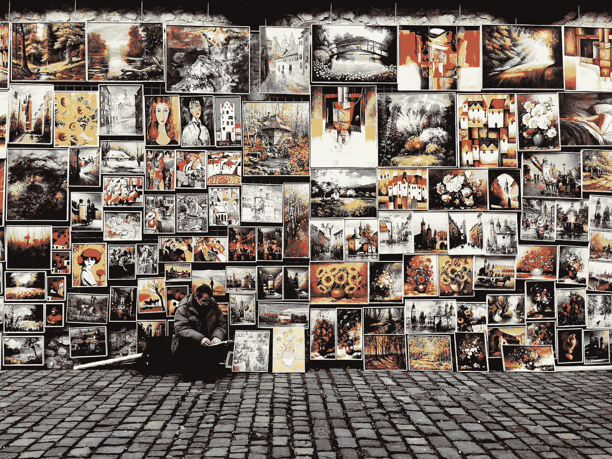

# 你的艺术可能永远不会像病毒一样传播或改变世界——但还是要去做

> 原文：<https://medium.com/swlh/your-art-may-never-go-viral-or-change-the-world-make-it-anyway-16e4290a4ae3>

[Beata Ratuszniak](https://unsplash.com/@beataratuszniak) | [Unsplash](http://unsplash.com)

如果一件艺术品诞生了，却没有人看到它——这意味着什么吗？

有关系吗？

有时候，我们阻止自己去做我们想做的事情，因为我们害怕可能会发生的事情——或者更确切地说，害怕可能不会发生的事情。我们不创造那个故事，或写那首歌，或追求那个想法，因为我们不认为它会…