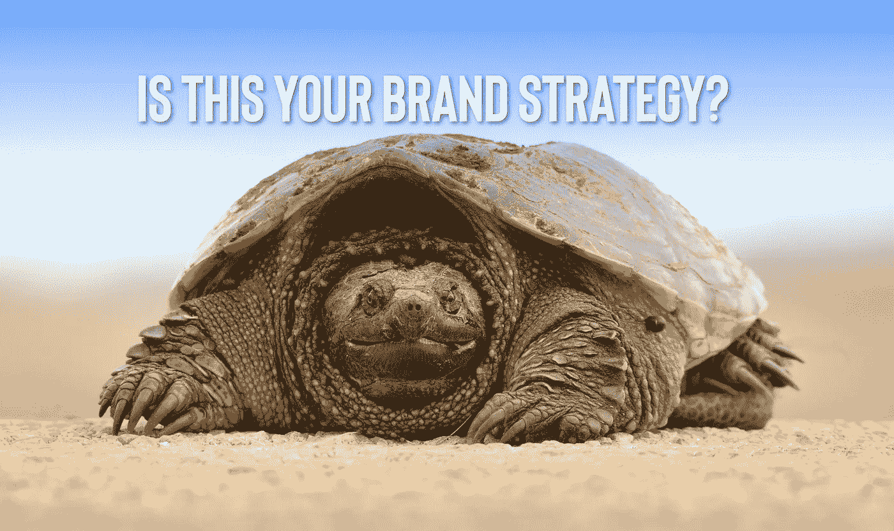
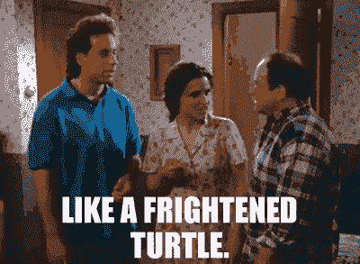

# 你的品牌:像不像受惊的乌龟？

> 原文：<https://medium.com/swlh/your-brand-does-it-resemble-a-frightened-turtle-e490ea029e04>

当杰瑞·宋飞被伊莱恩问及男人游泳后的身体结构以及某些部位如何经历“缩水”时，杰瑞的回答立刻成为经典笑点:“就像一只受惊的海龟。”

尽管这很有趣，但不幸的是，看到太多的品牌在计划下一步行动时失去了远见，在这个过程中经历了自己的萎缩。

一个根本原因不是他们做出的选择，而是他们不想做出的选择。

# 受惊的海龟不是策略。这是一种反应。

如果品牌化的步骤太试探性，范围太小，它们就太小而不能产生影响。

如果他们大胆、包容、见多识广，他们不仅能改变你的品牌的未来走向，还能改变你的品牌所属的整个行业。

这就是神奇之处。

小步渐进。

巨大、大胆、包容的步伐是革命性的([是我经常写的一个话题](https://www.risingabovethenoise.com/3-secrets-to-launching-a-brand-revolution/))。

因此，我在今天的*一分钟星期三*中提出的问题是:*你在为你的品牌创造一种进化吗？或者在你的行业里创造一场革命？*

为了使问题具体化，品牌认为的大动作往往是一小步，是大局计划中的一个小动作，非常像上面那只受惊的海龟。

这是任何人或品牌都不应该忍受的。

在你的观察中变得机敏，在你的品牌中变得聪明，在你的视野中变得足够大，你将不仅是不可阻挡的，你还将与鲨鱼共泳并活着出来。

## 从这篇文章中获得了价值？
然后鼓掌，分享，关注我，订阅我的 [YouTube 频道](https://www.youtube.com/user/headmusik)每周有新视频。需要一个品牌重塑或一个难忘的主题演讲人？在这里联系我。

## 这篇文章发表在 [The Startup](https://medium.com/swlh) 上，这是 Medium 最大的创业刊物，拥有+388，456 名读者。

## 在这里订阅接收[我们的头条新闻](http://growthsupply.com/the-startup-newsletter/)。

