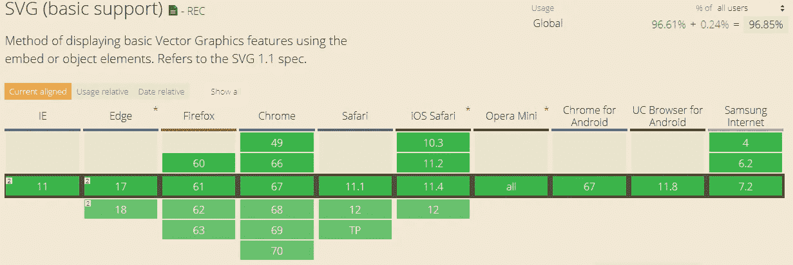
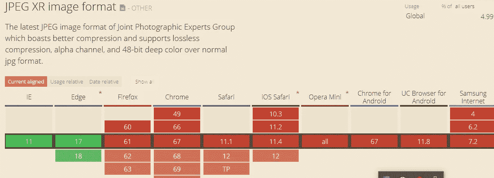
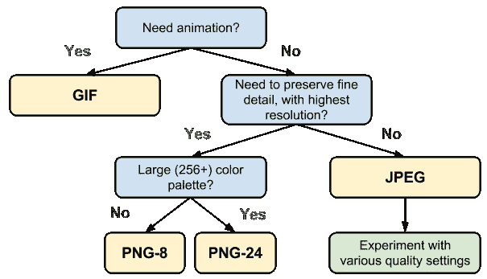
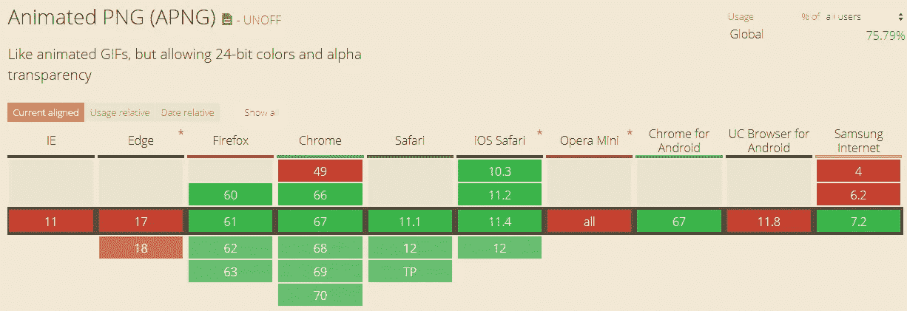
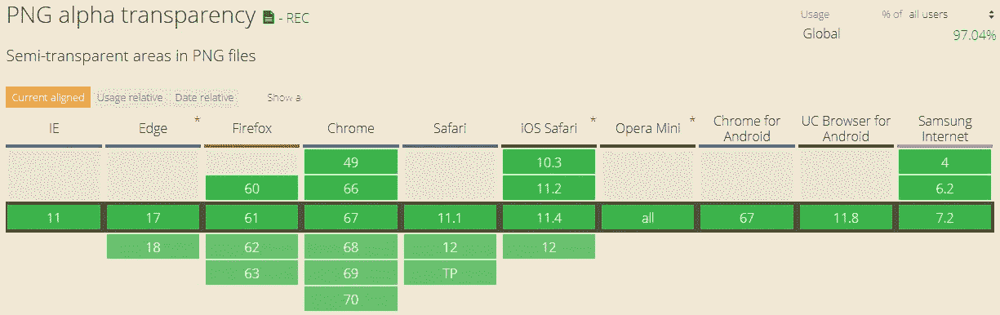
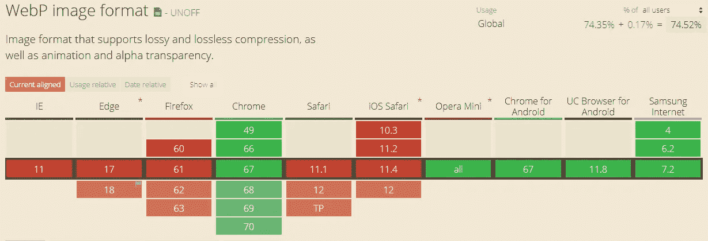

# 您为网站和网络应用程序选择的图像格式

> 原文：<https://medium.com/swlh/your-choice-of-image-formats-for-websites-and-web-apps-73856e15305f>

这是 2018 年！在写这篇文章的时候，人们已经变得非常不耐烦，这种现象被心理学家称为对“即时满足”的追求。21 世纪驱使我们现在想要一切。这种现象甚至影响了我们对网络搜索趋势的思考。JavaScript 在开发人员中很受欢迎，因为它可以在浏览器中操作 DOM 来加载内容，而无需多次刷新，给人的印象是它比任何其他 web 编程语言都快。快速的网站和应用程序为客户带来了更好的用户体验。谷歌的开发者网站显示，像[阿里巴巴](https://developers.google.com/web/showcase/2016/alibaba)和[书展](https://developers.google.com/web/showcase/2017/bookmyshow)这样采用渐进式网络应用的公司，在所有浏览器中的转化率分别为 76%和 80%。这种体验部分归功于装载速度。图像约占互联网的 65%。因此，优化是网站或应用程序性能的关键。有不同的图像格式可用于各种目的。

# **1。基于矢量的图像:SVG**

基于矢量的图形在为需要缩放的对象呈现可视内容时肯定更好。它适用于地图、图标、徽标、动画内容和图形。它使用形状、线条和可编辑的路径，可以通过数学运算进行操作，并且是无损的——这是一种真正的数字格式。一些令人惊叹的功能包括无损压缩的简易性、可伸缩性、与 JavaScript、HTML 标记和 CSS 的兼容性，从而减少 HTTP 请求，以及动画功能。浏览器支持很棒！

Browser support for SVG format

***SVG 优化资源***

制作一个 SVG HTML 汉堡按钮([https://ray gun . com/blog/2014/07/making-SVG-HTML-Burger-Button/？UTM _ source = blog _ SVG _ opto mization](https://raygun.com/blog/2014/07/making-svg-html-burger-button/?utm_source=blog_SVG_optomization)

[https://raygun.com/blog/2016/07/designing-for-developers/?UTM _ source = blog _ SVG _ opto mization](https://raygun.com/blog/2016/07/designing-for-developers/?utm_source=blog_SVG_optomization)

***浏览器工具***

[https://jakearchibald.github.io/svgomg/](https://jakearchibald.github.io/svgomg/)

[https://kraken.io/web-interface](https://kraken.io/web-interface)

https://github.com/Lusimba/grunt-svgmin

[草图](https://www.sketchapp.com)

*Bummer:* 随着图像复杂度的增加，SVG 的大小会快速增长。另外，你不能用它来拍摄照片。

# **2。JPG**

这是最受开发人员欢迎的格式。它支持数百万种颜色，这使它默认适合摄影内容。所有能上网的设备都支持它。此外，高达 60–75%的压缩率可减少图像尺寸的适度视觉退化。然而，如果你的目标是透明，你就不能使用它。

JPEG XR 和 JPEG 2000 是更新、更有效的格式。

Browser support for JPEG XR

# **3。GIF**

图形交换格式(GIF)在其 8 位无损格式上支持多达 256 种颜色。尽管它在支持照片方面有局限性，但它的小尺寸、对透明度和动画的支持使它适合于横幅、徽标、表情符号等。

[Ilya Grigorik’s d](https://developers.google.com/web/fundamentals/performance/optimizing-content-efficiency/image-optimization#selecting-the-right-image-format)ecision tree on choosing the appropriate image format for your websites and web apps

# **4。巴布亚新几内亚**

Browser support for Animaged PNG

便携式网络图形(PNG)还支持 8 位和 24 位图像格式的透明和无损压缩。它是由 W3C 专门为网络开发的。大多数浏览器部分支持动画 PNG

Browser support for PNG

# **5。WebP**

WebP 是 Google 对网页图片优化的贡献。它是在 2010 年开发的，是开源的。对于 JPEG 等有损图像格式，它提供的无损图像比 PNG 同类产品小 26%和 25–34%。透明度支持 22%的额外字节。换句话说，它是 JPG 和巴布亚新几内亚的最佳选择，图像尺寸较小。但是，它仅在 Chrome 浏览器上受支持。

Browser support for WebP

**结论**

图像格式的选择取决于期望的质量以及客户/开发者的需求。在加载速度和浏览器支持之间取得平衡是明智的。以用户为中心的开发侧重于寻找一种方便的方式来共享高质量的资源，以实现较低的带宽和高可伸缩性。检查兼容性的一个重要工具是[can use](https://caniuse.com/)网站。web 和应用程序开发的效率将重点放在用户体验上。

## 这篇文章发表在 [The Startup](https://medium.com/swlh) 上，这是 Medium 最大的创业刊物，拥有+383，719 名读者。

## 在这里订阅接收[我们的头条新闻](http://growthsupply.com/the-startup-newsletter/)。

