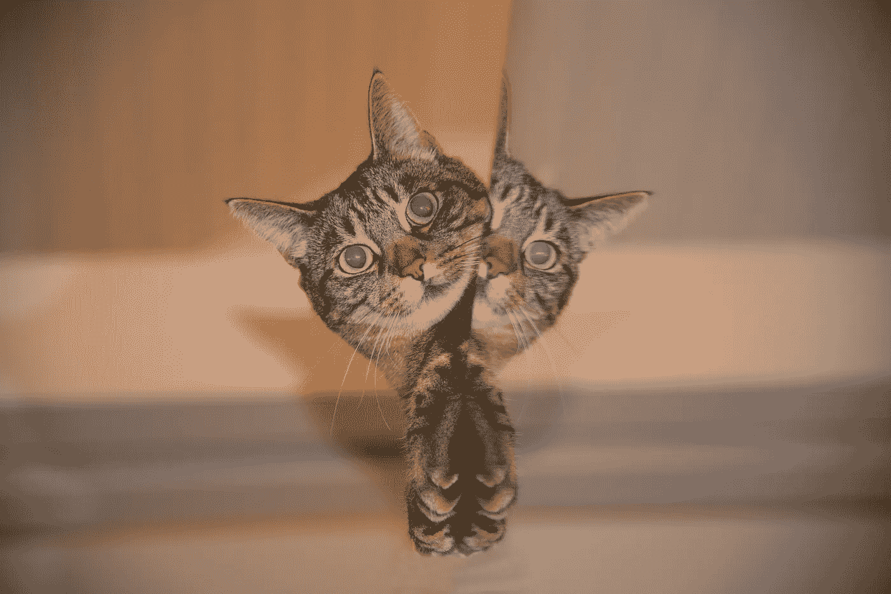

# 你的客户不是机器人，你也不是

> 原文：<https://medium.com/swlh/your-clients-not-a-robot-and-neither-are-you-511829a439a>

Photo by [Franck V.](https://unsplash.com/photos/YKW0JjP7rlU?utm_source=unsplash&utm_medium=referral&utm_content=creditCopyText) on [Unsplash](https://unsplash.com/search/photos/robot?utm_source=unsplash&utm_medium=referral&utm_content=creditCopyText)

你有没有试过在一个重要的会议上表现得超级专业…只是在会议开始时咖啡洒在了你的白衬衫上？接下来发生了什么？

根据我的经验，接下来会发生什么取决于溢出效应对形势的反应。如果喝咖啡的人假装什么都没发生，其他参与者也会假装，会议就变得有点尴尬。但是如果喝咖啡的人说了几句轻松的话，笑了笑，会议立刻变得更加友好，有时甚至更有成效。

这里发生的是镜像。

Photo via Pixabay

这是我们人类的自然本能，我们必须反映我们与之互动的人的举止和感知的情绪。如果我们看到有人微笑，我们通常会报以微笑，我们的大脑中会对那个人产生一点点好感。但是，如果我们看到有人看起来气势汹汹，我们会皱眉，给那个人一个很远的距离。

对于通过电话和电子邮件开展业务的自由职业者来说，这些镜像的东西有什么关系呢？因为镜像通过我们的声音起作用，甚至在我们的书面交流中。这就是我们与客户建立良好关系的方式，良好的关系对于回头客来说至关重要。

当我们与客户打交道时，很难放松警惕，因为我们正努力做到专业。但通常我们对“专业”的解释意味着我们将自己的个性和人性抛在脑后。我们不开玩笑，不闲聊。我们是专业的！

我们试图谨慎行事——毕竟，我们的生计取决于我们正在打交道的客户，所以我们不想说任何可能被误解或不良影响的话。那似乎是明智之举，不是吗？

但是把我们的个性留在家里是一个错误。

要建立客户的忠诚度和信任度，不仅仅需要出色的工作和按时完成任务。这需要融洽。

融洽并不意味着你们成为最好的朋友，而是意味着在电话交谈开始时花两分钟时间聊些工作以外的事情。也许你会提到你周末去听的音乐会。也许你会问你的客户关于前一天袭击他所在地区的反常暴风雪。

从一种没有人情味的交易关系转变成一种温暖的工作关系并不需要太多。

好处是巨大的:

*   它会铺平道路上的任何颠簸。如果你的客户喜欢你个人，他们更有可能理解和原谅你工作中的任何小问题。
*   进行专业讨论会更容易。当你的客户给你反馈时，他们不会觉得必须在你周围如履薄冰。这是一个巨大的红利，因为这让他们的生活更容易，这让你成为一个最受欢迎的自由职业者。
*   这会让你与众不同。当客户在考虑下一个任务该找谁时，他们会记得那个很乐意与之交谈的人，因为谈话中包含了一些人性化的时刻。

当一个人真诚时，人们会有一种内在的感觉，他们会对此做出反应。所以，振作起来，展现你的个性吧！

我知道你在想什么。*但是如果他们不喜欢我的个性呢？*

即使知道这一点也是件好事。如果你让谈话活跃起来的尝试失败了，你就有了关于你的客户和你所面临的工作关系的额外信息。最后，套用《T4》一书的作者迈克尔·波特的话:

有些客户是我们应该为之服务的，有些则不尽然。

*最初发表于*[*www.writeandprosper.com*](https://www.writeandprosper.com/blog/2018/not-a-robot?fbclid=IwAR037ZGjUukAJ1HMajrcScHetg8H4TMHuVM6xxE5xzYLcJENlB_zbxMVpfc)*。*

想创造一个会一次又一次回来的“粘性”客户吗？拿一份免费指南， [*5 个简单的写作技巧来创建粘性客户*](https://www.writeandprosper.com/5-simple-writing-tweaks) 。你的客户会喜欢你的。:)

## 这篇文章发表在 [The Startup](https://medium.com/swlh) 上，这是 Medium 最大的创业刊物，拥有+ 380，266 人关注。

## 在这里订阅接收[我们的头条新闻](http://growthsupply.com/the-startup-newsletter/)。

