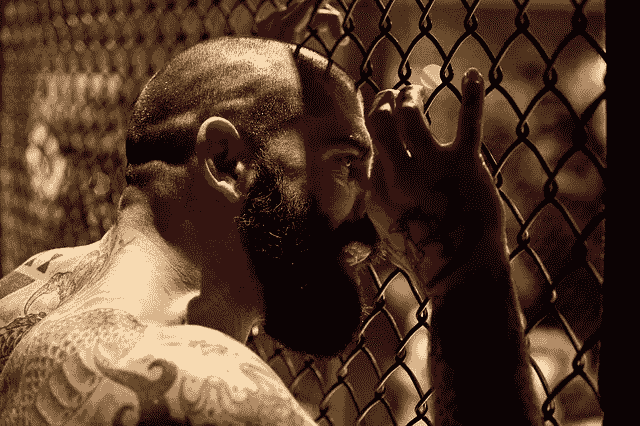

# 你对坚强的定义并不适合你

> 原文：<https://medium.com/swlh/your-definition-of-toughness-doesnt-serve-you-bc5e6c122f13>

[C_Scott/pixabay](https://pixabay.com/en/mma-network-cage-tattoos-beard-2282013/)

当你听到强硬这个词时，你会想到什么？穿皮夹克、骑摩托车、吃肉、喝啤酒的老套男人？如果是这样的话，你就把强硬这个词定义为“倾向于暴力”

不用说，这个定义在当今社会对你没什么帮助。如果你认为你很强硬，你会对别人咄咄逼人，即使你没有身体接触。

带着这种态度，你可能认为你在“把事情做好”，但实际上，你会疏远别人，而且时不时地，你会遇到真正的麻烦。

# 这个定义的两端都有问题

你可能认为你不强硬，因为你是一个文明人。在这种情况下，你会一直对每个人都很好，不管他们做什么，也不管情况如何。

这两种态度在当今社会都是不恰当的，都源于你对强硬这个词的定义“倾向于暴力”

那我们如何解决这个问题呢？是的，你猜对了。我们将对强硬这个词采用不同的定义。

> 坚韧:能够忍受艰难或痛苦。

如果你生活在一个西方民主国家或类似的社会，这个定义在今天的社会中会更有用。现在，当你采用这个定义时，你会想到什么？一个生了孩子的女人很自然的浮现在我的脑海里。

# 坚韧中包含的美德

有了这个定义，你就不需要对别人咄咄逼人，惹上麻烦，疏远别人来变得强硬。

这个定义包含了 [**毅力**](https://ideavisionaction.com/personal-development/cultivate-unbreakable-perseverance/) 到 [**当事情变得艰难的时候继续朝着你的目标努力**](https://ideavisionaction.com/personal-development/creating-a-reward-system-to-keep-going-when-the-going-gets-tough/) 。这需要自律，无论承诺有多难，都要坚持。

这需要培养 [**勇气**](https://ideavisionaction.com/personal-development/how-to-cultivate-world-class-courage-in-a-single-year/) 去面对你最可怕的恐惧。对我来说，所有这些听起来比“有暴力倾向”更有意义和有用。

# 如何培养韧性

如果我们把韧性定义为“忍受艰难或痛苦的能力”，我们该如何培养它？不，你不需要成为受虐狂，但一些健身训练可能会有所帮助。首先想到的是负重训练。

负重训练可以提高你的韧性，但以我的经验来看，慢跑效果更好。举重的时候，重复几次，最难的部分就结束了，我可以休息了。慢跑时，我会长时间进行高强度、低强度的身体活动。

# 举重和慢跑

举重时，我的身体很痛苦，但我的大脑很享受这个过程。刚开始慢跑的时候，身体不喜欢，但脑子讨厌。它缺乏举重的刺激，导致无法忍受的无聊。

如今，我已经习惯了慢跑，甚至开始享受这个过程。也许，这很有效，我变得更坚强了。

# 维姆·霍夫方法

现在我正在尝试另一种方法。这就是维姆·霍夫方法。这是一种呼吸法和冷水淋浴的结合。

你可能会认为我不介意呼吸，但讨厌冷水淋浴，但事实正好相反。

深呼吸 45 秒后，我的身体习惯了冷水淋浴，就像在海里游泳一样。但是那种呼吸感觉太无聊了。

# 找到自己的做法

我觉得不舒服的和你觉得不舒服的可以不一样。底线是培养韧性，找一些你觉得不舒服的事情去做。换句话说， [**爱情的痛苦**](https://ideavisionaction.com/personal-development/love-the-pain/) 。

# 1%的改进

在培养韧性时，你不需要在第一次尝试中接受最艰难的挑战。你要做的就是每天走出自己 1%的舒适区。那些 [**1%的改进**](https://ideavisionaction.com/personal-development/how-to-improve-your-life-38x-in-a-year/) 随着时间的推移累积起来。

比如，第一次尝试不需要洗冷水澡。在你的常规淋浴结束时，把水调到你能忍受的最低温度，在下面呆一分钟。

每天把水变得更冷，直到你到达最冷的位置。当你达到那个水平时，每天增加 15 秒的持续时间。不用说，有什么健康状况就不要洗冷水澡，以免晕倒受伤。

# 使用反转

第二种发展韧性的方法是使用 [**反转法**](https://ideavisionaction.com/personal-development/make-the-achievement-of-your-goals-inevitable/) 。那就是 [**消除一切削弱你的**](https://ideavisionaction.com/personal-development/eliminate-bad-habits-with-a-simple-question/) 。这可能是网络成瘾，娱乐性药物，包括酒精和咖啡，或游戏成瘾。

# 培养同情心

第三种方法是 [**培养慈悲心**](https://ideavisionaction.com/personal-development/an-unexpected-shortcut-to-mental-toughness/) 。当你沉浸在愤怒中时，很难对一个人产生同情心。

这需要站在他们的立场上，从他们的角度看世界。在现实世界中，这是一项有益的技能。

# 结论

如果你把强硬定义为“有暴力倾向”，你要么接受它，要么抛弃它。从长远来看，这两种选择都没有好处。

如果你将韧性定义为“处理困难和痛苦的能力”，并努力培养它，你将增加在现实世界中成功的机会。

有几种方法可以培养韧性，锻炼身体，消除削弱你的习惯，培养同情心。

而且别忘了，这是一个过程。你可以通过每天提高 1%的自律、勇气和毅力来培养世界级的韧性。

***如果你真的想让你的生活更上一层楼，*** [***注册我的电子邮件简讯***](https://ideavisionaction.com/email-newsletter/) ***每周都会收到我关于个人发展和生活经验的最新帖子。***

## 这个故事发表在 [The Startup](https://medium.com/swlh) 上，这是 Medium 最大的企业家出版物，拥有 344，974+人。

## 在这里订阅接收[我们的头条新闻](http://growthsupply.com/the-startup-newsletter/)。

