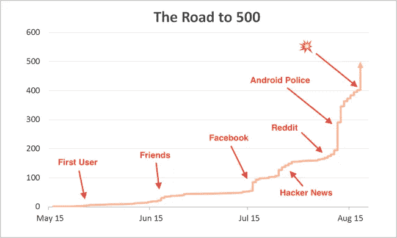

# 你的前 500 个用户

> 原文：<https://medium.com/swlh/your-first-500-users-dd61e4e5c9a2>

## 关于[这篇文章](https://blog.mitchjlee.com/2015/your-first-500-users)的最新版本，请参见[我的博客](https://blog.mitchjlee.com/)。

当我和我的联合创始人 Alex 决定将 [Penny](https://www.pennyapp.io/?utm_medium=Medium&utm_source=Your%20first%20500%20users&utm_campaign=top) 从有趣的黑客马拉松项目变成真正的产品时，我们对增长一无所知。

当然，我们已经做了必要的谷歌搜索来寻找一些灵感。当你搜索诸如“如何获得用户”或“发展你的创业公司”或“我在搞什么鬼，请帮帮忙”之类的东西时，你会发现不缺少快速致富类型的文章、兜售其服务的企业、兜售其专业知识的个人，等等。

问题是，我们发现的大多数文章(1)缺乏可操作的内容，(2)是露骨的广告，或者(3)完全没有帮助。他们谈论参加会议来建立你的关系网，为 Salesforce 等服务付费，或者为你的新公司建立社交媒体。

好吧，让我告诉你，当你是一个两人团队试图获得你的第一批用户时，这些都没有用。许多增长战略都是针对那些已经拥有几千名用户，并且有资金和带宽的公司——你知道，那些有能力支付广告费用、发布自己的博客帖子或培养自己的社交媒体存在的公司。

在这篇文章中，我将详细讲述我和亚历克斯是如何接触到我们的第一批 500 名用户的。我们的策略可能并不适用于所有人(尤其是那些在企业领域的人)，但至少它应该揭示了创业生命中经常被忽视的一部分:开始。

但首先，一些警告:Penny 是预收入(在撰写本文时)，所以需要花钱的策略是不可能的。出于许多原因，我们也想避开传统的科技新闻渠道，所以向 TechCrunch 和 Next Web 发送电子邮件也是不可能的。

# 从 0 到 10

我们的前十个用户是最容易的。Alex 和我(尤其是 Alex)竭尽全力让 MVP 尽快出炉。我们在一个周五正式开始，接下来的周五，我们迎来了第一个非米奇或亚历克斯的用户:我的女朋友。她打了大约 12 个不同的错误，但我们就坐在她旁边，并在运行中修复它们，直到她最终将一个银行账户与 Penny 关联起来。幸运的是，我(和亚历克斯)有一个耐心的女朋友。

> 方法一:重要的其他人，最好的朋友，室友。

从那以后，我们又花了几天时间来消除我们在第一次入职时注意到的所有粗糙边缘。然后，我们逐渐增加用户 2 到 10，在过程中加入反馈和学习。

这些用户来源于我们采访的几十个人，他们实际上是在编写代码；具体来说，我们找到了对我们的想法最感兴趣的人。(旁注:如果你没有和潜在用户交谈过，或者他们对你的想法不感兴趣，你现在应该有一种不安的感觉。)反过来，受访者大多来自朋友、家人，以及一大堆相距甚远的个人理财专家。

> 方法二:产品调研参与者。

就这样，我们的第一批 10 个用户已经稳操胜券了！需要注意的一点是:我们尽了最大努力让所有这些用户亲自参与进来，这样我们就能亲眼目睹他们的体验。它减慢了我们的速度，但也是非常宝贵的。

# 从 10 到 50

从 10 个用户增加到 50 个用户只是稍微更有挑战性。现在可能是一个很好的时机来提及我们非常幸运地拥有一个强大的同事和朋友网络。当谈到项目创意或创业时，我总是对依靠我的朋友群感到紧张——我有一种成为那个人的不合理的恐惧。

对我来说幸运的是，在他们张开双臂拥抱我们的项目(在这一点上，Penny 仍然是一个项目)之前，我几乎不必向那个网络的方向呼吸。诀窍是要有品味，记住你的项目不是他们生活中最重要的事情。真诚也大有帮助。

> 方法三:脸书和朋友。

一篇关于佩妮的脸书帖子和一条关于超大群聊的消息之后，我们有了第一批 50 个用户。长话短说:不要低估自己人脉的价值。

# 从 50 到 500 甚至更多

正是在这一点上，我们开始挠头思考，“现在怎么办？”

首先，我们决定在[真正的营销页面](https://www.pennyapp.io/?utm_medium=Medium&utm_source=Your%20first%20500%20users&utm_campaign=middle)上扣动扳机。起初，我对投入这一努力感到非常害羞，但亚历克斯的直觉证明是正确的:拥有一个高质量的营销页面会增加你所做工作的可信度，并使你的工作变得容易得多。

> 先决条件:一个好的营销页面。

假设这个页面最终有很好的转化率(一开始很难计算)，你可以把注意力集中在提高营销页面的流量上，剩下的就交给它自己吧。

(专业提示:如果你没有设计眼光，就借用别人的。这就是网络的工作方式——每个人都不断地从其他人那里借用设计线索。在我们的例子中，我们使用 [lapa.ninja](http://lapa.ninja/) 来寻找灵感。是的。忍者现在是个东西了。)

一旦我们的营销页面建立并运行起来，我们就把注意力转移到实际的流量上。

幸运的是，我们有一个非常科学和精确的计划来做到这一点:猎枪方法。我们和我们的一位营销朋友一起头脑风暴了十种增加网站流量的方法，根据每单位努力的预期流量削减了列表(并对其进行了加权，使得现在*的流量*比后来*的流量*的流量】更重要)，然后不顾后果地向前推进。

我们的第一步是与一些早期采用者社区分享 Penny。

> 方法 4:与早期采用者社区分享。

不幸的是，亚历克斯和我都没有对 Reddit 或 Hacker News 等更受欢迎的技术社区产生影响，所以我们必须绕过这个障碍，或者从头开始建立影响力。

首先，我们决定在没有任何影响的情况下展示 HN——黑客新闻的一部分，旨在与社区分享您的项目——因为 YOLO。

在我们分享它的那天，我们有大约 700 个不同的人访问了我们的网站，其中大约 100 人点击了下载按钮，大约 40 人注册了。考虑到大多数像这样的“向上投票”网站都有非常二元的结果(要么你得到流量，要么你没有)，我们对这个结果很满意。

与此同时，我开始以一种有意义的方式向 Reddit 投稿(回答关于个人理财的问题，发布有趣的猫咪 gif 等)。)因为 Reddit 社区不喜欢第一次出现并大喊“看看我做了什么！”在我满意之前，我花了几个星期的时间来做这件事。

然后，我们开始参与具体的子编辑(对于门外汉:子编辑是一个有主题的社区，比如个人理财、企业家或 corgie，通常以/r/)开头)。例如，我们在网站上向 [/r/web_design](https://www.reddit.com/r/web_design/comments/3gw1i9/finally_mobile_friendly_nongif_animations/) 发布了关于我们如何制作强大的、移动友好的动画。虽然我们没有征求对产品本身的反馈，但人们看到了产品并产生了兴趣。

总之，我们从 Reddit 吸引了大约 30 名用户。

我们的下一步是将 Penny 提交给一些较小的技术聚合网站和论坛，如 alternativeTo、AndroidPIT 和 AppShopper。如果你追求类似的策略，你可能会发现 submit.co 很有帮助。

> 方法 5:提交到技术聚合网站。

事实证明，这种方法的影响非常小，只有一个明显的例外:我们将其纳入 Android Police 的[双周回顾文章](http://www.androidpolice.com/2015/08/10/19-new-and-notable-and-1-wtf-android-apps-from-the-last-2-weeks-72815-81015/)之一，最终看到 Android 注册人数大幅增加。一个来自菲律宾的人写信给我们，问为什么他们不能下载这个应用程序(我们现在只是我们)。直到我们问他是怎么发现佩妮的，我们才发现了这篇文章。这相当于近 200 个新注册用户，在两天的时间里，我们的用户数量翻了一番。

我们迈向 500 强的最后一步是接触个人金融博客。

> 方法六:联系专家。

鉴于我们对获得高质量反馈的强烈关注，我们的外展主要包括向我们认为是专家的人(在这种情况下，个人金融博客)询问对我们所建立的反馈。我会第一个承认，与其说这是一种成长的方法，不如说这是一种反馈的渠道，但在有人特别感兴趣的情况下，成长(或至少曝光)通常会随之而来。

这些方法已经并将继续在超过 500 个用户的范围内发挥作用。然而，他们对我们超越朋友和家人的扩张至关重要，并且特别适合早期更温和的用户增长。

# 摘要

概括来说，这里有一张我们注册人数随时间变化的注释图(截断为 500 名用户)。

如果你想知道💥结尾不是编出来的。那时事情变得相当有趣——但那完全是另一个故事了😉。

> 如果你喜欢这个，不要害羞👏为了它！

一如既往，欢迎反馈: [@dontmitch](https://twitter.com/dontmitch) 或 mitch [at] pennyapp.io

[米奇](https://mitchjlee.com)，联合创始人@ [佩妮](https://www.pennyapp.io/?utm_medium=Medium&utm_source=Your%20first%20500%20users&utm_campaign=bottom)