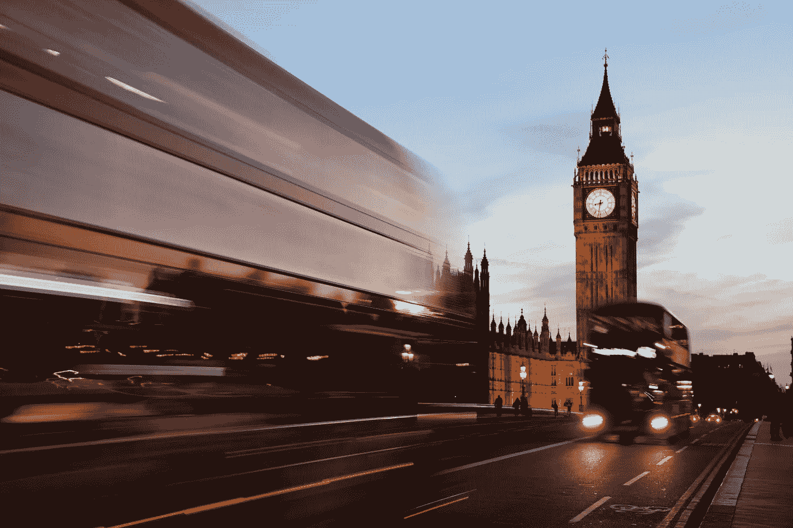
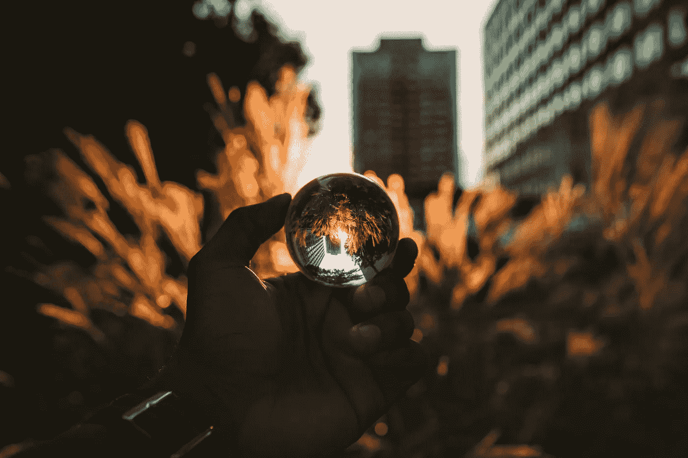

# 你的四个神奇小时

> 原文：<https://medium.com/swlh/your-four-magical-hours-82a16934a3bc>

Photo by [David Dibert](https://unsplash.com/photos/POYDluw0tyw?utm_source=unsplash&utm_medium=referral&utm_content=creditCopyText) on [Unsplash](https://unsplash.com/search/photos/clock?utm_source=unsplash&utm_medium=referral&utm_content=creditCopyText)

> 我们经常觉得我们的 24 小时不够。事实是，我们每天只需要 4 个小时。

我们的文化就是时间优化。

我们觉得如果我们不坚持不懈地前进，我们就会被其他人超越。

> 我们一直在努力…
> 
> …尽可能紧密地包装我们的日历。
> 
> …尽可能地从每一刻中挤出更多的时间。
> 
> …最大化我们每时每刻在做的事情。

结果就是我们一直在工作。

但我们从未真正发挥作用。

我们像半醒的僵尸一样走来走去。我们假装很忙，同时从事一些无意义的活动。

没有人能每天集中注意力超过 8 小时。

正如研究表明的那样，人类的大脑甚至不能每天专注于高强度的工作超过 4 个小时。

# 工作与做有意义的工作

Photo by [Joshua Rawson-Harris](https://unsplash.com/photos/md7cCWYVq9U?utm_source=unsplash&utm_medium=referral&utm_content=creditCopyText) on Unsplash

当然，我们所有人都在工作四个多小时。

但是大部分时间都被浪费了。

一旦我们达到了注意力的极限，我们就无法集中到真正有意义的工作所需要的程度。

我们做一些简单的活动，如发送电子邮件、召开会议或任何其他类型的重复性活动。

这就是我们所说的工作。

但这能产生什么样的真实、切实的结果呢？

> 工作和全神贯注于重要的工作之间有着巨大的差异。

有意义的工作是那种你专注于通过生产别人需要的东西来创造真正价值的工作。

做有意义的工作，意味着专注于创造的过程。

# 只有一件事需要优化。

Photo by [Kyle Sudu](https://unsplash.com/photos/u7gCPkoluTo?utm_source=unsplash&utm_medium=referral&utm_content=creditCopyText) on [Unsplash](https://unsplash.com/?utm_source=unsplash&utm_medium=referral&utm_content=creditCopyText)

> 你唯一需要优化的是如何度过工作日的前四个小时。

这是你的四个神奇小时。

这是你所有重要工作完成的时候。

在这神奇的四个小时里，你应该只关注一件事。这就是创造的过程。

> 在这四个小时里…
> 
> …编码人员除了尽可能创造最好的代码之外，什么也不应该做。
> 
> …工程师除了专注于创造尽可能最好的产品之外，什么也不应该做。
> 
> …销售人员除了创造最有价值的商业机会之外，什么也不应该做。

人们所做的活动可能是不同的。

但最终，每个人都应该把这神奇的四小时花在尽可能创造最有意义的工作上。

# 保护好这四个小时。

Photo by [Tanaphong Toochinda](https://unsplash.com/photos/9x3jGcu3qQ0?utm_source=unsplash&utm_medium=referral&utm_content=creditCopyText) on [Unsplash](https://unsplash.com/search/photos/mother?utm_source=unsplash&utm_medium=referral&utm_content=creditCopyText)

人们认为，尽可能把日历排得满满的，尽可能多做不同的事情，可以完成更多的事情。

事实是，他们做得更少。

为什么？

因为他们在应该专注于创作过程的时间里安排了不重要的工作。

因为当他们在一个安静的地方坐下来专注于他们的工作时，他们的注意力已经达到了极限。

因为他们会被各种各样与创作过程无关的事情分心。

他们应该做些什么呢？

他们应该选择一个单一的项目来工作。一个项目，它的完成将非常有价值。

他们所有的注意力都应该集中在这件事情上。

每天早上，他们应该花四个小时独自研究这个东西。

每天早上和自己预约一次。一次约会，为这个最重要的项目工作至少四个小时。

像母亲保护孩子一样保护这个约会时间。

不管是什么，其他的一切都要等到以后了。

# 围绕这四个小时构建你的生活。

Photo by [Brannon Naito](https://unsplash.com/photos/ua9xF2hasI4?utm_source=unsplash&utm_medium=referral&utm_content=creditCopyText) on [Unsplash](https://unsplash.com/search/photos/life?utm_source=unsplash&utm_medium=referral&utm_content=creditCopyText)

大多数人无法在他们神奇的四小时内真正高效的原因是因为他们没有做出必要的牺牲。

> 在这神奇的四个小时里，你需要做出牺牲来做好自己的工作，这不亚于围绕保护这段时间来构建你的一生。

假设你的朋友邀请你去泡吧。

去夜店会让你无法在早上 8 点回到日常工作中。

除非是在你休息的前一天，否则你将不得不友好地拒绝你朋友的邀请。

为什么？

因为会打乱你保护自己四个神奇小时的习惯。你把创作时间作为生活第一要务的习惯。

同样的原则也适用于生活的其他方面。

它们的设计方式必须能让你在工作时间尽可能地高效。

让我们以另一种工作为例。那种你在完成你的四个神奇小时后做的工作。

会议、电子邮件、社交活动。

不管是什么，你都必须足够早地完成这类工作，给自己时间和空间休息，补充能量。

你需要为第二天早上做好准备。

# 一些最后的话:

> 给你的生活留点空间，这样你在工作日的前四个小时就能 100%集中注意力。如果你坚持这样做，在你生命中的每一个工作日，你最终会成功。

这个原则需要你做出一些牺牲。

> 它需要你…
> 
> …以这样一种方式设计你的生活，让你始终在同一时间上班。
> 
> …确保你的能量在一天工作开始时充满。
> 
> …拒绝那些会分散你注意力的机会，让你无法优先创造时间。

然而，收益完全超过了成本。

你将不得不工作更少的时间，同时创造更强大的产出。

你将不再忙于各种无意义的工作，只关注真正重要的事情。

你将能够重新掌控自己的生活，将私人生活和工作生活结合起来。

申请这些福利并不是一件容易的事情。

我们的目标是在开始一天工作的半小时内达到可以预见的进入[心流状态](https://en.wikipedia.org/wiki/Flow_(psychology))的程度。

然后你继续工作(短暂休息),直到你觉得你不再能 100%集中精力。

把自己逼到这一点以外是没有任何意义的。

如果你一直把自己逼到筋疲力尽的地步，那么你只会损害你在第二天早上表现最佳的能力。

在这四个小时里做你最重要的工作。

之后，专注于满足你所有的其他需求。

你的心灵会因此而感谢你。

**这里有一些问题要问你自己:**

*   如果我每天只有这四个小时，我会专注于哪个项目来对我的业务产生最大的影响？
*   在这神奇的四个小时里，我目前在做什么让我无法发挥出自己的最佳水平？
*   我需要如何重组我的生活，才能在这神奇的四小时里最大限度地集中注意力？

**如果你觉得这篇文章有用，请👏并与你的朋友分享。记住，你最多可以鼓掌 50 次——这对我真的很重要。**

**您也可以通过** [**点击这里**](https://mailchi.mp/b0d1e1fba452/struggle-first-thrive-later) **订阅我的免费简讯。**

## 这个故事发表在 [The Startup](https://medium.com/swlh) 上，这是 Medium 最大的创业刊物，拥有 310，538+人关注。

## 在这里订阅接收[我们的头条新闻](http://growthsupply.com/the-startup-newsletter/)。

