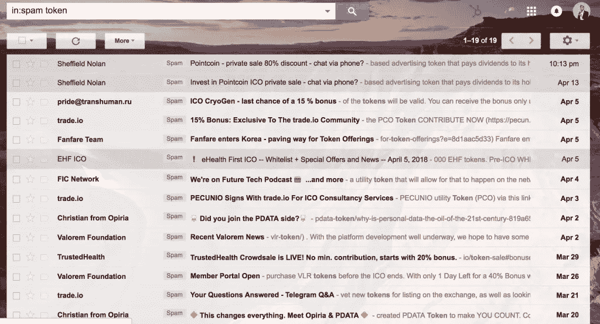
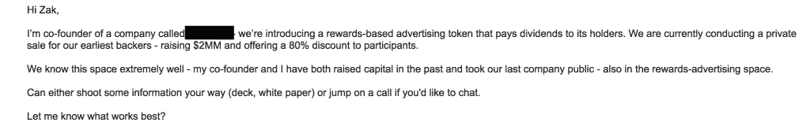

# 你的 ICO 邮件不好，你应该感到难过

> 原文：<https://medium.com/swlh/your-ico-email-is-bad-and-you-should-feel-bad-97aba308f67d>

How I feel when I see another email with “token” in the subject line.

我倾向于不去招惹那些给我发冷漠邮件的人。我受够了这些邮件，我让自己对接收邮件持开放态度，如果我挑出每个给我发垃圾邮件的人，我的博客内容将比中东冲突更持久。

然而，围绕首次公开募股(ico)的垃圾邮件让我很不爽。

具体原因我也不知道。这可能是因为当 ICOs 第一次出现时，我对它们感到兴奋。这是早期公司筹集资金的一种方式，而不必进入萨班斯-奥克斯利法案推动的噩梦，即后期风险投资融资(见我的朋友迈克尔·吉布森的推文[这里](https://twitter.com/William_Blake/status/958874188147654657))。这是一种市场力量，可以真正让私人投资民主化，避开合格投资者。

相反，大多数只不过是蒸汽器皿。[2017 年 ico 59%不合格](https://www.marketwatch.com/story/nearly-half-of-all-2017-icos-have-failed-2018-02-26)。不仅仅是“我们没钱了，但我们测试了市场”失败了。相反，“我们完全放弃了这个项目，我们没有任何东西可以展示，而且，不，你拿不回你的钱。”

更糟糕的是，[泵送和转储方案在 ICO 世界里横行霸道](https://venturebeat.com/2017/08/26/the-ico-world-is-full-of-pump-and-dump-schemes-dont-be-a-victim/)。有实际的订阅团体在重大声明前协调代币的大规模购买。然后，在被骗者买入后，他们协调大规模抛售，导致价格暴跌。

(是的，这是股票违法的。)

我曾经对这些项目感到兴奋。

现在，我宁愿收到一位尼日利亚王子发来的垃圾邮件，告诉我他认识的一位远房亲戚给了我一大笔钱(非加密货币)，也不愿收到另一位 ICO“区块链企业家”发来的冷冰冰的电子邮件，对我来说没有明显的附加值。

去年，我收到了太多(写得很差的)寻找“投资者”的 ICO“企业家”发来的冷冰冰的电子邮件，以至于现在，邮件正文中带有“投资者”的电子邮件往往会被我的垃圾邮件过滤器拦截。考虑到我所做的工作，这是一个巨大的烦恼。

# “投资我的 ICO”电子邮件

这些垃圾邮件困扰着我，不仅仅是因为去年的 ICO 市场给了一个很有潜力的技术一个坏名声。这让我很困扰，因为这些邮件写得太差了。写得如此糟糕，以至于我有时会想，“不管是谁，如果真的咬了这个，都应该失去他们投入的资金。”

今晚早些时候，我的收件箱收到了一封邮件(这也是我写这篇文章的原因)。

乍一看，这是一封还算过得去的邮件。他告诉我他是谁(这家加密公司的创始人)，他在做什么(以 80%的折扣筹集 200 万美元)，以及他想要什么(给我发送更多信息或接听电话)。它是如此的不像样，以至于它会欺骗发件人认为这是一封好邮件。我的半体面原则？向下舍入。

我脑海中立即闪过的问题是:

*   你是谁？
*   你怎么得到我的电子邮件地址的？(好吧，我相对公开一点，但还是。)
*   你为什么给我发邮件说这个？我为什么要在乎？
*   你想从我这里得到什么？去投资？把你介绍给别人？回顾一下你的牌？
*   你为什么用一个半问题来结束你的邮件？

请注意，我的问题实际上与他推销的内容没有任何关系。这不是因为我吹毛求疵。这是因为他的电子邮件太糟糕了，以至于大多数人都懒得参与他的推销的实质内容，直到他向他们证明他为什么给他们发电子邮件，为什么他们应该听他的。

在坐下来写这篇文章之前，我想确认我不认识这个人，并给他我的信息。在 Twitter 和 LinkedIn 上快速搜索一下，我发现不，我不认识他。他只是在给人们发垃圾邮件。

这封邮件中的“区块链企业家”需要为他的邮件设置两个阶段:

1.  这就是为什么你应该听我的。
2.  这就是我想告诉你的。

他也没有真正成功。他没有给出足够的背景来弄清楚他是谁，他是如何得到我的信息的，他为什么给我发电子邮件，为什么我应该听他的。然后他对他的 ICO 的描述很少，我不知道它是做什么的。“一种基于奖励的广告代币，向持有者支付红利”？

什么？

*想看看我会如何重写这封邮件，让它有机会发挥作用吗？更多阅读* [*此处*](https://zakslayback.com/not-send-cold-email-ico/) *。*

## 这篇文章发表在 [The Startup](https://medium.com/swlh) 上，这是 Medium 最大的创业刊物，有 316，638+人关注。

## 在此订阅接收[我们的头条新闻](http://growthsupply.com/the-startup-newsletter/)。

