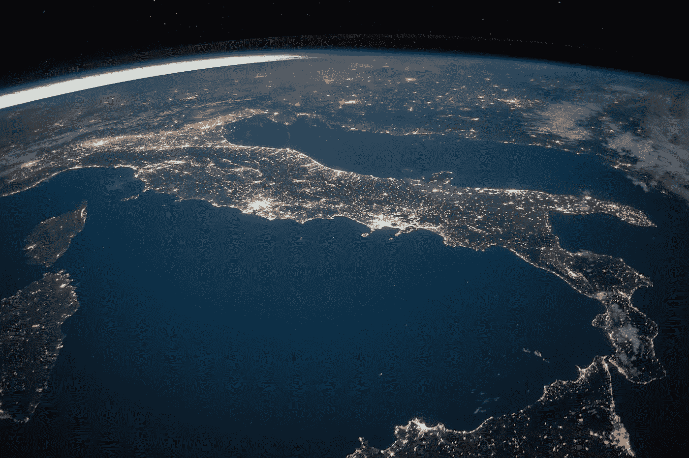
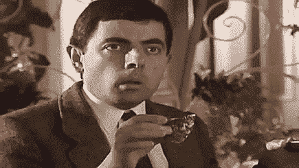
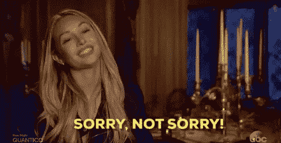

# 你杂乱的收件箱正在扼杀地球

> 原文：<https://medium.com/swlh/your-messy-inbox-is-killing-planet-earth-ebe457409a35>

电子邮件变得如此主流，以至于我们在数字世界中的每一次点击都会收到一封自动生成的电子邮件。例如，PayPal 上的一个简单交易会向您发送电子邮件和通知。脸书/LinkedIn 上的所有通知都以电子邮件的形式复制并发送给您。如果你使用信用卡，你会收到短信和电子邮件(甚至可能是推送通知)。如果我们在任何地方注册，网站说我们已经成功注册，但我们会收到一封确认电子邮件。为什么同样的信息时不时会被复制？

电子邮件已经成为一种标准的交流方式。我们大多数人甚至懒得打开这样的电子邮件。它们只是永远无人问津地留在我们的收件箱里…

Source: [https://www.pexels.com/photo/astronomy-atmosphere-earth-exploration-220201/](https://www.pexels.com/photo/astronomy-atmosphere-earth-exploration-220201/)

# 现在让我们把电子邮件和地球联系起来

电子邮件需要一个休息的地方，称为“存储”。这种“存储”又依赖于*服务器*或*数据中心。这些数据中心运行起来需要大量能源。为什么？因为服务器就像电脑一样，需要电力才能运行。而且，长时间跑步会发热。因此，产生的热量必须得到重视，这就带来了空调的概念。因此，需要大型通风系统来管理数据中心的环境。*

## 事实 1:2014 年，美国数据中心消耗了约 700 亿千瓦时，约占美国总耗电量的 1.8%。

这是一个非常可观的数字，而这正是我们*谈论电子邮件的时候。所以我们中的许多人仍然没有意识到电子邮件对环境的影响。我们从来没想过，对吧？我们只认为像汽车这样的物质正在毁灭地球。但是没有！需要能量来维持运转的非物质事物也在毁灭地球。*

# 这里有一个难题:知道每天有多少电子邮件淹没互联网吗？

答案:大约每秒 240 万封邮件。

# 想知道每封邮件排放多少碳？

电子邮件可以是不同类型的，排放的碳水平也不同。以下是不同类型的电子邮件列表:

>不带附件的普通电子邮件

>带附件的普通电子邮件

>转发的无附件电子邮件

>转发的带附件的电子邮件

>垃圾邮件！

*(如果我错过了任何类型，请在下面的评论中提出。先谢谢你了。)*

## 事实 2:计算碳含量

一封电子邮件的最低碳排放量= 0.3 克

一封邮件的最高碳排放量= 50 克(！！！！)

如果我们把它乘以 240 万/秒的速率，

每秒排放的碳量在 720，000 克到 120，000，000 克之间。真正的答案肯定在这个范围内。

Source: [https://giphy.com/gifs/justin-g-shocked-mr-bean-horrified-l2JHS7po8pGz94TgQ](https://giphy.com/gifs/justin-g-shocked-mr-bean-horrified-l2JHS7po8pGz94TgQ)

## 事实 3:平均每封垃圾邮件的温室气体排放量是 0.3 克二氧化碳。这相当于驾驶三英尺(1 米)，但乘以每年的垃圾邮件量，就相当于绕地球 160 万圈。

如果你想了解更多类似的事实，请查看迈克菲公司开展的**调查。太惊人了！**

## *事实 4:存储 1GB 的电子邮件每年消耗大约 32 千瓦时。如果每个法国人删除 50 封电子邮件，节省的能量相当于埃菲尔铁塔的灯关了 42 年，或者纽约市 4 小时不耗电。*

> *抱歉，我不会给你发更多事实的垃圾邮件。*

**

*Source: [https://tenor.com/view/sorry-not-sorry-gif-10331715](https://tenor.com/view/sorry-not-sorry-gif-10331715)*

# *我们可以采取的减少碳排放的措施*

1.  *请试着每隔一段时间就抽出时间清理一下你的邮箱。删除你不需要的邮件。附件笨重的要多注意。*
2.  *定期清空垃圾邮件文件夹。*
3.  *退订那些你知道永远不会看的时事通讯。*
4.  *如果你从 Twitter、LinkedIn、脸书等社交媒体收到重复的通知，那就选择不要收到这些邮件。*
5.  *不要发送不必要的电子邮件。*

*(*如果你能想到更多的步骤，请写在下面的评论里。谢谢你。)**

## *希望你现在取消订阅那些你从未读过的邮件。这将是一个伟大的开始！✌🏻*

**

## *这篇文章发表在 [The Startup](https://medium.com/swlh) 上，这是 Medium 最大的创业刊物，拥有+ 373，446 名读者。*

## *在此订阅接收[我们的头条新闻](http://growthsupply.com/the-startup-newsletter/)。*

**