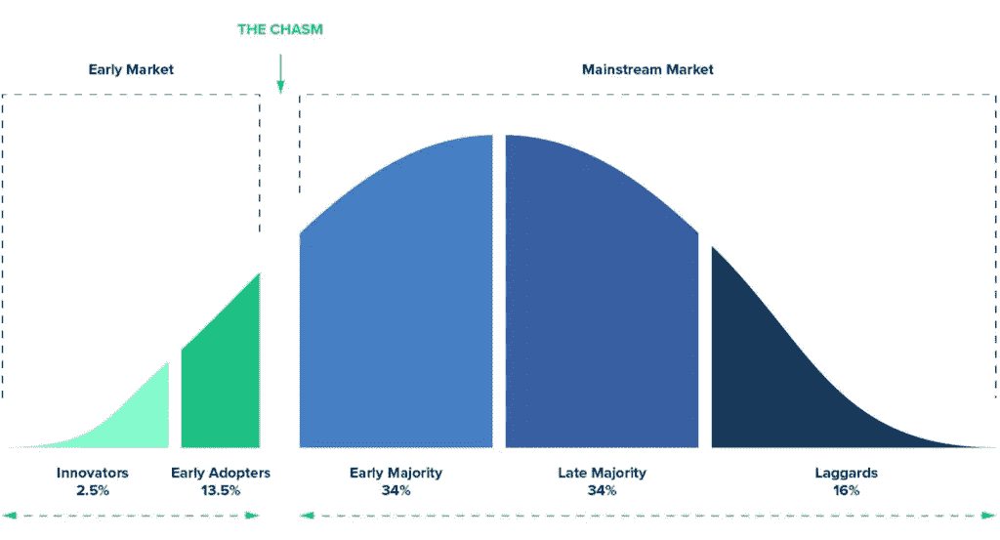
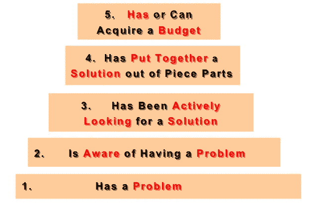

# 你的 MVP 的成功取决于你选择你的那份馅饼

> 原文：<https://medium.com/swlh/your-mvps-success-depends-on-you-choosing-your-slice-of-the-pie-4625cd756f72>

那是 2018 年 1 月初。我登录了 iTunes Connect，盯着苹果发来的一条消息，“**你的应用状态更改为开发者下架”。**在投入了六个月的时间和资金来开发一款移动应用程序后，我决定将其从 App Store 中撤出。

我目不转睛地盯着这条信息，因为我问自己，“我是怎么来到这个*地狱*的？”简而言之，我在不清楚谁是我的客户和我在解决什么问题的情况下构建了一个解决方案，这一切都可以在没有数千美元和六个月时间的情况下得到验证。最长的答案是一次旅程，让我更多地了解我犯了什么错误，以及选择一个狭窄的客户群而没有我的产品可以弥补的真正痛苦的重要性。

通过下面的学习，我找到了我的那份工作，我私下启动了我的 MVP 的第二次迭代，取得了积极的成果。我看到了收入和参与度的大幅增长。我也能够用两个月的研究和一张纸上的草图来验证我的想法。你会选哪一个？几千美元和六个月的开发或几百美元(大部分是咖啡)和两个月的研究。

## 旅程

在 12 月的最后一周，我花了一些时间给自己一个个人静修。我去了波多黎各，在我能找到的最便宜的 AirBnB 住了三个晚上，目的是阅读、写日记和思考到底哪里出了问题。我读过的一本书是布莱恩·科恩的[《每个天使投资人想让你知道的事情》](https://www.amazon.com/What-Every-Angel-Investor-Wants-ebook/dp/B00BPO76XY/ref=sr_1_1?s=digital-text&ie=UTF8&qid=1527625051&sr=1-1&keywords=what+every+angel+investor+wants+you+to+know)。这本书里让我印象深刻的一句话是，当布莱恩问:“你有产品还是有公司？”。在那个时候，我知道我所拥有的只是一个没有人付钱和使用的产品——没有公司。

回来后，我立即去 YouTube 上搜索“产品公司”，有趣的是，列表上的第一个视频是哈佛大学 i-lab 的创业秘密系列[将产品变成公司](https://www.youtube.com/watch?v=092JQrye9IM)(对算法来说太棒了)。当我在看的时候，我听到 Michael Skok 说了这样的话“我希望在建立 MVP 的同时更多地讨论这个问题”和“我把这个叫做 MVP 的舞伴”。我变得非常专注，因为我有一种感觉，我知道我即将找到宝箱的钥匙，然后他说了出来。“MVS”，代表[最小可行段](http://www.startupsecrets.com/mvs)。

> MVS 关注的是与你有相同需求的潜在客户的细分市场。定义并专注于你的 MVS 是至关重要的，因为没有它，有不同需求的潜在用户会很快将你的 MVP 拉向许多不同的方向。这反过来会膨胀而不是最小化你的产品需求，耗尽你有限的启动资源。

回想起来，我看到了自己的主要错误，也看到了作为创始人成长的最大机会。当我建立我的 MVP 时，我开始帮助那些对冥想感兴趣的人学习如何去做并保持动力，但是我从来没有弄清楚“冥想者”到底是谁。此刻对冥想如此感兴趣，那实际上是一大群人。对于一个只有一个创始人的小团队来说，整个蛋糕太大了。

在这一大群“冥想者”中，有太多的可能性变得更加具体。他们住在郊区还是市区？他们会去冥想中心和一群人一起冥想吗？或者他们只在家里通过一个应用程序练习？他们是在静心静修，还是刚刚开始通过顶空或平静来了解它？

在进行用户研究后，我了解到有不同类型的冥想者有不同的需求和行为。我向整个团队营销和销售，并想知道为什么会有这么多不一致的地方。当应用程序在 App Store 中运行时:一些客户留下来，一些没有，一些客户付费，一些没有，一些客户使用人们要求的功能，一些没有。

我在为一个非常模糊的客户建造。问我自己，“对我的 MVP 来说，谁是我的 MVS？”迫使我专注于 T1，我开始意识到这是一项至关重要却很难培养的技能。没有焦点，很可能会浪费时间、金钱和其他资源，这可能是大多数早期创业公司失败的首要原因。

在意识到撒的网太宽的错误后，我想了解企业家如何定义和选择他们成功的初始市场。在《创业秘密》系列视频的另一个视频[中，迈克尔·斯科多次提到一个叫杰弗里·摩尔的人，我决定用谷歌搜索一下他。我发现他写了一本书，这本书在创业和软件领域非常受欢迎，名为](https://www.youtube.com/watch?v=rqi-n0hA4uo)[“跨越鸿沟”](https://www.amazon.com/Crossing-Chasm-3rd-Disruptive-Mainstream-ebook/dp/B00DB3D81G/)。这将是我旅程中的下一个关键资源。

在《跨越鸿沟》中，杰弗里·摩尔提出了创新采用生命周期，这是一个概述人们如何决定尝试新产品并从中发现价值的框架。通过理解这一点，企业家可以向正确的潜在客户营销和销售，这些客户可以提供比我所看到的更一致的结果。

via [spencer wolf](http://spencerwolf.com/new-realities-vr-ar-mr-future-design/)

摩尔解释说，通过占领你所在领域的早期市场，你可以建立一个“滩头阵地”,这将使你在与现有企业和竞争中立足。这也将为口碑增长提供机会，因为潜在客户将会有关于你的产品或服务的价值的参考或人。早期市场包括营销和销售给你的创新者和早期采用者。

创新者被描述为技术专家，他们用经济手段积极寻找新产品，尝试对积极结果期望不高的解决方案。早期采用者被描述为比创新者风险更小，但仍然愿意比主流市场更频繁地尝试解决方案。他们固执己见，被认为是所在市场的思想领袖。反思之后，我问自己，“在我想占领的市场中，谁最愿意尝试我的产品或服务？”

摩尔提供的另一个框架是他针对不同客户群的评分系统，我发现自己反复回到这个框架。经过几周又几周的研究，我发现了几个有吸引力的团体，但当我一遍又一遍地阅读以更快地学习时，只选择一个部分。**焦点**。

人们对只选择一个细分市场非常焦虑，因为有太多的假设。摩尔提供的排名系统很有帮助，因为它迫使我客观地看待这些群体。我在三个之间进退两难，不得不选择一个。排名系统中有[七个标准](http://gsl.mit.edu/media/programs/india-bms-summer-2013/materials/select_a_beachhead---trepreneurship_101.pdf)来评估每个有吸引力的群体。在我从 1 到 5 给每个标准打分后，我选择了分数最高的部分。如果你有一个团队，你会想和他们一起做这个练习！

1.  目标客户有经济能力支付我的服务吗？
2.  目标客户有多容易接近？
3.  目标客户是否有令人信服的购买理由？
4.  你能在合作伙伴的帮助下交付整个产品吗？
5.  竞争是否强大到真的很难抓住这个客户？
6.  如果你抓住了这个细分市场，我们能利用它来抓住其他市场吗？
7.  目标客户是否符合创始人的激情、价值观和目标？

三个人的得分非常接近。这实际上归结于客户的可及性。我选择了一个我可以很容易见到的小组。这确实帮助我在 MVP 的第二次迭代中与我的第一批客户建立了信任。我可以喝咖啡，建立融洽的关系，并向他们展示产品的草图。当我要求一个预先支付的承诺时，如果没有产品正在生产，他们很可能会说是，而不是通过视频通话。

摩尔强调了定义和选择你的利基市场的重要性，并展示了这样做对企业的影响。和我一样，我也看到过创始人对他们最初的目标市场估计过高的情况，因为这些数字在纸面上看起来不错。

> 没有一个商业计划能在与客户的第一次接触中存活下来——史蒂夫·布兰克

我读完了《跨越鸿沟》,意识到我需要停止所有的开发，专注于研究，直到我对我的客户群相对有信心。对每个问题进行精确评分的唯一方法是与客户交谈，以更好地了解他们的需求、行为和困难。我读了几本关于进行用户研究的书，但是我发现最有价值的一本是辛迪·阿尔瓦雷斯写的[“精益客户开发”](https://www.amazon.com/Lean-Customer-Development-Building-Customers-ebook/dp/B07582F7BB/)。

从这本书里有很多很棒的收获。让我印象深刻的两件事是史蒂夫·布兰克(Steve Blank)提到的早期天使投资者(earlyvangelists)的概念，它建立在早期采用者的基础上，以及她对进行用户研究的技术方面的建议。

> “早期用户愿意尝试任何东西！这不会帮助你验证或否定你的假设。你需要找到那些有你想要解决的具体问题的人”——辛迪·阿尔瓦雷斯

我最初被收回，因为这与我在摩尔的书中读到的内容相反，但我喜欢这种不同的视角。这个观点提醒我，重点应该是验证或否定我的假设，而不是收入。

> 赢的唯一方法就是*比任何人都学*快。—埃里克·赖斯

早期天使不仅和你有共同的愿景，他们还具有以下特征:

[via Steve Blank](https://steveblank.com/2010/03/04/perfection-by-subtraction-the-minimum-feature-set/)

在对潜在客户的采访结束时，我总是会看看我的直觉是否认为这个人是早期天使投资者，当我查看笔记时，我会再次问自己。

说到笔记，这也是我需要改进的地方。在阅读 Cindy 的“精益客户开发”时，我正在进行用户研究，但我没有一个结构化的问题列表，也没有以有组织的方式记录笔记。在艰难地综合我收集的所有数据后，我意识到这是研究的两个非常重要的部分。

我在许可的情况下记录对话，并且总是想知道当我回去查看它们时，“我的笔记应该详细到什么程度？”。这变得非常麻烦，因为我要把每 20 分钟的对话都记录下来！想象一下试图从中发现模式。辛迪在这方面为我提供了一些合理的建议。

> 当受访者说:证实你的假设的东西时，你需要最详细的信息；使你的假设无效的东西；任何让你大吃一惊的事情；任何充满情感的东西。

我记下了这四点，在面试结束后，我会花 15 分钟的时间将这些信息转储到我的 excel 表格中。发现模式变得容易多了，因为我已经有了总结所有对话的结构化方法。我没有抄写每个单词，而是提取支持学习的重要信息。

## 确保您的成功

通过练习使用这些概念和框架，我找到了属于我的那一份。对于第二个 MVP，我能够获得八个预购订单，或者预付资金，而不用花费更少的资金和时间来生产产品。我现在正在运行 MVP，但在第一个月，我看到收入和参与度分别增长了 2 倍和 3 倍！

在您发布或开始构建您的 MVP 之前:

*   诚实地问你自己，“我的 MVP 有 MVS 奖吗？”
*   如果不是，就停止建造，并开始把关于谁可能是你的早期天使的假设放在一起。
*   通过进行有组织的用户研究来验证这些假设，以获得足够的信息来使用摩尔标准对一些客户群进行排名和比较。
*   选择一个段来运行 MVP 并分析结果。记住，重点是学习，所以如果这部分没有成功，你学到了东西！成功有多种途径。

祝你好运！

*原载于*【julioarivera.com】

**

## *这篇文章发表在 [The Startup](https://medium.com/swlh) 上，这是 Medium 最大的创业刊物，有 333，253+人关注。*

## *在这里订阅接收[我们的头条新闻](http://growthsupply.com/the-startup-newsletter/)。*

**