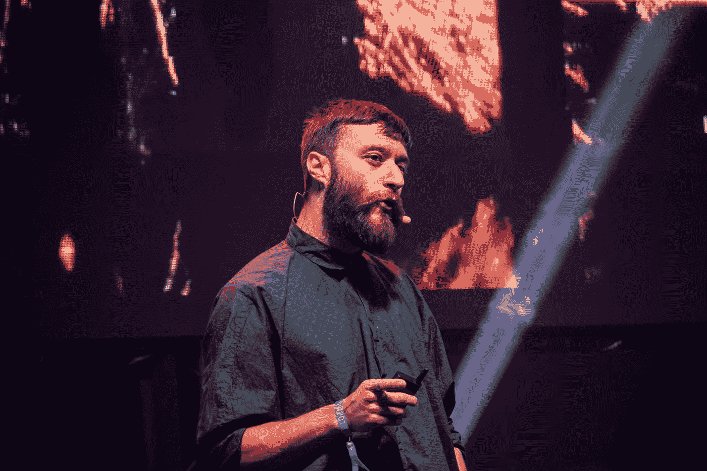

# 你的观点比你想象的更有力量

> 原文：<https://medium.com/swlh/your-outlook-is-more-powerful-than-you-think-60e5717a71c2>

你的选择不仅仅是行动

Photo by Liam Martens

几年前，我不得不为一个班级做演讲。

我吓呆了。

并不是只有我一个人。每个人都要演讲。它实际上只是我们做的一个作业的报告。

> 我不介意做研究。事实上，我甚至可以和坐在我旁边的人谈论这件事。但是在聚光灯下，不得不在全班同学面前清楚地表达我的想法，让我害怕得发抖。

当我站起来演讲时，我想我在大约两分钟内完成了整个过程。

这是一场我渴望忘掉的表演。

# 我没准备好

如果我知道如何做演讲，我本可以做一场精彩的演讲**。**

但我没有。在那之前，我上的任何一门课都没有教会我一件关于公众演讲的事情。就好像我被期待着自己去发现它，就像一个徒步旅行者迷失在荒野中，没有人帮助。

这是在我为另一个学校作业(在另一所学校)阅读金克拉的 [*见顶*](https://amzn.to/2zcQmF2) 之前。

这还是在我参加一个演讲会之前，在那里我可以每周练习演讲。

这是在我参加戴尔·卡内基人际关系课程或阅读《如何赢得朋友和影响他人》之前。

> 做任何事情而不知道如何去做就像没有地图的旅行一样。或者甚至有一个目的地。你只要坐上车，去灵魂指引的地方。

这比没有舵的船好不了多少。

当我没有准备好要做的演讲时，我感到紧张(这是理所当然的)。这种感觉影响了整个经历，而且随着时间的流逝，这种感觉越来越强烈。完成工作就像走出一个狭窄的牢房，那里的墙壁为了杀戮而移动。

# 再次发言，但观点不同

我的下一个演讲是作为戴尔·卡内基课程的学生。

> 这次我发表演讲是因为我想。其他人也不得不发言。但这一次，我没有充满恐惧和紧张，而是充满了兴奋。

我的主题是我。这对任何人来说都是最容易谈论的事情。我上台在两分钟内讲述了我的故事。这一次，我有一种强烈的使命感在指引我。让我告诉你，这让一切都不同了。

一步之内，公开演讲从我最害怕的变成了我最大的快乐。

# 什么变了？

一些事情已经改变了。

*   我学会了如何演讲。
*   我有机会发表演讲。
*   我看到了能够公开演讲的价值。

所有这些都很重要，但它们不是最重要的。

我的观点是。

> 科学告诉我们，对身体来说，紧张和兴奋在生理上是一样的。区别在于你的大脑用它做什么。

这都是基于战斗或逃跑的反应。当你在高速公路上与死神擦肩而过时，你的肾上腺素会激增，帮助你度过难关。然后你的身体冷却下来，一切恢复正常。

当你紧张时，你的大脑不一定会对某个事件做出反应。因此，你没有给身体瞬间注入能量，而是陷入了一个无休止的“如果……会怎样”的循环中。

当你专注于最糟糕的情况时，会出现一个“如果…会怎样”的循环，并且一直停留在那里。

*   我出车祸了怎么办？
*   她不喜欢我怎么办？
*   如果我失去了我拥有的一切怎么办？
*   没人关心我的工作怎么办？

如果你不处理这些问题，它们将永远溃烂。

> 当你兴奋的时候，你会前进，不是吗？当你完成某件事时，你会期待你会得到的兴奋。所以你采取持续的行动来实现它。然后，当你完成后，你可以休息。明天你可以追逐另一个让你兴奋的目标。

你更喜欢哪种生活方式？

# 这是你的选择

你比你想象的更有能力掌控自己的生活。

**你每天都可以选择如何看待这个世界。**这叫取景。你根据几个因素来决定如何设计。

*   你此刻的感受
*   你希望看到什么发生
*   你觉得你有多少力量

> 你不能否认你的感觉。但是如果它们对你不起作用，你可以忽略它们。如果你在你做的事情中找不到快乐，那就在完成的过程中寻找快乐。让你的作品成为值得你骄傲的艺术。最终，这才是最重要的。

**现在走出去，抓住每一天。让生活为你服务，而不是让它折腾你。你只有一次机会。去让它有价值。**

一切都取决于你的看法。

## 这篇文章发表在 [The Startup](https://medium.com/swlh) 上，这是 Medium 最大的创业刊物，有 340，876 人关注。

## 订阅接收[我们的头条新闻](http://growthsupply.com/the-startup-newsletter/)。

