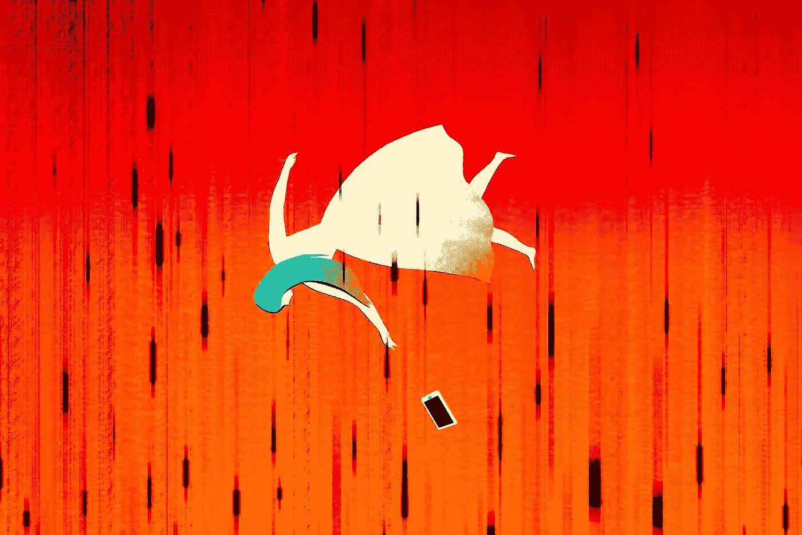
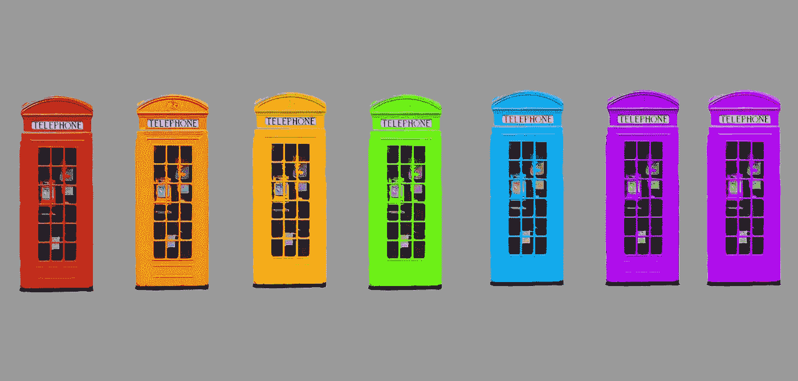

# 你的手机没有摧毁你，而是你自己。

> 原文：<https://medium.com/swlh/your-phone-is-not-destroying-you-you-are-f03d03634901>

Image Credit: [ItsOverForBarbie](http://itsoverforbarbie.blogspot.com/)

我最近在网上看了很多帖子，都是关于我们的手机或技术是如何杀死我们或扰乱我们的生活的。

是的，你的手机是个问题，但真正的问题是你。

仅仅因为我们口袋里有一个工具，它就像一台超级电脑，有我们可以回答的任何问题的所有答案，这并不意味着你的手机就是问题所在。

把我们分心、没有效率或专注于小事的原因归咎于我们的手机是胡扯。

# 你就是问题所在。

把你生活中的一切都归咎于科技和手机非常方便。

把你没有做你喜欢做的事情和实现你的目标的原因归咎于你的手机也很方便。

事实是你才是问题所在。

为什么？你缺乏纪律性。

仅仅因为糖果放在你面前，并不意味着你必须舔它，品尝它的含糖，可卡因般的善良。就此而言，有很多方法可以克服手机成瘾甚至技术成瘾。

Image Credit: [**zozzy-zebra**](https://www.deviantart.com/zozzy-zebra)

## 让我用简单的词语打你的脸，即使是黑猩猩也能理解:

1.  睡觉的时候把手机调成飞行模式。
2.  当你在阅读或学习重要的东西时，把你的手机放在另一个房间。
3.  花时间不用手机。有时候把它留在家里。
4.  使用灰度，这样会上瘾的颜色就不会诱惑你。
5.  删除脸书、Instagram 和 WhatsApp 这样的应用，这样你就不会被它们诱惑了。
6.  关闭通知。

# 承担责任，伙计。

将你生活失败的原因归咎于你的手机，是非常不成熟和愚蠢的。

你有责任心，你能控制你的毒瘾。该由你来解决这个问题。苹果和三星不会停止制造这些设备，在某种程度上，无论我们喜欢与否，它们都是生活的一部分。

> “除非你打算住在远离电网的山洞里，吃罐头里的豆子，否则你必须学会控制自己使用手机和科技的方式”

# 没那么难，来吧。

人们谈论对技术上瘾，好像这比戒掉海洛因更难处理。不是的。

与被称为“人”的复杂机器打交道，远比一部彩色屏幕的手机难。我们不会把宇航员送上火星的。它只是一部电话。冷静点。

# 投入工作。

> **你的手机只是一个借口，让你把时间浪费在墙上，因为你不想工作。**

你害怕不舒服，所以你的手机会分散你处理问题的注意力。分散注意力是你自己的决定。你的手机不会为你做这些决定——至少现在不会。

别再责怪你的手机了。
放下电话。着手做一件让你兴奋的事情。

# 行动呼吁

如果你想提高你的工作效率，学习一些有价值的生活窍门，那就订阅我的私人邮件列表吧。你还将获得我的免费电子书，它将帮助你成为改变游戏规则的在线影响者。

[**点击这里马上订阅！**](http://timdenning.net/free-ebook)

## 这篇文章发表在[《创业](https://medium.com/swlh)》上，这是 Medium 最大的创业刊物，有+369，832 人关注。

## 在这里订阅接收[我们的头条新闻](http://growthsupply.com/the-startup-newsletter/)。

