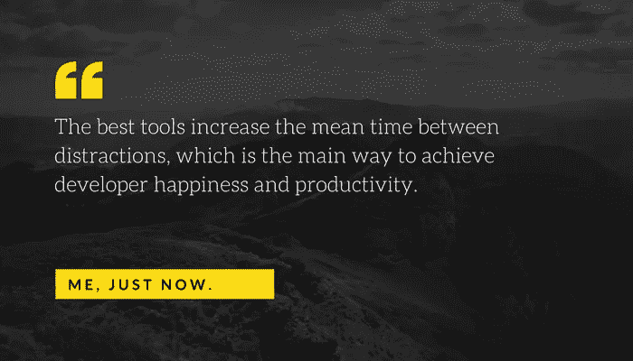

# 你的技术投资组合是 f#$&ed。

> 原文：<https://medium.com/swlh/your-tech-portfolio-is-f-ed-212fb6da77c9>

如果你投资了软件公司，你就有一个你看不到的大问题。

每个投资组合公司都在浪费大量的资金，专注于客户不关心的问题。

在 5 人或更多的软件团队中，很可能其中一个团队成员花费了大量的时间来维护和支持非核心系统。

你可以尝试雇佣更多的人，但这解决不了根本问题。

> 最好的技术领导者会很快认识到开发人员的生产力来自于专注，而专注来自于为工作使用最好的工具。

在我看来，这里的解决方案是通过由专家构建的工具来购买开发人员的注意力，从而通过代理在您的团队中获得他们的经验。

专业级开发工具是提高团队效率的最佳选择。开发人员讨厌低效率，那些不断打断他们流程的免费或廉价工具是极其昂贵的隐性成本。

我最近花了一些时间与一些令人惊讶的公司合作，它们是 [Calibre](http://calibreapp.com) 、 [Stax](http://stax.io) 和 [Forticode](http://forticode.com) 。所有的创始人都有深厚的领域知识，可以加入你的团队，每月只需支付相对较少的费用。

[BuildKite](http://buildkite.com) 、 [Hava](http://hava.io) 和 [Percy](http://percy.io) 是我有幸参与的三家公司，它们都是由厌倦了在部署、网络可视化和视觉回归上浪费时间的工程师创建的。再说一遍，创始人在他们的领域是绝对的专家，当你的团队使用他们的产品时，他们可以随时获得专业知识。

> 最好的工具增加了分心之间的平均时间，这是实现开发人员快乐和生产力的主要方式。

开发人员的快乐直接指向底线。

如果你是 dev tools 的创始人，我很想听听你是如何帮助团队聚焦的，如果你是想帮助你投资的公司的风险投资家，请在 [@mattallen](http://twitter.com/mattallen) 上找到我

## 这篇文章发表在 [The Startup](https://medium.com/swlh) 上，这是 Medium 最大的创业刊物，拥有 336，210 多名读者。

## 在这里订阅接收[我们的头条新闻](http://growthsupply.com/the-startup-newsletter/)。

