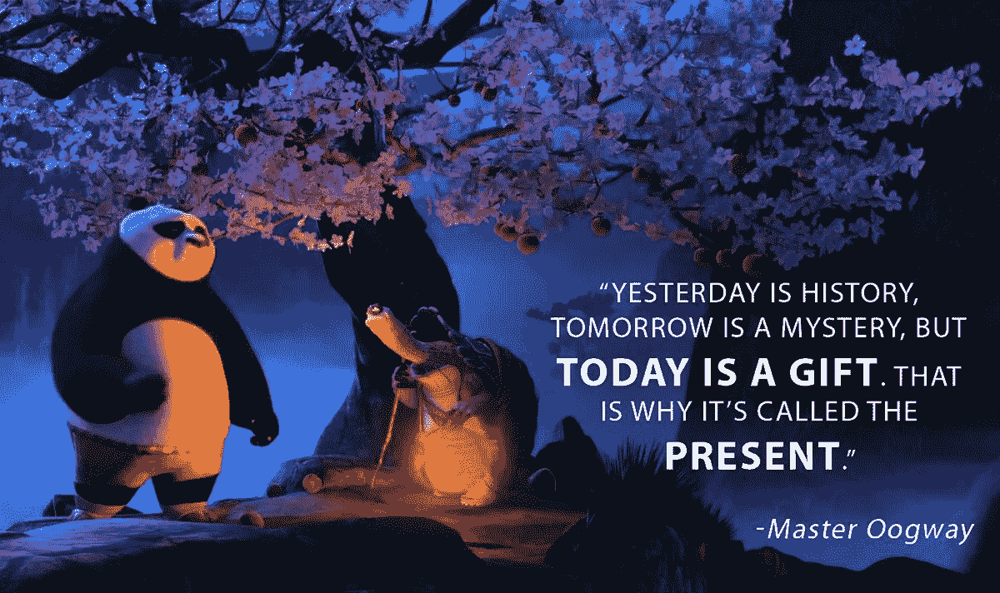

# 你 2018 年最大的三种货币

> 原文：<https://medium.com/swlh/your-three-biggest-currencies-for-2018-f7b9f5d70758>

今年是经济疯狂的一年。随着比特币达到创纪录的高度，不断变化的全球经济以及反全球化和保护主义的新前景正在让我们质疑最基本的贸易规则。我们要把钱投到哪里？我们将如何成长？

在所有这些方面很容易迷失和困惑，但是有一个非常基本和更容易的方法来实现成长和进步。很多人已经说过一遍又一遍，但我喜欢罗宾·夏尔马把它放在一起的方式。

> “为了在外面的世界成长，你必须在里面成长。”

这将帮助你在今年实现成长和发展。无论世界经济发生什么，你总能打破内在经济的新记录。也许你想开始一项新的事业，跑马拉松，攀登珠穆朗玛峰，改善你的个人关系，无论是什么，你都可以实现，用简单的行动。

我喜欢称它们为三种货币，它们远比任何比特币或大宗商品更有价值。他们在这里:

# 时间就是金钱:

这是所有资源中最丰富也是最被滥用的资源之一。加里五世总是说:

你不知道，你错过了多少时刻:当你抱怨时，当你没有追随你的激情时，当你没有实现你的梦想时。现在是时候行动了，多放点内容，感恩谦卑，干你的屎。

# 只关注一件事:

大声梦想你的遗愿清单是很容易的。你想要实现的目标可能有几十个或者几百个。但这是导致灾难的原因。你需要选择一件最重要的事情去做，那将会永远改变你的生活。

挑选一个目标。花时间去实现它。把这个搞定。然后再继续你的下一个遗愿清单。

# 动力就是一切:

我喜欢西蒙·西内克的这本书——从为什么开始。不管你在做什么，花点时间问一个简单的问题:为什么？这将使你区别于普通人。

如果你对你正在做的事情有动力，你不仅会完成你的目标，你会掌握它。想想所有的杰作，所有的企业家。他们的成就背后有一个故事。史蒂夫·乔布斯不想只造一台电脑，他想造一台“最个性化”的电脑。埃隆·马斯克(Elon Musk)不只是想让火箭飞行和着陆。他想让我们去火星。对于每一个目标，他们都有一个非常个人化和强大的动力来驱动他们。

你的目标是什么？你的动机是什么？回答这些问题，你会发现宇宙中的一切都会帮助你实现目标。

这是我今天的智慧。

下面让我知道你的想法。在评论中写下你的目标和动机。如果这篇文章启发了你，请鼓掌。

## 这篇文章发表在 [The Startup](https://medium.com/swlh) 上，这是 Medium 最大的创业刊物，有 281，454+人关注。

## 订阅接收[我们的头条新闻](http://growthsupply.com/the-startup-newsletter/)。

