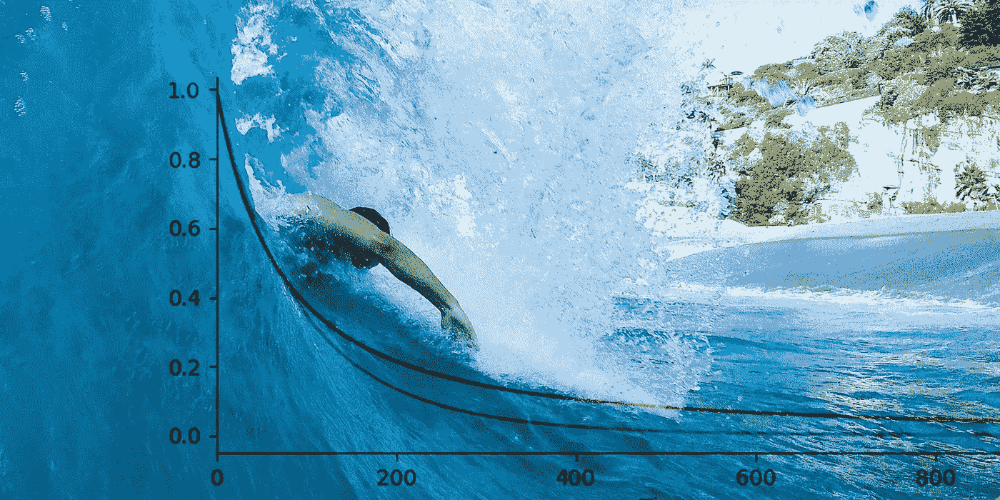
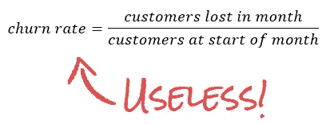
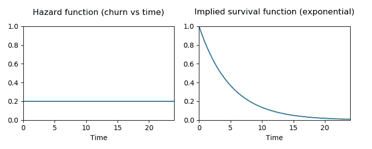
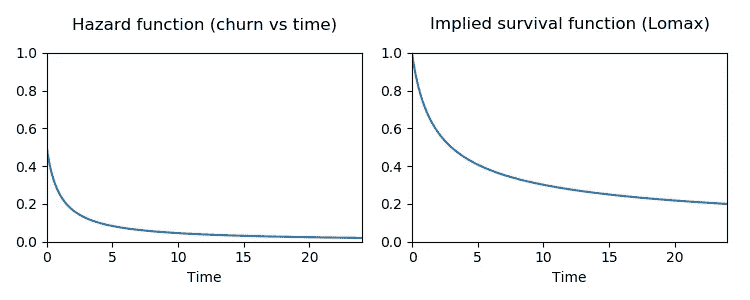
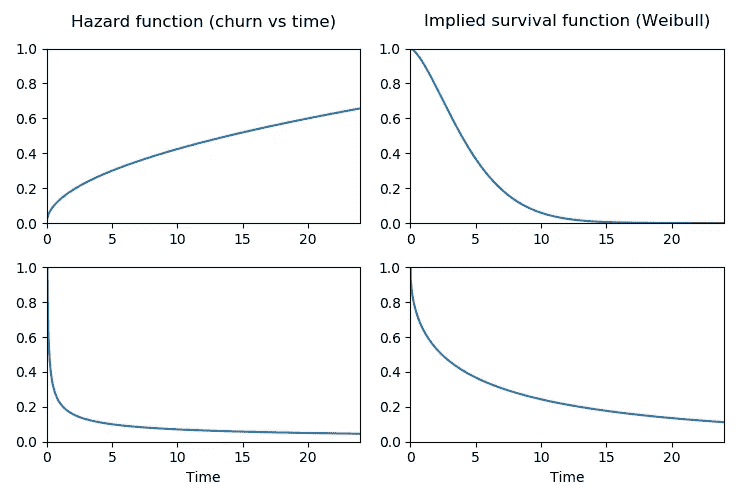
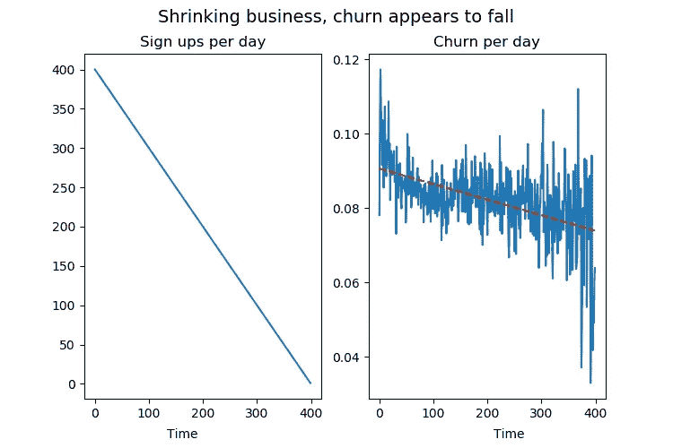
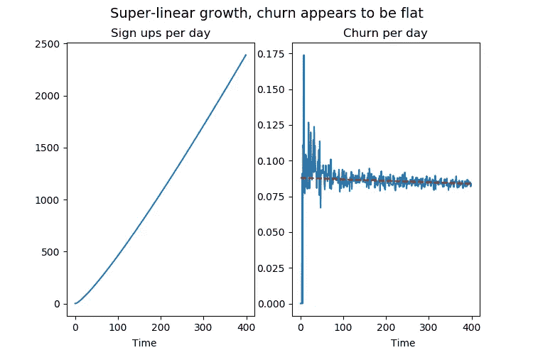
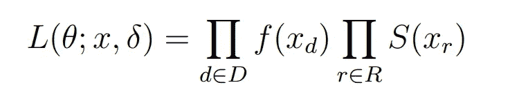
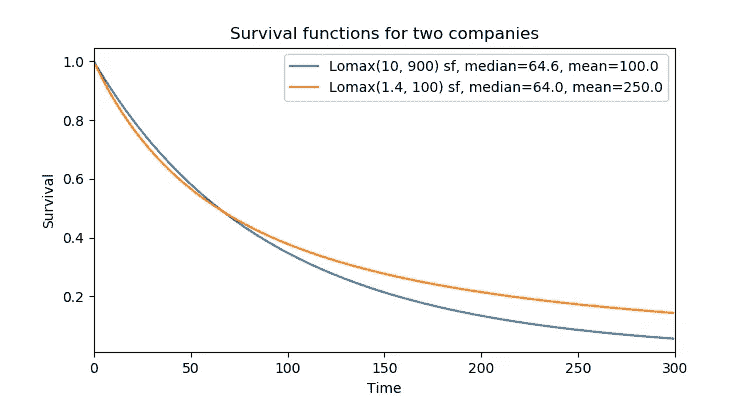
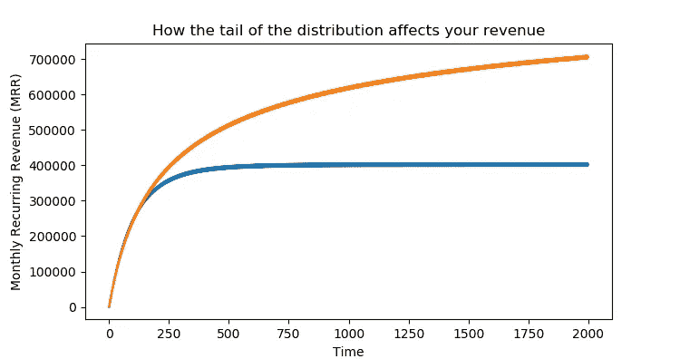

# 你们都把流失率计算错了

> 原文：<https://medium.com/swlh/youre-all-calculating-churn-rates-wrong-cbab072cd992>



*Image credit @RolfJager via Twenty20*

许多聪明人会告诉你要对你的流失率着迷。



根据 Andreessen Horowitz 的说法，这个数字是衡量 SaaS 初创公司的 16 大指标之一。嗯，对不起安德森，对不起霍洛维茨，但这是不对的。

这是违反直觉的，但这是一个统计事实:这个数字实际上**并没有告诉你任何关于客户流失**的有用信息，但确实与你的订阅年龄有关。在大多数情况下，它会自行下跌，而且荒谬的是，防止它下跌的唯一方法是保持非常高的增长率。因此，如果你的业务做得非常好，那么这个数字实际上只会看起来不好，为它进行优化会直接产生反效果。这里的错误是一个简单的统计错误，很容易犯，幸运的是也很容易理解和避免。

如果你经营的是基于订阅的 SaaS 业务，你可能会非常关心能留住你的客户多久。我运行一个 JavaScript 异常跟踪服务，这个业务的健康完全取决于我们带来多少客户，以及我们能保持他们多久。从表面上看，*流失率*似乎是*客户寿命*变化的自然代表。让我们探究一下为什么这不是真的。

# 错误的假设

计算流失率**假设客户在任何时候都同样有可能离开**，不管他们已经订阅你多久。这几乎肯定不是真的。事实上，正如我们将会看到的，随着时间的推移，拥有一个恒定的流失率本质上意味着你永远不会有长期客户。



*If a user has a constant churn probability over time, this implies that customer lifetimes come from an Exponential distribution.*

如果你有一个每月`c`的固定客户流失率，那么一个客户持续订阅`n`个月的概率就是`(1-c)^n`。这意味着客户寿命来自于[几何分布](https://en.wikipedia.org/wiki/Geometric_distribution)。如果客户可以在任何时候退出订阅，我们有连续时间，应该使用连续时间模拟，即[指数分布](https://en.wikipedia.org/wiki/Exponential_distribution)。

# 在 K. S. Lomax 的帮助下，你的机器实际上是什么样的

问题是，您的客户不太可能随时取消订阅。最有可能的情况是，你遇到的情况是，最初几天顾客的减少比后来多。如果你的产品有免费试用期，那就更是如此。

如果客户订阅的时间越长，客户流失率越低，你可以将其建模为`c/(t+1)`，其中`t`是时间步长(例如，客户订阅的天数)，而`c`是某个常数。在这种情况下，这意味着客户寿命来自[洛马克斯分布](https://en.wikipedia.org/wiki/Lomax_distribution)。这相当于从 0 开始移动的帕累托分布。



*The Lomax distribution can express churn probabilities that get lower with time.*

# 在沃罗迪·威布尔的帮助下，你的机器实际上是什么样的

如果你怀疑用户订阅的时间越长，每天的流失率可能*增加*,那么 Lomax 发行版就不适合你。相反，你可以寻求瑞典统计学家沃罗迪·威布尔的帮助。[威布尔分布](https://en.wikipedia.org/wiki/Weibull_distribution)可以表示客户退出的概率下降、持平和上升。这使得它成为建模客户生命周期的流行选择。



*The Weibull distribution can express both growing and shrinking churn probabilities.*

# 为一个谎言优化会把你引入歧途

现在让我们来看看为什么正确建模是重要的。

让我们以错误的方式衡量客户流失，看看它会把我们带到哪里。假设客户生命周期来自 Lomax 分布。让我们也假设你有一个业务处于糟糕的状态，每天的新注册人数每天都在下降。这对客户流失率会有什么影响？我们可以模拟一下看看。

请记住，在下面的每个示例中，我们模拟了来自相同客户寿命分布的寿命，并且该分布**不会随着时间的推移而改变**。



*With a shrinking business, churn appears to improve because subscriptions are getting fewer and older.*

这显然是一个垂死的行业，然而流失率图表看起来很棒！**即使我们知道在我们的模型中客户生命周期没有变化，每天的流失率也在稳步下降。**

这是怎么回事？流失率的急剧下降是我们没有新客户的结果。因为我们没有增长，我们的大部分客户已经存在很长时间了，这意味着他们不太可能流失，这意味着我们的每日流失率比其他情况下降得更多。尽管潜在的个人客户寿命没有变化，但这种人口水平的变化还是发生了。

让我们把这变成一个你的企业正在经历疯狂增长的场景。我们将保持客户生命周期完全相同，但改变它，使每天的新注册数量超线性增长。



*With a growing business, churn* rate *appears to not change, only because most subscriptions are new.*

即使客户寿命与之前没有变化，这里的流失率图也是平坦的。投资者可能会皱眉说，我们没有采取任何措施来提高我们留住客户的能力。事实上，图表看起来“糟糕”的唯一原因与客户流失无关，因为我们在获得新注册方面做得非常好。

如果你在这个标准的基础上指导你自己和你的团队，你就是在奖励自己抑制成长，惩罚自己成长。显然，这是百分之百的适得其反。

# 那我们如何衡量客户流失呢？

正如你从前面的段落中可能已经猜到的，我们应该对客户生命周期的*分布*建模，并且我们应该以一种*统计上合理的方式*来做。Lomax 和 Weibull 分布是很好的模型选择。

变得棘手的部分是我们将有两种类型的数据:已经退出的客户和仍然订阅的客户。只有我们的前客户给了我们一生的时间去合作。对于我们仍然订阅的客户，我们只知道他们的订阅一直持续到现在，我们不知道未来还会持续多久。在统计学术语中，我们有所谓的*右删失数据*。

幸运的是，有一种方法可以使用我们所有的数据，甚至来自我们仍然订阅的客户。

# 威布尔还是洛马克斯？

在威布尔或洛马克斯(或任何其他分布)之间做出选择没有简单的答案。威布尔更灵活，因为它可以表示增长、收缩和持平的流失概率。然而，如果您的数据基本上是 Lomax 式的，这种表达能力对您没有帮助。首先，也是最重要的一点，你的选择要基于你对所在行业的了解。如果你对客户流失概率的发展有任何先验知识，那么就以此为基础来选择分布。也有各种各样的[拟合优度](https://www.weibull.com/hotwire/issue71/relbasics71.htm)测试，你可以用来告知这个决定。事实是，任何分布的选择在某种程度上都是错误的，所以你需要根据你的数据和你以前的知识来判断什么最适合你的情况。出于本文其余部分的目的，我们将只适合这两种发行版，而忽略哪个最适合我们的问题。

# 让我们做一些适当的统计

我们将要建模的概率分布是由它们的参数定义的。我们希望找到最符合数据的参数。首先，我们想对这些参数进行猜测，并有一种方法来判断我们的猜测有多准确。幸运的是，我们有一个统计上合理的方法来知道给定我们现有的数据，一个猜测有多好。特别幸运的是，当我们审查数据时，这也是正确的。这个函数告诉我们，在给定数据的情况下，我们的参数出现的可能性有多大，这个函数叫做似然函数。我们通过查找未经审查的数据点的[概率密度函数](https://en.wikipedia.org/wiki/Probability_density_function)值和每个经过审查的数据点的[生存函数](https://en.wikipedia.org/wiki/Survival_function)值，并将所有这些值相乘得到。



接下来，我们记得计算机不擅长将接近于零的数字相乘，所以我们取每个数字的对数并将它们相加。我们可以在不改变函数最大值的情况下做到这一点。我们将使用 SciPy 中的 NumPy 和[统计](https://docs.scipy.org/doc/scipy/reference/stats.html)和[优化](https://docs.scipy.org/doc/scipy/reference/optimize.html)包来计算这一点。这是 Python 代码。

接下来，我们将使用一个函数最大化器来寻找使我们的函数`L`最大化的参数。(实际上我们只有函数*最小化器*，所以我们将等效地最小化`-L`。)

我们刚刚做的被称为最大似然估计(MLE)。关于删失数据下该估计量的更彻底推导，参见张的 PDF。

现在我们有了分布参数的估计，我们可以看看分布的平均值和中间值。

这将输出:

```
weibull shape=1.0935179324818296, scale=122.3601743694174 
weibull mean 118.29884582009447 
weibull median 87.51413316428012 
lomax shape=101.65488165157542, scale=12575.372370928875 
lomax mean 124.93554375692996 
lomax median 86.03983407302042
```

均值告诉我们*均值*客户生命周期，以天为单位。用这个乘以你每个顾客每天的收入，你就得到了你的顾客终身价值。

中位数告诉我们典型的客户生命周期。这比平均值小，因为平均值是由不太可能的非常大的值决定的。正如我们将会看到的，这些罕见的长期客户的存在对你的业务前景至关重要。

# 尾部效应:罕见的长期客户让你慢慢变富

让我们来看看两个企业的客户存活率。每个都有来自 Lomax 发行版的客户生命周期。这两种分布都具有相同的*中值*客户生命周期，但是其中一种比另一种具有更长的*平均值*生命周期。换句话说，一家比另一家拥有更多的长期客户。



*Survival functions for two Lomax distributions. Two distributions that have the same median can have wildly different means. This has huge effects on your revenue.*

沿着橙色线的公司在开始时有较高的客户流失，但在接近结束时有较低的流失。对收入的影响是巨大的。如果你沿着橙色线而不是蓝色线走，**你赚了 2.5 倍的钱**。请记住，*典型客户*(由中间值发现)在任一公司逗留的时间都是一样长的，但是很少有长期客户将终生客户价值大规模转移到橙色公司。

让我们模拟一下这两家公司的每月经常性收入(MRR)。我们会给他们每个月 10 个新注册。最终的差别是巨大的。



*The effect of the tail of the distribution. Monthly Recurring Revenue (MRR) for the first 2000 days of operation, for two companies with equal median customer lifetimes, and different mean customer lifetimes.*

这两家公司在开始时有相似的轨迹，但最终更少的长期客户的影响会显现出来。橙色公司最终将获得比蓝色公司高 2.5 倍的 MRR。

# 胖尾巴很好，但是你对它们视而不见

胖尾巴给你带来罕见的极端事件。在我们的案例中，持续时间很长的客户很少。正如我们所见，客户终身分布中的厚尾会对您的长期收入产生巨大影响。然而，准确地估计这些结果是困难的或不可能的。

当涉及到这些分布时，大多数人的直觉都失效了。这里有一个例子，由于[纳西姆·尼古拉斯·塔勒布](https://medium.com/u/f138bf5466fe?source=post_page-----cbab072cd992--------------------------------)。让我们假设我们正在处理一个 80/20 的帕累托分布(或者类似的洛马克斯(1.13)分布)。假设我们正在计算样本均值。高斯模型需要 30 次观察才能将平均值稳定到给定水平，而帕累托模型需要 [10 次观察才能将样本误差降低相同的量。](http://fooledbyrandomness.com/DarwinCollege.pdf)因此，如果你有帕累托 80/20 分布的客户生命周期，**在样本平均生命周期准确之前，你需要 1000 亿个客户。**祝好运！(注意，这是样本平均值，即样本寿命之和除以计数。它并不直接适用于我们上面所做的 ML 估计。)

虽然你的客户寿命可能不会遵循这样一个极端的分布，但它表明，如果尾部足够厚，得到正确的估计可能会比我们过去在没有厚尾的情况下更难。

另一个不可避免的错误估计来源是我们无法预见未来。考虑一下:假设您的客户中有 5%的人订阅了 10 年。你肯定不会观察到这一点，直到你的企业已经存在了 10 年。你永远不会在一个一年的业务中看到一个两年的客户。

用经过审查的数据进行估算有所帮助，但是我们仍然会对长期客户的订阅时长有一个基本的盲目。对于一个着眼于客户生命周期的企业来说，这可能是一个乐观的来源，因为不确定性主要是在更长的生命周期方向上。

我们刚刚计算的数字可能是订阅业务中最重要的，但似乎大多数人从未被教会如何正确计算它们。请随意使用这篇文章中的代码来计算你的企业的客户寿命。

*最初发表于*[*【catchjs.com】*](https://catchjs.com/Blog/Churn)*。*

[](https://medium.com/swlh)

## 这篇文章发表在 [The Startup](https://medium.com/swlh) 上，这是 Medium 最大的创业刊物，拥有+395，714 名读者。

## 在这里订阅接收[我们的头条新闻](http://growthsupply.com/the-startup-newsletter/)。

[](https://medium.com/swlh)