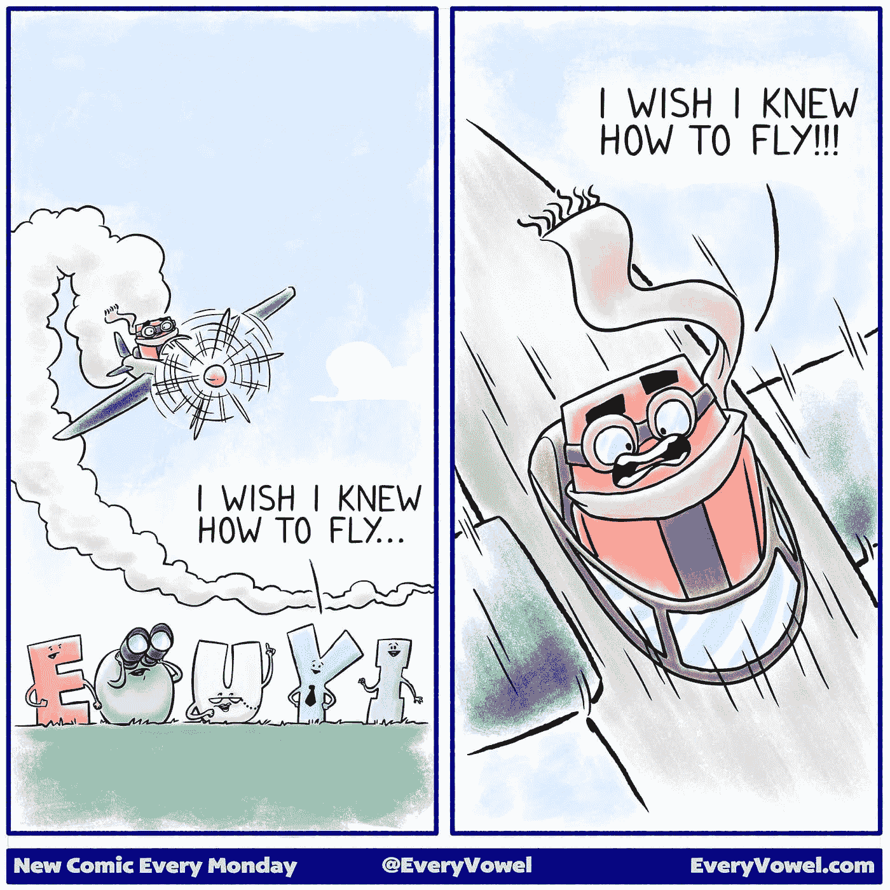

# 你会死的

> 原文：<https://medium.com/swlh/youre-going-to-die-955ee28b669>

> 你会死的。" ~加里·维

我的意思是，我不记得当我第一次听到这句鼓舞人心的话时，我在哪里或在做什么，但从那一刻起，它就像疯了一样影响了我的生活！

问题是，大多数人都有自己梦想的东西。他们内心深处有一种激情，也许从未与任何人分享过。也许这是他们谈论和头脑风暴了很多年却从未真正迈出的一步。也许他们把自己的激情或梦想伪装成一种爱好，并用一些常见的不“做”的理由来证明自己没有进一步发展。他们害怕被拒绝，被忽视，被嘲笑。如果不是这样，他们担心他们会破坏工作/生活的平衡，他们觉得他们没有任何有价值的东西可以提供，他们觉得他们需要许可，或者他们害怕他们开始得太晚。

事实上，所有这些担忧和恐惧都是有根据的。我完全明白了！我每天都要克服其中的大部分困难。下面是我如何做到这一点，你也可以！

## 关注你的主题(你的“为什么”)

当我开始被生活分心或感受到我上面提到的恐惧之一的重量时，我提醒自己我的目标，我的主题。

我的目的是唤醒人们意识到他们所拥有的创造力和力量，这将有助于他们实现梦想。我在这里为他们提供成功所必需的工具、鼓励和灵感。简而言之，我想帮助人们过上他们梦想的生活。

如果你正在努力寻找你的主题，简单的答案就是想想你想用余生去做的事情。一旦你对那件事有了一个清晰的认识，你就会不顾一切地追逐。

一旦你牢牢记住了这一点，你就可以回头参考它。对我来说，这就像一座灯塔在暴风雨中给船只发信号。当我对缺乏回应感到不安或对负面回应感到沮丧时，我能够回到这个话题。这不是几个人的回应，而是始终如一地遵循我的主题。

## 戴上眼罩

当你走在通往梦想的道路上时，你会被那些阻碍你进步的事情和伪装成有价值的想法去实现的事情分散注意力。虽然创新和成长是非常好的，但你也必须确保你不会让这些事情阻碍你的优势。专注于你最擅长的事情并去做。如果你想增加什么，那就循序渐进，小心翼翼。不要让它影响或破坏你的计划或意图。

另一种你需要注意的方式是我之前提到的。在这条路上，你会失望、失望、气馁。在同一天里，你会经历你想象不到的高潮和威胁到你梦想生活的低谷。克服这一点说起来简单，但实施起来非常困难——你必须重新调整你的愿景/激情/主题，检查你当前的位置，并采取下一步行动。如果你期望在开始之前就有所有的答案，那你就不现实，这种心态会让你的梦想看起来遥不可及。我最近看了这幅漫画，觉得它很好地总结了这个悖论:

## 不要接受冷漠

当事情变得艰难时，当你在空中，不知道如何让飞机保持在空中时，当你从朋友、巨魔、熟人和有影响力的人那里拍照时。尽管如此，你将不得不仅仅依靠意志力前进。你会想要分区和让步。这样做只会伤害你和你的进步。这使得迈出下一步并继续你的旅程变得更加困难。

回到工作岗位，为下一次推销、视频、文章或客户会议做好准备。相信你自己，允许你自己继续反抗生活的洪流，它正试图阻止你，让你再次摇摆。你能行的！

## 我是来帮忙的！

在我写的文章中包含这一点有时看起来很傻，但我是真心实意的。如果有什么我能帮忙的，请不要犹豫与我联系！我喜欢帮助别人，我相信积极、毅力和一致性的力量，我知道如果你也相信这些东西，你就能实现你的目标。

我期待与你联系！

## 行动呼吁

我写了一本关于如何克服阻碍你成功的障碍的电子书。每个人内心深处都有创造力，都有与之匹配的梦想。如果你想开始或重振你的创意之旅，看看我的免费电子书: ***《创意之旅——入门指南》*** *。*

## [点击此处免费获取！](http://www.michaelehenson.com/opt-in)

## 最后一件事…

*如果你喜欢这篇文章，点击*👏*下面，这样其他人就可以在媒体上阅读和欣赏了。*

## 这篇文章发表在 [The Startup](https://medium.com/swlh) 上，这是 Medium 最大的创业刊物，拥有 283，454+人关注。

## 在此订阅接收[我们的头条新闻](http://growthsupply.com/the-startup-newsletter/)。

