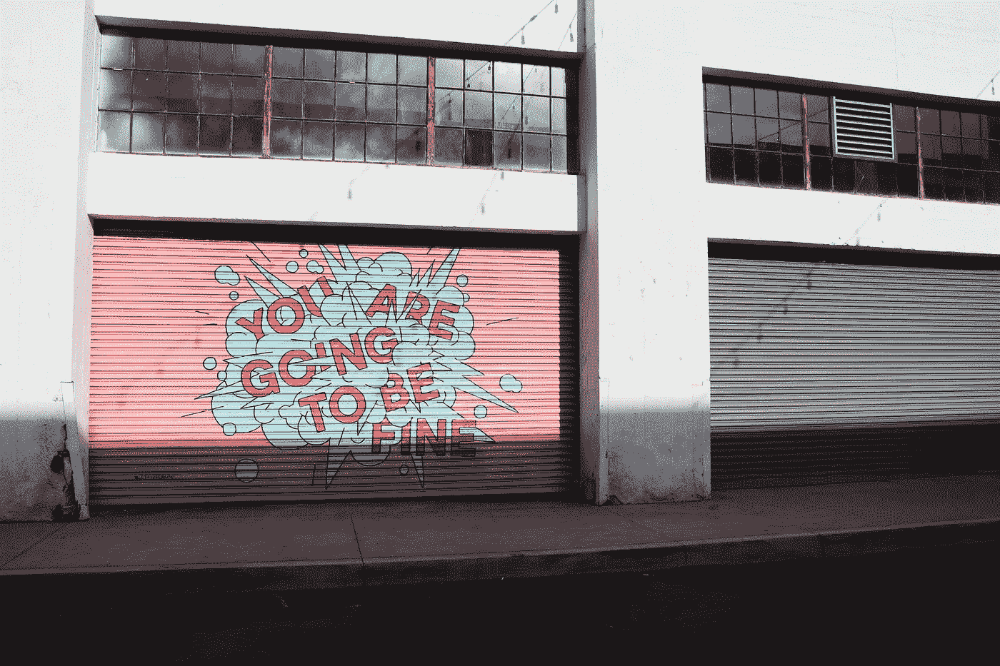
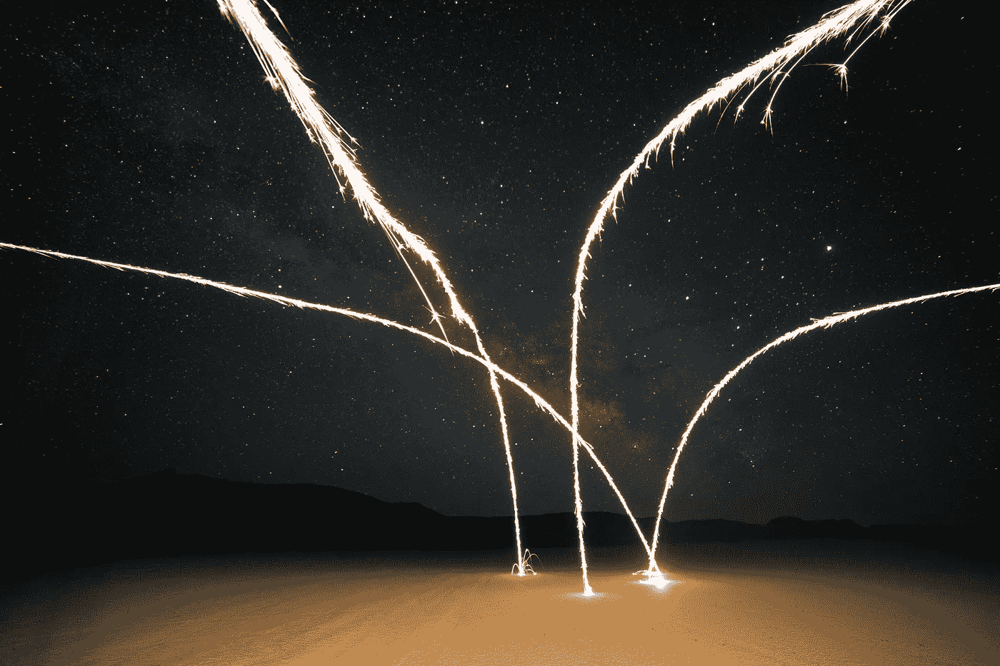

# 你没有好好激励自己

> 原文：<https://medium.com/swlh/youre-not-motivating-yourself-properly-68d5eed2110>

## 先看看星星

Thanks, bracelet.

是什么推动我们成长？我们变得更好的动机是什么？

作为一名领导者或其他人，如果你不知道如何激励自己，你就很难成长为一个人。

外部动机和内部动机是有区别的，每个人都应该明白这一点，这样才不会把两者混为一谈。

最根本的区别在于寿命。

外部动机——来自研讨会、一本书、一盘磁带或其他——无疑对获得观点是有用的。

Definitely nice, but you can’t stare at it all day.

问题是，除非你自律，否则灵感只会持续一个季节，因为它不是来自你固有的自然来源。

当然，如果你度过了艰难的一天，你可能需要一些外部刺激来帮助你走出困境。这一点也没有错。

事实上，我鼓励你去寻找外部动力的来源，只是为了让自己满足。这是一个快节奏的世界，我们都可以使用提神饮料。

**只要预料到这将是短暂的，而且是在有限的一段时间内。**

然而，内在动机通常是由愿景、战略、目标和当前行动的一致性驱动的。也许不那么壮观或令人振奋，但它是一股稳定的动力，会促使你采取行动。

想想星座和烟花的区别。让我解释一下:

几年前，7 月 4 日的周末，我躺在前院，和几个孩子一起仰望夜空。我们抬头看着星座，试图识别它们。这是一个“哦，啊”的时刻。

星座很壮观。他们令人印象深刻。他们激励着我。

与此同时，附近正在燃放烟花，这同样激发了“哦”和“啊”的声音。

星座和烟花的区别在于星座会在明天…下周和下个月出现。

星座在持续不断的基础上提供了惊奇的源泉——除了当它们被乌云笼罩的时候。

烟花提供了相似或相似的反应，但它们转瞬即逝。他们是昙花一现。

**你的内在动力，由你的愿景和专注的情绪驱动，会像那些星座。**

它将是你生活中有意义的灵感的持续来源。

外部动机更像那些烟火。和星座一样吸引人，但稍纵即逝。

Motivation sure is pretty!

想想这个比喻:如果你给一个人一条鱼，你就喂了他一天。教一个人钓鱼，你可以喂他一辈子。

外部动机是一天的食物。天生的动机，适当的来源和适当的框架，是“钓鱼”的能力这两者都是维系你自己所必需的，因为你今天的需求预示着你未来的需求。

当你的动力来源于内部，并适当集中，当你有能力在持续的基础上利用它，那就是你有持续动力的时候。

不要忘记，如果你发现自己被误导了，你可以改变你的动机。

仅仅因为你一时专注于一个星座，并不意味着当你不再有灵感时，你不能转身去寻找另一个星座。

在你的内在动机中保持敏捷和诚实，否则，你会浪费太多的时间，并最终过度依赖外在。你可以向外界了解你的动机所在，但最终还是要靠你自己去发现你的动力最有成效的地方。

但是无论如何，在需要的时候两种形式都要用。

当云从你的星座旁边经过时，把外部动机作为一种激励。寻找烟火，但不要期望它们会持续。

以同样的语气，关注、努力并加强你内在动力的能力

那就是你个人成长会爆发的时候。

*阿隆·韦伯是一位连续创业者，是* [*韦伯投资有限责任公司*](http://webberinvestments.com/) *的首席执行官，也是* [*麦迪森沃尔机构*](http://www.madison-wall.co/#home) *的管理合伙人。*

如果你喜欢这篇文章，请点击“喜欢”按钮，并在下面留下任何问题或评论。

查看我的 Quora、& [LinkedIn](https://www.linkedin.com/in/aaron-webber-8a54836/) 页面了解更多。

## 这篇文章发表在 [The Startup](https://medium.com/swlh) 上，这是 Medium 最大的创业刊物，拥有+401，714 名读者。

## 在这里订阅接收[我们的头条新闻](http://growthsupply.com/the-startup-newsletter/)。

