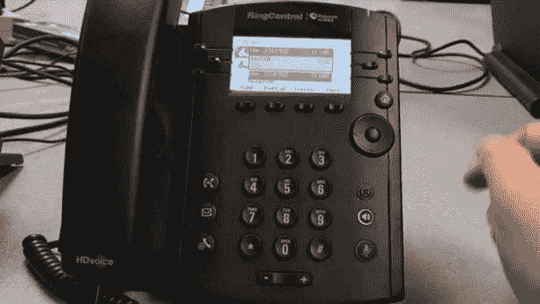

# 为什么第一天上班没有“危险信号”

> 原文：<https://medium.com/swlh/yourfirstdayofwork-2845793f80c3>

## 如何无端担忧，误读人意

在我第一天工作的前几天晚上，我出去买了 12 条领带。一个女孩来到我家，拿一条特别的领带开玩笑。

谁会戴这么厚的橙色领带？!"

它实际上是焦橙色，我的母校 UT 奥斯汀的颜色。那段感情没有持续，对我的自尊心是一个小小的打击。

几天后，我自豪地系上肥大的橙色领带，穿上宽松的套装，提前两个小时去上班。

那是夏天。

当人们开始慢慢走进办公室时，我能感觉到每个人都在盯着我。他们能看穿我。

*这个瘦长的白人是谁？*

我也把头发向后梳得很好。我以为做生意的人都是这样。我看起来像是黑手党。或者是吸尘器销售员。

*我是个冒牌货。我要失败了。大家都知道。*

我非常不舒服和紧张，蒸汽从我的领子里冒出来。

我的第一堂训练课几分钟后就要开始了。一位穿着高跟鞋的迷人、长相刻薄的同事把我护送到一个极其无聊和寒冷的房间，让我坐下。

她砰的一声把一本黄色的电话簿扔在我面前的桌子上。

她为什么要如此咄咄逼人？谁会用电话簿？

然后她给了我训练的“指示”。

> “在这里。你只要拨这些号码，编个故事，找市场部的人就行了。拿到他们的名字和邮箱，挂了电话，就这样。”

我给了她一个茫然的凝视，她让出一个沉重的叹息，但同意告诉我，这是如何做到的，然后我给它一个裂缝。听完她自信的推销和她假装对其他人感兴趣的诀窍后，轮到我笑着拨电话了。

我汗流浃背的手掌伸向 Polycom VVX 300 黑色办公电话，随机拨打了一家财富 500 强公司的电话(带有特殊分机，可以隐藏我的号码身份)，一名办公室接待员接听了电话。

这是一个销售培训电话，我在一家招聘公司工作。

当我的同事看着我笨手笨脚地打完几个这样的电话时，严厉变成了娱乐。我们肯定在短短几分钟内做了 30 个左右，所有的都很糟糕，因为我实际上没有得到任何名字。也许我太内向了，或者根本不适合这种咄咄逼人的销售工作。

她可能认为我是个失败者。她打算告诉我老板我很差劲。我可以想象…

> 你为什么雇这个人？

想法继续比赛，我试图通过这一天剩下的时间。我不禁产生了一种感觉，我可能给人留下了最糟糕的第一印象…

## 事实上，结果还不错

> "我一生中有过许多担忧，其中大部分从未发生过。"― **马克·吐温**

我在公司待了四年，升职四次。我花了几个星期来适应这里的一切，但第一天过后，我很快就扔掉了领带，穿上了和其他同事一样的衣服。

我提到的那个“刻薄”的同事有一种 [RBF](https://en.wikipedia.org/wiki/Resting_bitch_face) ，所以我想大多数人都会感到害怕。她总是让新来的人不好过。去想想。但是她不讨厌我，她也暖和起来了。后来我们成了朋友，她教我如何跳萨尔萨舞。

我的恐惧被放大了，因为一切都是新的。我不知道如何使用电话或客户关系管理系统或任何东西。我甚至害怕去厕所拉屎，因为我不想让我的队友听到。

我感到被评判，被恐吓。表演的压力很大。但这都是我想象出来的。这是一段训练时间…但我觉得我必须做些什么，产生一些重大影响，留下一个“伟大的印象”

回想我第一天上班的时候，人们真的非常友好和支持我——他们和我打招呼并带我去吃午饭。但我太专注于自己的想法，试图给人留下好印象，以至于没有注意到。

## 第一天没有危险信号

> *“有意识的注意是大脑的一种设计功能，用来扫描周围的麻烦。如果你认为自己是问题解决者，那你就把自己定义为永远生活在焦虑之中。”—艾伦·沃茨*

新工作令人害怕。你通常会紧张、缺乏安全感和焦虑。一切都是威胁。我们在荒野中进化，首先注意到威胁，这对我们很有用。但是当如此多的事情处于危险之中时，我们高估和夸大了现实。我们过度分析。

我们大多数人看待面部表情的方式不同。取决于你是如何长大的，你可能倾向于认为人们比他们实际上更愤怒。当你已经感到焦虑的时候(就像我们第一天一样)，我们会自然而然地看错别人的脸。

那面红旗更像一条红色的纸龙。

这并不意味着危险信号不存在，也不意味着这是合适的工作场所。只是我们很可能过早下结论。在工作的第一天，甚至是第一周就对一切做出判断还为时过早。

当你刚从大学出来的时候，你可能对工作和商业有很多想法(或者毫无头绪)，这些想法可能并不反映现实。在工作的第一周就辞职是一个错误，除非有人违反了法律或者你的老板一直对你说性方面的话。

所以，如果你的第一天即将到来，请记住，感到有点紧张是正常的。

> “紧张不是你应该感到羞耻的事情。紧张意味着你在乎，你真的想做好。”—保拉·克里默

但是没有人想抓你，你会比你想象的做得更好。提醒自己，即使一个人没有微笑，也不意味着他们对你生气或者你做错了什么。事实上，大多数人可能都忙于工作而没有注意到你。

你花了时间面试，公司也花了时间和金钱雇佣你。给自己时间，给自己一个公平的机会，也给他们一个公平的机会。放弃很容易。给它一个月。

记笔记，尽力而为，努力工作。学习。在几周内分析形势，最好是在周末，然后做出明智的决定。至少你可以说“我呆了一段时间，尽了最大努力。”

## 感谢阅读！如果你喜欢，请花一点时间鼓掌并跟随我。

## 这篇文章发表在 [The Startup](https://medium.com/swlh) 上，这是 Medium 最大的创业刊物，有+385，976 人关注。

## 订阅接收[我们的头条新闻](http://growthsupply.com/the-startup-newsletter/)。

我在几个不同的领域提供 [**一对一辅导**](https://mishayurchenko.me/consulting/) ，并与各行各业的人共事过——自由职业者、工程师、企业家和财富 500 强公司的总经理。话题围绕职业、生产力、健康、幸福和日本。它可以从更广泛的问题开始，如“我的职业生涯应该做什么？”并且可以变得非常具体，例如，为在亚马逊找到工作制定工作搜索策略。