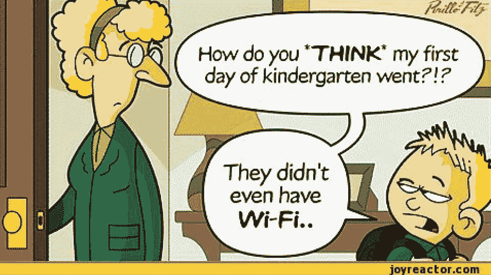
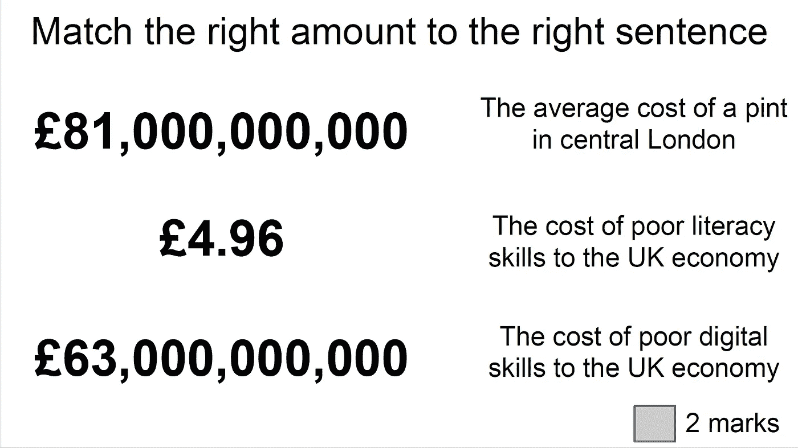
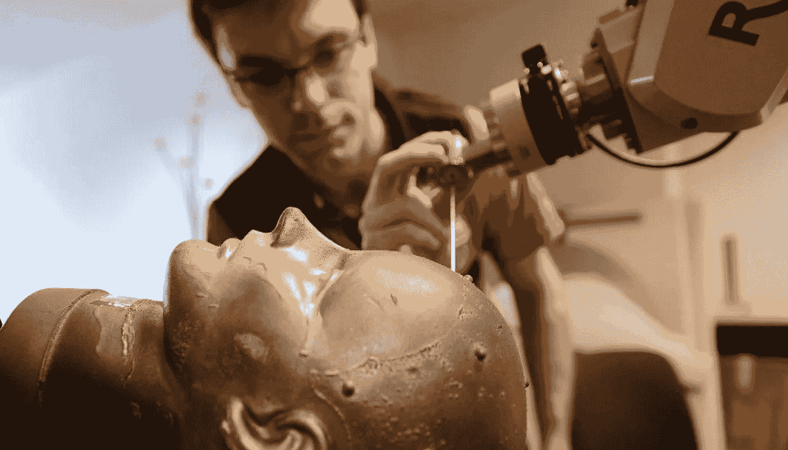
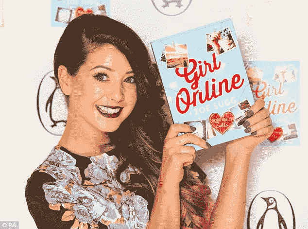
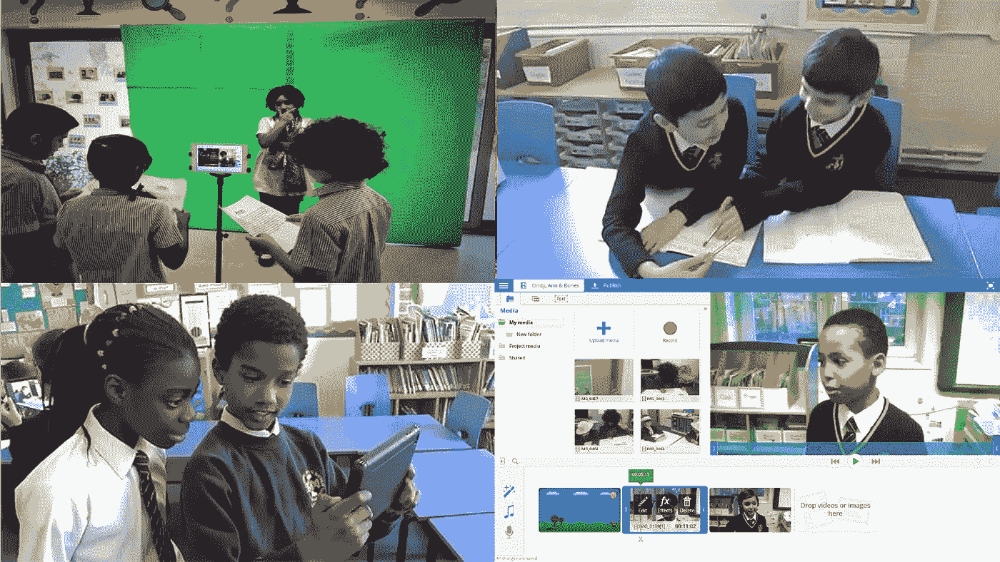
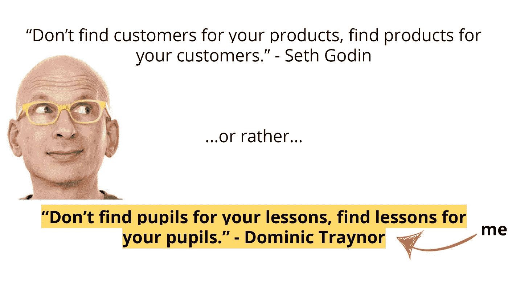

# YouTube &学校的未来

> 原文：<https://medium.com/swlh/youtube-the-future-of-schools-e3ddf07272aa>

昨天，我在 [Lead，Learn，Lancs 2016](https://twitter.com/LeadLearnLancs) 给老师们讲了一节课。作为一名与会者和一名演讲者，就各种各样的主题进行了令人惊叹的讨论，这令人着迷。我自己的会议被称为“为什么 YouTube 的佐拉是文化女王”。会议的目的是讨论我们在[做什么，一个故事展开](http://www.ataleunfolds.co.uk)，以及为什么我们需要在决定在教室里做什么之前**听取年轻人的意见。通过这样做，我认为我们可以解决学校需要解决的两个大问题。**

在我最近做过的所有演讲中，我最喜欢这个。我想这和我让人们在一张纸上回答的五个问题有关。我通常不采取这种方法，但这些问题已经在我的脑海中萦绕了一段时间。我不会记录会议的具体内容，但希望我可以通过思考这五个问题所引发的讨论来总结一下。

1.  你为什么参加这个会议？
2.  教师的终极角色是什么？
3.  书的未来是什么？
4.  YouTube 对社会有害吗？
5.  学校应该为内容和资源付费吗？

1.你为什么参加这个会议？

有些人，不是每个人都是老师，正在为他们的课堂寻找灵感。有些人听说了我们在[所做的工作，故事展开了](http://www.ataleunfolds.co.uk)，想知道更多。两个评论说，与许多学校合作后，vlogging 是学生们说他们长大后想做的第一件事。对于那些不知道佐拉是谁的人来说，她是世界上最受欢迎的视频博主之一。另一位与会者简单地用“YouTube”回答了这个问题，从与会者的平均年龄来看，这个答案说明了一切。帮助组织这次活动的五名青少年学生决定来听，完全是因为这个标题，对他们中的大多数人来说，这是他们一整天参加的唯一一次会议。

YouTube 和 Zoella 的力量是如此之大，以至于仅仅提到他们就能激励我们的年轻人坐起来听。所有参加的五名学生都只说出了上图中所有博客作者的名字。很明显，他们几乎把他们视为朋友。如果老师想知道我们年轻人的注意力在哪里，那就是这里。根据一些报道，YouTube 现在是最受五岁以下儿童欢迎的应用程序。想想吧。“YouTube 一代”现在是一个标准的营销术语，用来描述我们所教的人。据报道，由于广告、代言以及与 Boots 和 BooHoo 等品牌的合作，Zoella 每天收入约 1 万英镑，这些品牌认为她是最强大的营销渠道之一。她最近也开始出书，这一点我稍后会谈到。

2.教师的终极角色是什么？

我一直对这个问题很好奇，因为很难找到一个胜过所有答案的答案。“激励、参与和装备”是所有与会者回答的共同主题。我自己的答案是，我们需要让年轻人成为成功的成年人。

根据《时代》杂志，如果我没记错的话，到 2030 年左右，一份正常的工作将是记忆增强外科医生。有人在你的大脑中植入芯片，这样你就可以储存更多的信息。哇哦。不管我们是否认为这是一个好主意，使用这个例子的目的是强调我们对我们教的孩子最终将从事的工作所知甚少。话虽如此，但我们知道的一件事是，未来的绝大多数工作都需要数字技能。

当我离开大学时，我通过推销自己是微软 Word 的专家得到了我的第一份工作。我告诉他们我可以在电脑上写信，他们给了我一份工作。想象一下这年头这么说！我和许多教育初创企业一起工作，他们的应届毕业生可以做基本的编码、管理 wordpress 网站、视频编辑、进行简单的设计工作以及一大堆其他数字技能。这些技能正在成为新版的微软 Office 技能。如果我们不给年轻人在教室里定期做这些事情的机会，我们就会影响他们成为成功成年人的机会。

3.书的未来是什么？

听众中有一家印刷公司的主管和一家在线教育杂志的编辑，这是一个引发激情的讨论点。在会议开始前，我和几个朋友聊过之后，在最后一刻加入了这个问题，其中一个朋友告诉我们，她经常看到非常小的孩子试图触摸和操作桌面电脑屏幕和实际的书籍，就像它们是平板电脑一样。如果我们记得 YouTube 现在是最受五岁以下儿童欢迎的应用程序，这并不奇怪。此外，我一直在研究《连线》杂志创始人凯文·凯利的观点，他谈到了出版业的下一步以及“屏幕”的出现，这是一个提供我们所有内容和数字服务的个性化平台。

不管我们喜不喜欢，内容正在数字化。印刷出版业正在衰落，但我的观点是，出版业总体上在发展，就像所有行业一样。如果我们问自己，我们中是否有人在一岁时这样做，这并不奇怪。

这很好地引导我们进入下一个问题。

4.YouTube 对社会有害吗？

大多数人认为 YouTube 总体上对社会是一件好事，尽管有些人在回答时小心翼翼，这是可以理解的。“这取决于它如何影响观众”和“太复杂了，写不下来”是两个有趣的回答。

对人们消费的视频媒体数量的担忧是可以理解的。毫无疑问，过度消费任何形式的媒体都是一件坏事，尤其是当人们在观看媒体时没有将它放入上下文中进行明智而开放的讨论。然而，非常有趣的是，佐拉的书《女孩在线》最近打破了有史以来第一位作者的畅销书记录。她打破了谁的记录？JK 罗琳的。结论？可以说，YouTube 的佐拉比有史以来最成功的作家之一更有能力让年轻人阅读。房间里的五位年轻的 YouTube 专家赶紧补充说，YouTube 视频博客作者的书通常包括让读者完成的写作任务。有趣的是，他们觉得不得不提出这一点来支持他们的英雄。

最终，我认为关键是，如果我们试图阻止技术和流行文化的潮流，我们将会失败。技术有太多的优点，我们都可以利用这些优点来阻止它的进步，因此，我们，尤其是教师，有责任确保我们的年轻人以一种提高他们生活质量和促进社会进步的方式参与其中。

5.学校应该为内容和资源付费吗？

在我们讨论最后一个问题之前，我们应该快速转移话题，为我的会议做一个正常的总结，并把这个问题放在上下文中。我创办了一个名为“展开故事”的项目，为学校设计教育项目和提供培训。我们致力于将传统的读写技能与数字技能相结合，以解决我在引言中强调的两个问题。糟糕的读写技能每年给英国经济造成 810 亿英镑的损失，而缺乏数字技能每年给我们造成 630 亿英镑的损失。坦率地说，提供培训和制作内容和资源是我们谋生的方式。我们也很擅长。使用我们内容的学校和教师告诉我们，他们看到了巨大的进步，速度是预期的三倍。

除了利用视频的力量，我们的资源涵盖 6 种不同的写作风格，并利用电影制作来激励年轻人阅读、写作和制作他们自己创作的数字内容。这让他们觉得自己是他们渴望成为的人:博客人。它将他们的传统工作与数字生活联系起来，让他们感到前所未有的投入。这种方法的神奇之处在于，它使用了世界著名思想家赛斯·戈丁(Seth Godin)的商业原则。

如果我们想解决读写技能和数字技能的问题，赛斯有答案。我在开始时提到过，我这次会议的目的是讨论为什么我们需要在决定教室里做什么之前倾听年轻人的声音。这就是我们在故事展开时所做的事情的原因。不是因为我们决定要把它强加给学校和他们的学生，而是因为我们听取了学生的意见，这是他们告诉我们的。

现在回到最后一个问题，我决定把它包括进来，因为这是我喜欢问老师的问题，尤其是作为一个现在销售内容和资源的老师。绝大多数教师认为内容和资源应该对学校免费。值得注意的是，房间里唯一不同意的人是一名教师，他现在和我一样，把教育项目作为一项业务。如果你想一想，你会定期购买印刷报纸吗？为什么印刷报纸现在被许多大型新闻公司称为传统产品？因为，总的来说，我们不再买报纸了。我们希望这种媒体是免费的，并帮助我们在搬家时保护易碎物品。随着社会的发展，类似的行业转变还有很多例子，尤其是在内容方面。

我不打算用这篇文章来告诉学校他们应该如何看待这种情况。我只是觉得一位老师在我的课上提出的观点很深刻。他们发现，通过坚持免费使用，学校和教师注定会成为最终的销售力量。更紧的学校预算意味着购买的压力越来越大，我们越希望学校里的东西免费，就像我们对媒体一样，只有涉足教育领域的大公司才能满足这种需求。《卫报》早在 2014 年就推出了会员计划。他们说，‘您对我们很重要，不仅因为您的支持，还因为我们从您的洞察力中获益。通过与会员的对话，我们可以一起挑战传统智慧。只有时间才能证明这种方法是否成功。如果不是，那么我们就只能任由“自由”媒体的摆布了。一个有趣的想法是，如果学校继续被迫寻找节俭的方式来提供高质量的教育，类似的情况在不久的将来可能会在学校发生。操场上的数字广告牌？

[www.ataleunfolds.co.uk](http://www.ataleunfolds.co.uk)

英国邮政公司