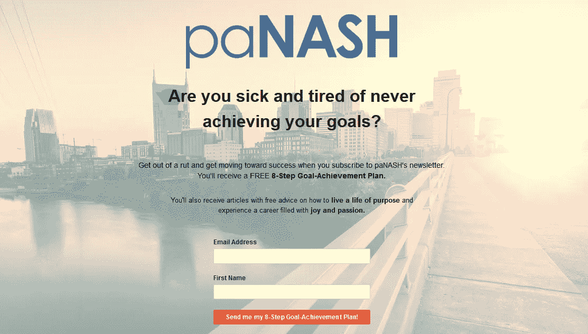

# 你已经找到了你热爱的工作。现在你做什么？

> 原文：<https://medium.com/swlh/youve-found-a-job-you-love-now-what-do-you-do-477ae9ebc465>

Photo by [Gabriel Beaudry](https://unsplash.com/photos/70rHtD11NNk?utm_source=unsplash&utm_medium=referral&utm_content=creditCopyText) on [Unsplash](https://unsplash.com/collections/1417611/consistency/be04551150ddf0bf5a34dde360cbc316?utm_source=unsplash&utm_medium=referral&utm_content=creditCopyText)

在经历了漫长而艰难的求职过程后，你终于找到了一份令你兴奋的工作。一个你认为你可以真正爱上的人。

你找工作的努力结束了。但你的职业发展不是。现在是时候给自己定位，实现自己未来的职业目标了。

这些目标是什么？

它们可以包括以下任何内容。

## 短期目标:

*   学习一种你以前从未用过的新技能或软件。
*   扩大你的人际网络，包括你的新同事和上级。
*   打造你的简历。
*   为一年后的晋升做准备。

## 长期目标:

*   在某个行业获得丰富的经验。
*   掌握某项技能，成为这方面的专家。
*   不断往上爬。
*   赚足够的钱最终自己创业。

你在新工作的头 90 天如何花费时间和精力将决定你实现短期和长期目标的可能性。

# 个案研究

事实上，在我的客户成功完成我的职业指导计划中的求职部分后，我会指导他们在新工作中应该做些什么。

不仅仅是头 90 天，而是第一年的每个季度。

例如，杰米是一个客户，他第一次来找我是因为在两年半的时间里找不到工作。这次拒绝使她的信心空前低落。

她知道自己肯定做错了什么，需要想办法纠正自己的做法。

杰米一开始参加辅导项目，她就意识到自己对求职知之甚少。教练向她揭示了那些盲点。

一旦杰米应用了我教她的求职方法，她的自信就一飞冲天了。

只上了四节辅导课，杰米就收到了一份工作邀请。事实上，当招聘经理打电话给她提供这份工作时，他说，

> “顺便说一句，你接受了一次很好的采访。你能帮我妈妈吗……她下周有个面试？”

杰米接受了邀请后，我告诉她，我们现在可以利用她剩下的时间，集中精力帮助她在年内获得晋升。

她说公司的规定是员工在公司工作满一年后才能晋升。

我告诉她这并不意味着我们不能现在就开始计划。

在开始新工作的九个月内，公司已经在考虑提拔杰米了。

# 新工作头 90 天最重要的事

要想在任何新工作中取得成功，新员工在头 90 天应该做的最重要的事情之一就是尽可能多的认识一些人。

这实际上包括结识那些职位较高的人。即使是最高管理层的高管。

当我第一次建议约见副总裁或首席执行官时，我的客户向我投来一个奇怪的目光。

他们的第一反应是，

> “我不能进去要求会见首席执行官！我只是新来的！”

我的回答是，

> “正是！”

如果有什么时候安排和上级的会面是有意义的，那就是你刚上任的时候。

为什么？

因为你的新鲜感是你想尽可能多地了解这家公司并结识尽可能多的人的原因。

而且，因为你是新来的，你安排这样的约会看起来不会奇怪。

如果你等到你在那里呆了六个月或更长时间才试图安排一次约会，那看起来真的会很奇怪！

在第一年及以后，你还应该记得把你的雇主当成你的客户，正如我在我的帖子 [*中讨论的如何像企业家一样思考(即使你不是企业家)*](/thrive-global/how-to-think-like-an-entrepreneur-even-when-youre-not-one-f6e8c093c798) 。

 [## 如何像企业家一样思考(即使你不是企业家)

### 每个人谋生都需要的 8 项技能。

medium.com](/thrive-global/how-to-think-like-an-entrepreneur-even-when-youre-not-one-f6e8c093c798) 

职业指导不仅仅是帮助你实现找到下一份工作的短期目标。

它还能帮助你在整个职业生涯中实现长期目标。

 [## 确保事业成功你需要知道什么

### 作为一名职业教练和一名创造性思想家，我总是集思广益，帮助我的客户在他们的事业中取得成功。

medium.com](/@panash/what-you-need-to-know-to-ensure-a-successful-career-99ef978334fe) 

你最近开始了一份新工作，还是你即将开始一份新工作？

我的 [*职业成长*](http://www.panashstyle.com/#services) 服务计划将帮助你知道在你工作的头 90 天以及第一年的其他三个季度你还需要做什么。

为了开始你的短期和长期职业目标，[订阅](http://www.panashstyle.com/get-the-panash-newsletter/)我的时事通讯，并获得免费的 **8 步目标实现计划**。这个计划不仅仅是教设定目标。它导致目标- *成就*！

## 相关帖子:

*   没有人会和你分享职业建议
*   [如何像企业家一样思考(即使你不是企业家)](/thrive-global/how-to-think-like-an-entrepreneur-even-when-youre-not-one-f6e8c093c798)
*   [确保事业成功你需要知道的事情](/p/what-you-need-to-know-to-ensure-a-successful-career-99ef978334fe)

洛里·布姆加纳是一家名为 [*paNASH*](http://www.panashstyle.com/) *的激情和职业指导服务公司的老板，该公司帮助人们摆脱困境，追求自己的激情，找到自己喜欢的工作。欲了解更多信息，请访问*[*www.yourpassioninlife.com*](http://www.yourpassioninlife.com)*。*

## 这篇文章发表在 [The Startup](https://medium.com/swlh) 上，这是 Medium 最大的创业刊物，有 320，131+人关注。

## 在这里订阅接收[我们的头条新闻](http://growthsupply.com/the-startup-newsletter/)。

