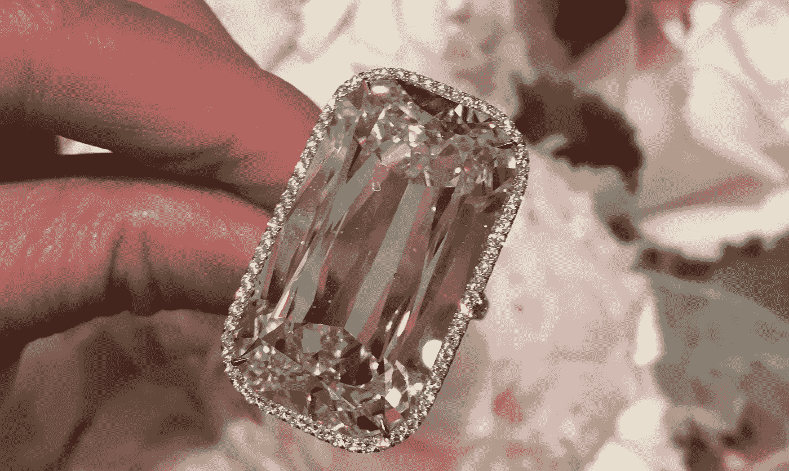

# 口袋里没有美元，手指上戴着 48 克拉的钻石

> 原文：<https://medium.com/swlh/zero-dollars-in-my-pocket-and-48-carats-on-my-finger-c0c0a8bf75ea>

让我们倒回去——2015 年 11 月。我有一个服装系列基本上是横着的。我最大的障碍是，虽然我喜欢我做的东西，但我讨厌推销它(事实)。我真的很难找到一种支撑公司的精神。我可以在 Instagram 上发布的小黑裙帖子只有这么多，我不会恶心到自己。

我没有灵感，沮丧，并意识到营销服装需要大量的资金和营销天才，而我并不具备这些。

大约在同一时间，我也变得*痴迷于*💎Instagram 上的钻石。你知道人们把钻石的照片放在 Instagram 上吗？各种各样的钻石，大钻石、廉价钻石、丑陋钻石、漂亮钻石——都在那里，我可能亲自浏览了几乎每张照片。我每天晚上都花几个小时沉迷于这个新发现的东西。*真糟糕。*

我的服装品牌没有给我带来灵感，我只是决定开始一些新的东西。

这可能看起来很疯狂，我有一份全职工作，我刚刚在这个服装品牌上投资了钱，从理论上讲，这个计划可能看起来很草率，注定要失败。

随便啦。我有一种感觉，我很受鼓舞。有影响力的人越来越多，我可以用手指数出珠宝有影响力的人的数量，市场完全不饱和。我设想了一个新的品牌，一个支持女性购买自己的钻石并谈论钻石的品牌，就像我最好的朋友那样。并非所有的技术、厌女症和黑幕都像这个行业的标准。

所以——我采取了这个跳跃——我开始了我自己的专注于钻石的 Instagram 账户，名为 [@gem_hunt](https://www.instagram.com/gem_hunt/) 。我没有粉丝。从头开始。我也开了一个博客，我认为网站总是一个好主意——见见[gemhunt.co](https://www.gemhunt.co/)

我对珠宝行业一无所知，我的意思是几乎一无所知，在这个以封闭和神秘著称的行业，我不认识任何人。

*刚从某处开始。*

我开始写博客，接触那些问问题的人。我变得痴迷于一天多次在 Instagram 上发帖，花数小时建立关系网，点赞，评论，寻找和创造有趣的内容。

猜猜怎么着——它得到了回报。

我投资了 0 美元在宝石狩猎，现在我有一个成熟的业务。我有行业关系，钻石供应商，我在 GIA 学校上学。我知道我的 G 色和 SI 钻石的样子。对珠宝商说出我的名字，人们很有可能会知道我(insta fame 会做到这一点)。我在各个平台上有近 20 万名粉丝，我有一家真正的企业。我拥有 48 克拉的钻石(是的，它很大)。

一砖一瓦，我建立了宝石狩猎。首先我建立了博客和 Instagram。我建立了关系，得到了赞助。我把这些钱投资到广告上，让它增长得更快。拿了那笔钱，开始投资我的商店 [Gem Breakfast](https://gembreakfast.com/) 。

我还有很长的路要走…我的事业绝不是，成功的，稳定的，或者我想要的那样。但我不得不说，我真的很喜欢。

在一个有很多文章和炒作关于筹集资金，基金，或贷款来建立你的公司的地方。这可能是唯一的办法。我想写这个故事与大家分享，但事实并非如此。*对我们其余的人来说，还有创业的机会。*

**可以关注我个人的** [**Instagram、**](https://www.instagram.com/catcason/) **或者关注我的**[**Twitter**](https://twitter.com/catcason)**。**

**你可以在 gemhunt.co**[**找到我的精品珠宝博客，在 gembreakfast.com**](https://www.gemhunt.co/)找到我的店铺

## 这篇文章发表在 [The Startup](https://medium.com/swlh) 上，这是 Medium 最大的创业刊物，拥有 289，682+人关注。

## 在这里订阅接收[我们的头条新闻](http://growthsupply.com/the-startup-newsletter/)。

