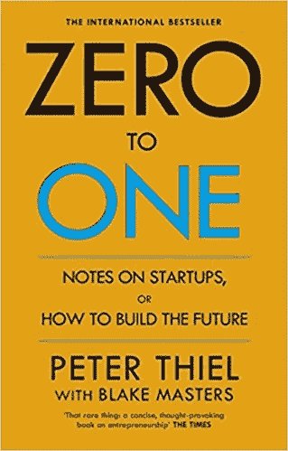
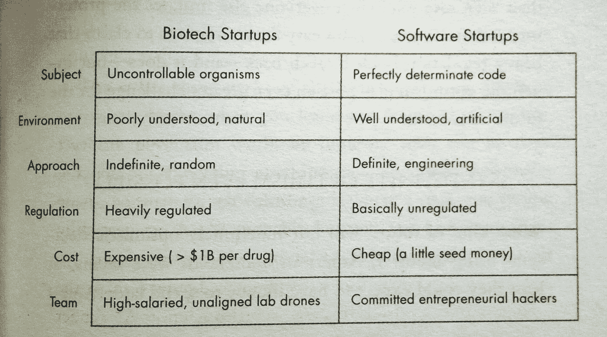
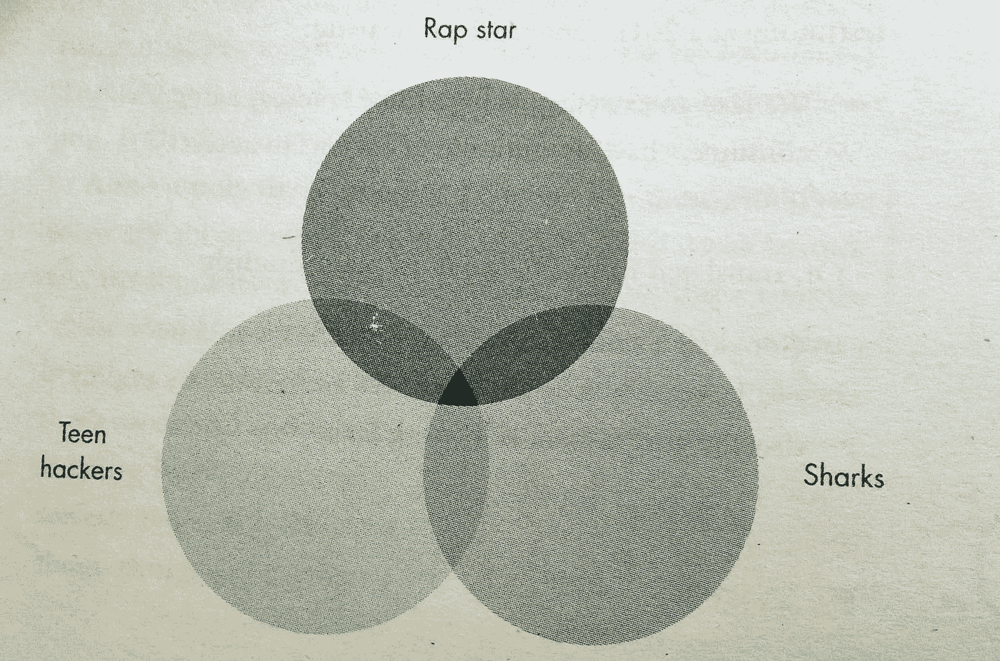
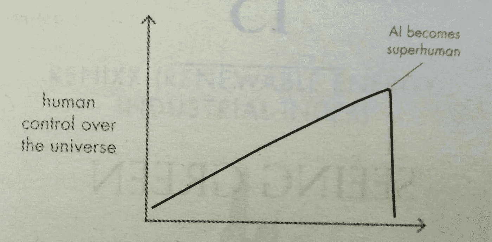

# 彼得·泰尔的《从零到一》。评论和解构一本畅销书。

> 原文：<https://medium.com/swlh/zero-to-one-by-peter-thiel-review-and-deconstructing-a-bestseller-f64116b757f4>

## 好主意，坏主意和一些“WTF”图形。

PayPal 是创业公司*成功*的一个例子。该公司成立于 1999 年互联网泡沫破裂之前，其提供在线支付服务的理念占据了上风，目前为近 2 亿用户提供服务。

PayPal 的创始人之一彼得·泰尔于 2012 年定期在斯坦福大学举办讲座。泰尔与这个班的学生布莱克·马斯特斯合作，把这些课堂笔记整理出来，出版了《从零到一》一书。

这本书已经成为国际畅销书，副标题是“如何建设未来”。这是创业公司、企业家和创新者的推荐读物，这也是我选择它的原因。

**唉，我不喜欢。有一些有趣的智慧和洞察力，但也有很多教条主义和不相关的信息，填补了真正可怕的可视化和图形的使用。**

**好的，坏的和丑的，让我们看看我们能找到什么。**

这本书确实有章节，但没有弧线或概念，所以我将挑选出一些我注意到的东西。

## 好人

我全心全意地同意核心思想和基本前提:建立一个别人没有的价值主张的公司/产品，可能比复制现有的东西更好。创新的核心应该是一个独特的解决方案，一种思考老问题的新方法，以及质疑已有模式的能力。毕竟，这就是创新的意义所在。

泰尔写道:

> [……]这是一家初创公司必须做的事情:质疑收到的想法，从头开始重新思考业务。

到目前为止，一切顺利。这是他的“零到一”，意思是在以前没有的地方创造解决方案。

稍后，还有一个警告:仅仅因为你的业务是独特的，并不意味着它是有用的。我认为这是一个好观点。

> 它有助于思考价值主张，即你可以向潜在客户提供的实际价值。独特的想法数不胜数，但很少有价值足以建立一家企业。

他强调，为了在竞争中遥遥领先，以成功为目标的初创企业需要建立垄断。这与第一点*的独特性*有关。你必须面对的竞争越少，你就越有可能专注于发展而不是营销战。泰尔定义了几个“垄断的特征”。

1.  拥有或开发一项超越现有技术的专有技术。
2.  开发一个网络(或平台),让用户更有可能使用你的产品
3.  在拥有大量用户的大型市场中进行扩展和运营的潜力
4.  创建触及客户体验每一点的强大品牌

随后，Thiel 利用其中的一些观点提出了一个关于生物技术创业公司的有趣案例，并将它们与 IT 创业公司进行了对比。我可以接受这一理论，即控制基于软件的企业的发展比控制“混乱的”生物技术要容易得多。

我并不真正理解表格中的最后一行，但它展示了一个例子，说明泰尔显然是如何看待他周围的人的(我们稍后会谈到这一点)。

我们一致认为创新就是提出新的问题，这本书进一步探讨了泰尔所说的秘密——可以被发现以发现新机会的想法。最后，这一章强调了我们之前看到的:独立思考，质疑旧的方法，寻找新的解决方案。

接下来，对于泰尔如何看待公司建设，尤其是团队建设，有一个非常混杂的看法。我同意这样一个观点，最好是那些认同团队核心使命和工作方式的人，而不是纯粹凭才能招聘。关于如何为你的想法找到合适的人的其他想法很少，事实上，作为读者，你最好从其他书中寻找更简洁的信息。

在关于销售的一章中，泰尔展示了一个有价值的想法，尽管我并不完全相信它是普遍适用的。**他的评估是，初创公司需要找到正确的销售方式:如果每笔销售额很小，你需要大量的客户，这意味着巨大的营销努力或(可以预见的)病毒式增长引擎的使用。**如果每笔销售额很大，你需要大量的个人销售，这将花费更多的时间。

泰尔写道:

> 这里的挑战不是如何进行特定的销售，而是如何建立一个流程，通过这个流程，一个中等规模的销售团队可以将产品推向广泛的受众。

用这句话，他开始列出一些过程，但没有一个是有用的细节。还是那句话，对于销售这个话题，我建议你去找别的来源。

作为结论，泰尔提供了成功创业的七个指标。

1.  技术:你能创造突破性的技术吗？
2.  时机:现在开始合适吗？
3.  垄断:你是从一个小市场的大份额开始吗？
4.  团队:你有合适的团队吗？
5.  销售:你有办法交付产品吗？
6.  未来:你的市场在未来 10-20 年内还能防御吗？
7.  秘密:你发现了一个独特的机会吗？

正如我所说的，这些是指标，不是绝对的。但是你在这里选择的选项越多，你为你的生意考虑的基础的东西就越多。

> 这本书里有很多有用的建议，关于如何看待你的创业，确认或质疑你的信念和价值观。

可悲的是，有相当多的段落，我认为应该小心处理，保持距离。

## 坏事

是的，泰尔在 PayPal 上取得了广泛的成功，这让他成为了一名富翁和风险资本家。**自相矛盾的是，PayPal 始于 1998 年，创业环境与 2012 年(讲座举办的时间)甚至 2018 年(这本书还是标准读物的时间)都有着天壤之别。然而，Thiel 以 PayPal 的早期为例来构建他的理论。有一个很长的章节讲述了互联网泡沫是如何破裂的，PayPal 是如何挺过来的，但这是 20 年前的事了——科技世界的一个世纪。**

为了支持“垄断是唯一途径”的理论，泰尔写道:

> 由于他们不必担心与任何人竞争，它有更大的自由去关心它的工人，它的产品和它对更广阔世界的影响。

在我看来，一家公司为了能够照顾员工，首先需要成为垄断者，这很奇怪。

> 我认为，我们今天正在建设的公司需要从一开始就关注和支持所有员工。这同样适用于对更广泛世界的影响，例如企业的社会责任。

在我看来，让积极的社会价值观植根于公司组织结构中，比先扩大规模，然后再看能挽救什么，要明智得多。

Thiel 痴迷于“永不竞争”的理念，但我不确定这是否适用于所有情况。**这暗示了我对这本书的一个主要批评:它太教条了。很少有中间立场、替代解决方案或不同的做事方式。要么是泰尔的方式，要么是错误的方式。**

有一大段是关于他的世界观和看待未来的不同方式，我不确定它们实际上是如何与书的其余部分联系在一起的。也许是为了支持我们需要更大更大胆的冒险的想法，或者是为了插入一段他认为欧盟目前有多悲惨的话。**还有一种教条主义，它让很大一部分成功企业家及其想法失去了信誉:他们没有赚到数十亿美元，这意味着他们失败了。**

他甚至谈到了教条主义和邪教的观点，他说

> 最大的区别是，邪教往往在一些重要的事情上是狂热错误的。一个成功的创业公司的人会狂热地正确看待外界错过的一些东西。

我不会对这种说法做出判断，但我对他仅引用*实际成功的公司*作为例子感到困扰——这是一个明显的确认偏差/生存偏差的例子。没人记得那些曾经狂热追求某种独特的东西，反正失败了的公司！

顺便说一下，Thiel 是苹果的粉丝，我不确定我们是否应该把苹果算作一家初创公司，因为它自 20 世纪 80 年代以来一直是一家技术公司。

当泰尔谈论人的时候，这种非黑即白的观点也困扰着我。他讨厌“潮人”，将生物技术初创公司的人归类为“高薪实验室无人机”，而在 IT 部门工作的人则是“忠诚的创业黑客”，然后概括了这一点

“[……]书呆子们对广告、营销和销售持怀疑态度，因为它们看起来肤浅且不理性。”

对他来说，高层需要有个性极端的人似乎很重要——也许这应该成为某些事情的借口？**的确，我们把耀眼的人和他们的公司联系在一起，但另一方面，也有很多初创公司的创始人和首席执行官相当“普通”，他们都不需要为了成功而走极端。**

很难批评泰尔，因为最终，他确实通过建立一个数十亿美元的公司取得了成功(用他自己的话说)。**然而在《从零到一》中，他提供了一个狭隘的世界观，一个符合他自己的叙述的世界观。我认为读者在区分“事实”和“观点”时应该小心，因为它们经常被混为一谈。**

## 丑陋的

我不知道谁对书中的一些视觉例子负责，但它们是…垃圾。我知道他们试图用一些图片来点亮文本，但它们出现在奇怪的地方。

举个例子:

这个文氏图应该是在说明一个独特的电影剧本是如何构思出来的(通过结合不同的基本想法)，但是老实说，这有什么价值呢？它只在一句话中被提及，而且这个概念并不难，我们需要把它形象化。

Let’s draw some circles

同样的道理也适用于后来的图表，这些图表试图表明一个观点，但它们的含糊不清令人捧腹。如果我缺少深刻的见解，请在评论中告诉我。

Ah yes, we all know the measure of “human control over the universe”

此外，我们还放入了一些肖像，首先是“大学炸弹客”和一个潮人(潮人抨击见上)，后来是一些你可能已经忘记了面孔的人，比如比尔·盖茨、史蒂夫·乔布斯或 Lady Gaga。

There is a connection, I’m just not sure where. Maybe the hood?

## 结论

不要把《从零到一》作为你第一本关于创业的书来读。把它当成一个 20 年前成功创业的人的故事来读，从中提取你可能会发现有用的想法。

> 核心思想是“做独特而有用的事情”，但它淹没在相当多的噪音和模糊的典故中。

感谢您阅读这篇评论。如果你想要更多这种样式的，请告诉我。

## 这篇文章发表在 [The Startup](https://medium.com/swlh) 上，这是 Medium 最大的创业刊物，有 291，182+人关注。

## 订阅接收[我们的头条新闻](http://growthsupply.com/the-startup-newsletter/)。

